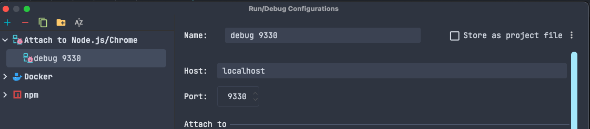

In the [first part](https://costica.dev/posts/backend-delivery-hands-on-docker-1/) of the Hands-On Delivery Node & Docker we saw how to "dockerize" a Node server, and how to build & run the container for that. Basically we saw how to deploy an app to production using containers.

For me, that's only half of the story. The other half is how we can leverage containers for creating share-able configurations. 

No more "do this, do that" - just a simple `docker-compose up` and anyone should be able to run the code in `dev` mode, with all the cool stuff: debugger, hot-reload, running tests, etc. 

## Why 
I'm doing this because I grew tired of how many times I had to do it so far. Staying true to the theme of this blog - it will serve me (and possibly, you) in the future. 

I'm doing this because the first part of the article is incomplete - it covers only the _how to deploy to prod_ bit. 

## A short recap 
We have a little-tiny web server that can be deployed and run anywhere there is a container runtime (Docker). 

The `Dockerfile` - the template that sets up the `bundle` to be run everywhere has only the bare minimum for our app to work: 
* a Node.js runtime 
* external libraries used by the application 
* application's logic - the source files that we wrote

Spoiler alert: the `Dockerfile` [has only](https://github.com/costicaaa/node-quickstart/blob/main/Dockerfile#L14) the `prod` dependencies installed (`RUN npm install --omit=dev`). We're not going to change this, because: 
1. It does work
2. It is the right way to deploy an app - ship only what's required

The project & docker setup that we use as a starting point can be found here: [node-quickstart/tags/v1.1-prod_deployment](https://github.com/costicaaa/node-quickstart/tree/v1.1-prod_deployment).

## 1. Developer efficiency: local setup (without containers)
### Hot reload
While `node` processes are easy to run with a simple `node app.js` command, that doesn't serve me well while I want to try 3 different versions of my code per minute. 

Why: simply because going to a terminal, `ctrl+c`'ing + `arrow up` + `enter` is way slower than `ctrl+s`. 

So add [nodemon](https://www.npmjs.com/package/nodemon) to the mix, and hot-reload is now available. 
> **Todo::** update this when `--watch` mode [will be GA](https://nodejs.org/en/blog/release/v18.11.0/). 

Now all we have to do is call `nodemon src/app.js` instead of `node src/app.js`. 

So far, so good. 

## Debugger
I write about Node, but PHP is still in my hearth. I grew up using Laravel's `dd()`. But then I learned how to use a debugger and how to... debug faster. 
> Just in case isn't obvious yet, I'm lazy. I'd rather have a setup that allows me to be productive rather than just complain that "my code doesn't work".
>> I'd still use Laravel if it were for me, but that's another story...

So add a `--inspect=PORT_NUMBER` to the command and now connect with your IDE to the debugger port and everything works. The running command now becomes `nodemon --inspect=9500 src/app.js`. 
> I'm a JetBrains' fan usually, so this would mean a running configuration that is `Attach to Node` with the `port=PORT_NUMBER` I specified in the command. 


---

> Visual Studio Code 
>> I was actually **really** impressed with VsCode here: if run from a VsCode embedded terminal, it will connect automatically to the debugger
>> The nice thing is that I can use any port (like `9500` in [my example](https://github.com/costicaaa/node-quickstart/blob/v1.1-prod_deployment/package.json#L3)), not just the default port `9229`.

## I'm not only lazy, I'm also forgetful 
That command is getting long. I will forget about it all the time. Even if I memorize it somehow, I don't want to type it anytime I start working on my project. 

`package.json`'s `scripts` section to the rescue: 
```js
  "scripts": {
    "dev": "nodemon --inspect=9500 ./src/app.js"
  }
```
Now all I have to do is type `npm run dev`. 

> And now I can't have 2 projects with a debugging configuration running at the same time, again! 
> 
> I won't go into details of how complex it would be to pass the `APP_PORT` to the `npm` command... 

A minor caveat, everything is ok. I have a working server, with a debugger, hot-reload and environment values.
 
But then again, all that we discussed so far depends on the host machine having the right dependencies installed. 

We containerized the app for prod mode, but we get no benefit if we still write & run the code on the actual machine.

## 2. Containerizing the debugger
The first "easy win" we can have is to debug inside a container. 

Instead of installing and running the web server on the actual host machine (basically throwing away everything we did for _delivering_ the app), we can simply run the app inside the container. 

All we have to do then is to also expose the debugger port. 

Yes, we can mimic the setup for "proxying" the port from the container to the app, like we did for the `ARG_WEB_SERVER_NODE_APP_PORT` in the previous article. 

Considering we already have the `dev` command in the `scripts`, we can run the app inside the container with a simple `docker run` command, slightly adapted: 
* we will expose port 9500 
* we need the container to to run `npm run dev` instead of `node src/app.js` 

The command will look something like so (mind the `-p 9500:9500` and the `npm run dev` parts):   

```shell
docker build --no-cache -t test_bundle . && docker run -it -p 3003:7007 -p 9500:9500 test_bundle npm run dev
```

But... it won't work. Not with the default container which we prepared for `prod` mode by running, in the `Dockerfile`: `npm install --omit=dev`, because `nodemon` is declared as a `devDependency`. 


## 3. Back to the drawing board
We don't really want to install everything in the container from the beginning, as we already know that that part is **well done** and **sufficient** for running the app in **prod** mode.

We worked hard on the `Dockerfile` and set it up to be simple to run, with a simple command and it has already some nice defaults configured. 

What we're going to do, instead, is to install the `devDependencies` inside the container only when we run it in "local dev mode". 

That can be done using a simple `npm install && npm run dev` - so no problem there.

The recurring issue, however: the command needed to do this is getting rather long.

## 4. Docker-compose to the rescue 
I like to think of `docker-compose` as a "wrapper" of `docker run` commands. Instead of having a **really** long `docker run bla-bla-bla-bla` command, I can just define everything in a `docker-compose` file and then all I have to do is `docker-compose up`.

```docker
# dev/docker-compose.yml
services: 
  web-server-node:
    hostname: web-server-node # any name you want 
    build: ./../ # we need to `up` a folder, because I like to keep this separate in a `dev` folder
    ports: 
      - 3003:7007 # web server will be accessible on the 3003 port on the host machine
      - 9500:9500 # debugger will be accessible on the 9500 port on the host machine
    command: bash -c "npm install && npm run dev" # install and run the `nodemon --inspect =9500` command
```

The equivalent, `docker run` would be: 
```shell
docker run -it -p 3003:7007 -p 9500:9500 test_bundle /bin/bash -c "npm install && npm run dev"
```

Now this opens the door to having a debugger, by using the same "port proxying" technique as before. 

But this locks the configuration in, and any modifications of the debugger port would mean to change both the `npm` command and the `docker-compose` file.

It is also impossible to start two containers and debug them in the same time, as the `9500` port on the host machine can be used only once. 

We can do better 😎

## 4. Environmentally-aware run configurations

Luckily, we can simplify the `npm command` and use the default Node debugger port `9229` AND have a `.env` file that is read by the `docker-compose` file and exposes container's `9229` to a host port.  

```js
  "scripts": {
    "dev": "nodemon --inspect=0.0.0.0:9229 ./src/app.js" // 0.0.0.0 allows the process to accept incoming connections from any source
  }
```

The new config will look like so: 

```docker
#dev/docker-compose.yml 
# ...

ports:
  - "${WEB_SERVER_NODE_DEBUGGER_HOST_PORT}:9229"
```

Where `WEB_SERVER_NODE_DEBUGGER_HOST_PORT` will be set in a `.env` file. 
```docker
# dev/.env

WEB_SERVER_NODE_DEBUGGER_HOST_PORT=9500
```
The nice thing about this is that every developer using this setup can set his/her own ports for each of the projects **without** any changes committed to the main repository - and they all use **the same** `docker-compose up` command to run the project locally.

## Hot reload inside a container

Having `nodemon` up and running is basically pointless at this point, as the local files inside the container are only copied at build time. 

The container needs to be stopped, rebuilt and started again for any changes to take effect inside the container. This is, obviously, less than ideal. 

The solution is simple, if we leverage the `volumes` configuration of the `docker run`/`docker-compose`.

While in `prod` mode the container files will be copied inside and never change, for the local setup we want to keep in sync the files in the host machine with the files inside the *running container*.

```docker
# dev/docker-compose.yml

volumes:
  - "./../src:/node-app/src"
```

### Putting it all together 

```docker
# dev/docker-compose.yml
services: 
  web-server-node:
    hostname: web-server-node
    build: ./../
    env_file: 
      - ./.env
    ports: 
      - "${WEB_SERVER_NODE_HOST_EXPOSE_PORT}:${WEB_SERVER_NODE_APP_PORT}"
      - "${WEB_SERVER_NODE_DEBUGGER_HOST_PORT}:9229"
    volumes:
      - "./../src:/node-app/src"
    command: bash -c "npm install --only=dev && npm run dev"
```

1. `build: ./../`: We keep the same `Dockerfile` template as the one used for `prod` deployments
2. `env_file`: We specify where we store the ports config at a per "host machine" level. These are local setup (ports-only, in this case) env variables, while the `app` will still have access to any _root_ `env` variables we set (either at build time using `Dockerfile` or later using a container orchestration tool like Kubernetes).
3. `ports`: link host machine ports (set in the `dev/.env` file) to the ones set inside the container 
4. `volumes`: keep the host machine files in sync with the ones inside the container 
5. `command`: install `devDependencies` then run the project in "dev mode", taking advantage of `nodemon` to watch for changes and restart the process any time a change a file is changed

## Bonus: tests
As process for setting tests & debugger for testing containers is similar, I won't go into much detail. 

I would like to point out I like to keep a separate `docker-compose` file for testing: 
```docker
services:
  test-base: &test-base
    build: ./../
    env_file:
      - ./.env
    ports:
      - "${WEB_SERVER_NODE_HOST_EXPOSE_PORT}:${WEB_SERVER_NODE_APP_PORT}"
      - "${WEB_SERVER_NODE_DEBUGGER_HOST_PORT}:9229"
    command: bash -c "npm install && npm run all-tests"
    volumes:
      - "./../src:/node-app/src"
      - "./../jest.config.js:/node-app/jest.config.js"
  watch-tests:
    <<: *test-base
    command: bash -c "npm install && npm run watch-tests"
  all-tests:
    <<: *test-base
    command: bash -c "npm install && npm run all-tests"
  coverage-tests:
    <<: *test-base
    volumes:
      - "./../src:/node-app/src"
      - "./../jest.config.js:/node-app/jest.config.js"
      - "./../coverage:/node-app/coverage"
    command: bash -c "npm install && npm run coverage-tests"
```

Another cool thing I discovered is that `docker-compose` supports [anchors](https://medium.com/@anasanjaria/code-reuse-in-docker-compose-using-yaml-anchor-feature-6cb2ff1d0427). 

## Closing up 
Putting it all together, [here's](https://github.com/costicaaa/node-quickstart/tree/v2.0-dev_and_prod_ready_quickstart) a commit with the whole setup :) 

### Coming next
While this is all nice for the local environment and helps us code and debug efficiently, it is only the starting point. 

Now that we have the fundamentals, we should have everything we need to start deploying the application in Kubernetes.
