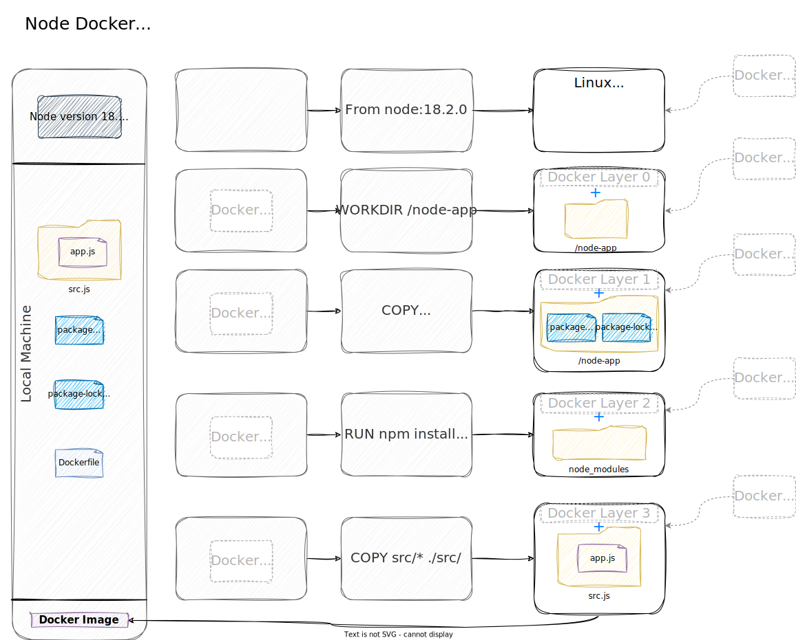
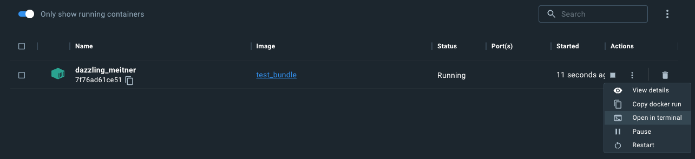
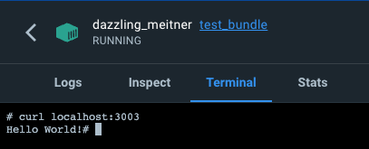
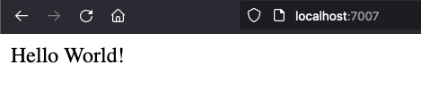

[](https://viewer.diagrams.net/?highlight=0000ff&nav=1&title=Node-docker-Dockerfile#R7V1bc5s4FP4tffDs7oMZ7uDHOI7bmW23mSYz2z51ZJBtUkBeEInTX7%2BSEBiQfDe20%2BLMuJa4H33fOUfnHNGecRst3ydgMf%2BEfBj2dNVf9oxRT9d1bWCRf2jPa96jObRJe2ZJ4PO%2BVcdD8BPyTpX3ZoEP09qOGKEQB4t6p4fiGHq41geSBL3Ud5uisH7VBZhBoePBA6HY%2B2%2Fg43lxd6q62vABBrM5v7Sp8w0RKHbmHekc%2BOil0mXc9YzbBCGc%2F4qWtzCk0ivkMvuQDp78UfTYd39%2B%2FPvT9F5Lx%2F38ZON9DikfIYExPu2p%2BVg%2BgzDj8uLPil8LASYoi31IT6L1jOHLPMDwYQE8uvWFYIb0zXEU8s3pD4i9OW%2FMgTfPEvie7jQyScdTMJux0xLZDb0seYbjAOMgnvEDpijGYxAFIQXbTeLRa3k4JfczAhkZIZjwnR5QlrA7mGNMcKRbxg35Io9Ov%2BgOqTJDiFwLLIJU8VDENngp23U8zS9BftYuYunD5mVyNJPRztu3KEQJk4qRf2h%2FEIaV%2FqlF%2F6gkcIJ%2BwMoWm33IFh%2Bk81KeXP4wwXDZAOyW0dZKCBLyQhRBnJBnUouzaA6HLSdu3ygY%2BbKigWnyvnmFAcaAdwJOvVl59hW8yA%2BOsD3QZkjQZoeYyiR4Jj9nmEkk76ICryHR%2Fi9DxYZ%2ByoaGjLqqqYtlfhjfXpyIgPQHVQ78fL0cGc3LkG7Jxdu4H%2BUpRfGed9Pg4jb2zcGCbomWM6rNlQlIA0%2FxkZdFDEu%2FJj01XaShdje0x2MZDVXVvrsZi4RW2adFRpqmVSOkaSqWQEhHwkezLTqal6BjP0Tej46THSevgZOGpV4ZJy0BX9An%2FixvogTP0QzFILxb9Q5XHpp6NJ5WV%2FiI0IJ3PkGMX%2FnIggyjOsLJACSvX%2FnVWeMbbShW0RwtqxtHr7x1rdC1S8BR0R8ANzJ8xR2v28%2FhMyGQzODG85ly%2FCYwBDh4rt%2FdycFoHwDGQt%2Fx%2BRylco6zwuOtzycEgB4CwGWAv64gR1rfCsCR3yv00cZrpXEPk4AIigKA9dUc8xBMYDgkNmvGbrjQSj6cgoyZBUGLuSr9u3Jgr5vGwNi%2FobNtOnIhSImNaqoSibKoKZNroYyxRuWfhzKO4FONiL8DE2ILYec6HOo6%2BAC6U086q%2FZcOJm26bY3XIS%2Bbl7WQ3C3h2yoylqsFQjXzGBS7K6eRFBlfKEQlCPGGzRdIinXbklSA0FSaeIRj1%2BQVxnZq1kBtcHGJvR8e2JbtgjW6XSqe15hQu5RGuCATDKIYiXiZWingxJ4xMI1dpggjAl7VjvchMGMbsDUEg4Bb5XnQRkOg5jcUxE6VSVa4xlCECm6r9DQKTvs11UbhysBV47ti2G3IFMFvGCxkIG3MyK7GJEYxVBG4oHtGMBuAzqFWqxrRd2%2BrPXQNAFX%2FyAf0sNiOmjMWSkiH5OkiHpMsiD0e5QBNoiYLmLf1K3K6HF96votFyEg6sgXIEpEijcpUz44kvESVF5TM0aB77N5h4wG9YmxgO0rxa5uHeZ6t5BEsBylHrTsG6Zo1XXLEhHstIZg0d%2B5%2BhDJlSJNNiO8ZZ8jwjpkJima5PamhZq547xQcy45L9SMA1D7VmIpJVIU0zGraNEU1d4KF9LqIjFvKRKzM%2BUM46KUE%2FNbPndv1MKf6fdj1PcIb6gH1Ke5JAxT%2FH1CcEbjNaqyty9TzfSvqw04pVcjq1PYCfIy7LXlSNhqsxhBdIPLXEzVi7DNtsBxSKJlT318%2FkwMV97F79xg64Uml2vvPdXrqv8NKdeKUyNRruf2WHaOZF80%2BaOdIftzJQzZTJBDHeHfgVjj8dBy1DdHLOuixBJzRDWnoxl7aRS7eKX0V8UshYIT6lv%2BLD2eIAIz%2BNfaUpcG07uiz9yZqjtwUPMt6MhcvhOEEbeEYoT0iu64gg%2BlyWKJbmuRGDEVFSMffo%2BQn4WwS7P8irQ4Ms2yBeR6Y54gKVmWpmFMvS2IiznErmS5K4%2F8TcojNaH4wbEuXSCpi4nRrmq5o%2BVvTUvtwkllfW1SmTx8Sp0uAmZX0RVVwGE30dCsDRBqgNE2HduVTkAMzTQss03QaYOGLdAcW2IMpP6Z3RryDkkG1wJSFyyXVwaDQa8WUjL13gHZsmsF9qZAbIpBgouIUVmcQ%2FrGAUVAGYXLBeU41YCdpqhsQrhfdfeZg1G6sWMwSh8cGYxihxJRgtfKDgsUxDitnPmedlTobOsNOrtWlY3bD9BMs0Hf%2FB5WZC4f5gh%2B77Rk9O7r%2FeeHO7Kbo6rO3u6YGGnb4juJKcDdE3oJJP4dL72lqOTjRM5rDXvWiJ6LaIyUA1Wm6Yfsr2Eb6sHjAufuPspBdolGtF4av9ktRX%2B05T6D7mrNdFp203SaktidbC12e4ZTtvizgfOLlJELMaD%2BwJW4GfpZq3F1S5BWV0rexTg3UeuKasmLmuOulvzqa8nXYec6i8l1MZP5MUgxjOmYsVl%2F7pB1%2FlPnPx0De8F9ksUd7LMi333LcQfLdKpxh76qqFq5y68eeVhFFYi6rkcVzKJ9vVGFXUtcjo4qHEcPMW36CcwC7504535kpbdkMoHp2iFaqcK8ChDSAVcDiqWnLKWBCPFYQFUA8UQW7Lgpot9EguQ7zsPPZNOVWR9pZPe01qe8RGd9TjMhbWZbJFUJUr%2BrtcIbQ8yjXOVikm4ZxzHLOM5sWo5%2Bb8aauLFAn%2BbKwNyW8cNWzNg7ou3Ir7MuoG02JlMDtcHLFsLZhpgovfnynnT883l09%2F3m%2Fv77%2Fecvj2RDN2%2FqLNcJ4s7NedNADDufN2JgHJKv7SzX5S1X69Zn13TpZV%2FvVNxm7f1O8R%2BsnGsBvWDKLFZMv%2Ft9tsiwTx6op9%2FKko1EKpSLdKJCn5k8PJsLFbjim0gzf6lC%2FoaGfJ8NL5XqrERnJfaxEpbwgitVtBKmdHFma1Ziw8pd%2Fr6RRSUgsGlhjGEMBuOxWEJZ8rHosCz6Fosy%2Fz%2BR1ATUyizpAG%2B%2FPF8fJVy%2BUahQL%2BDc6cGGum3LHkyylGjbYp9uSfMhztXAaPJGsiDnvIuaDTFN3TpvGC5%2BE97sct8MduvFJqs16sjZPjllFTdnJqeYhf%2FCOAmosKLcaQziFIPYo4vnJPFuSREbO%2FgVZfTJQIzf9boSts5JPD2hdFV4g4fk9Z7ler3zeImSddRscnSMffvw%2BeExD8KttTLpHGXs5TETNj0LplPIZFtkoCDBRoXKIo13v8t1ZrCSLhuzHNe6e12gBAu33J4BzgUA2NihaT5bjd512qfTPseZc9cVlY05OI2yIc3V%2F%2BGVB%2FpX%2FxWacfc%2F)

We're going to explore how to set yourself up for success - when it comes to exploring Kubernetes and running Dockerized applications.

It all starts with understanding `why`s and `how`s to deliver your application while being productive in your local dev environment.

## Why
Every time I want to start a new project, I feel like reinventing the wheel. There are so many tutorials that cover Node, Docker, and debugging node... but not how to combine those.

While individually each of those is a 5-minute setup, the internet runs short when it comes to an explanation of how to set up the whole thing.

So let us follow [The twelve factors](https://12factor.net/) and start thinking "cloud-first", and have a project setup that makes sense for both delivery and development.

## What's covered 
In this article: building & running your container. In-depth examples and explanations of how I reason about setting things up. 

In the follow-up article: in-depth explanation about using containers for "one-command, ready-to-run" projects. Hot-reload, debugger, tests. 

## Delivery-first mentality
Say you finished your project and want to deploy it in the wild, so other people can access it. All you have to do is run `node src/app.js`, right? Right?!

Not quite.

* What were the steps you took on your local environment to run your application?
* Any prerequisites?
* Any OS dependencies?
* etc, etc...

The same goes for any server. It needs to have some things installed so that it can run your code.

> This applies to your friend's PC and to your mom's laptop, too.
> You need to actually install `node` (and ideally, the same version) so that it runs the same way as it does for you.

The problem, if you only do this as a "final" step is that, most likely, your app won't work anywhere else than on your local machine.

Or you are a remember-it-all kind of person, that knows exactly all the steps needed to run the application. And **you're willing** and have the time to do that setup _manually_ on multiple machines!

## The project
Just in case you want to follow along, this is the `app` that we're going to consider: a simple `express` application, with `cors` enabled, and `nodemon` for local development & hot-reload.

```js
// src/app.js
import * as dotenv from 'dotenv'
dotenv.config()

import cors from 'cors'
import express from 'express'

const app = express()
app.use(cors())

app.get('/', (req, res) => {
    const testDebug = 4;
    res.send('Hello World!')
})

const port = process.env.APP_PORT
app.listen(port, () => {
    console.log(`App listening on port ${port}`)
})
```

```json
// package.json
{
    "scripts": {
        "dev": "nodemon --inspect=9500 ./src/app.js"
    },
    "dependencies": {
        "cors": "^2.8.5",
        "dotenv": "^16.0.3",
        "express": "^4.18.2"
    },
    "devDependencies": {
        "nodemon": "^2.0.20"
    },
    "type": "module"
}
```

While there are many other things a real project would need, this should suffice for this demo.
This is the commit used for this explanation, btw: [node-quickstart-local-dev](https://github.com/costicaaa/node-quickstart/tree/v1.0-local-dev).

After cloning/downloading the files, all you have to do is to run a simple `npm install`; it will fetch all the dependencies defined in the `package.json`.

Running `npm run dev` will start the `nodemon` process simulating `node --watch` and exposing port `9500` for debugging.

Or we can run this in "prod" mode by calling `node src/app.js`. This is all that's needed to run this project on our local machine.

🤦 No, it's not, you silly! You also need `node` to run the app and `npm` to install the dependencies. To add to that, probably some specific versions of those.

## Containers
While we're discussing the simple case of just having `node` & `npm` here, in time, projects and their runtime dependencies grow.

While keeping in sync your laptop configuration with the server's config is probably possible, wouldn't it be easier if you... *don't have to do it*?

How about a way of deploying your application on any server _(some conditions may apply*)_ or laptop without having to install `node`? Or any other dependencies our app might have?

Say 'Hello' to containerization, **the** buzzword for the past decade.

Instead of giving a wishlist of prerequisites to your mom and then emailing her the `app.js` file,
we're going to wrap everything inside a... let's call it `bundle`, for simplicity.

### What bundle means

This `bundle` is actually a... "bundle". It has both application code (the `app.js` that we wrote) and all the dependencies needed to run our app: `node` engine and app's dependencies, found in the `node_modules` folder.

At a first glance, this is nice. We have everything we need to run the app in the `bundle`.

However, I am still in the same uncomfortable position as earlier, the only difference being that instead of **"you need to install node"** I can now say to my mom **"you need to install a container runtime so you can run the** `image` **I sent you"**.

It is, however, an improvement. While not all laptops or servers will have the exact same version of `node`, most "dev-compatible" machines will have a container runtime: something that knows how to run the `bundle`. There are more of them out there, but, for brevity, we're just going to call the runtime `Docker`.

So we have changed our _run instructions_ from **"install node"** to **"install Docker"** and run the file I gave you like so: `docker run bla-bla`.

Why it is an improvement: I can now send any file to my mom and she will be able to run it. Let's say we install Docker on her laptop beforehand - then all she has to do is to run them.

That's a nice improvement, I'd say.

### Let's create a bundle

Creating a `bundle` starts from a `template` - a `Dockerfile`. It looks something like this:

```Docker
# Dockerfile

FROM node:18.2.0

ARG WEB_SERVER_NODE_APP_PORT=7007
ENV WEB_SERVER_NODE_APP_PORT=$WEB_SERVER_NODE_APP_PORT

# Create app directory
WORKDIR /node-app

# Install app dependencies
# A wildcard is used to ensure both package.json AND package-lock.json are copied
# where available (npm@5+)
COPY package*.json ./

RUN npm install --production

COPY src/* ./src/

EXPOSE $WEB_SERVER_NODE_APP_PORT

CMD [ "npm", "run", "server" ]
```

I know it doesn't make sense. And all tutorials that I've seen so far mix multiple concepts (like building, running, exposing ports, binding volumes, etc) without any explanation and everyone gets confused.

Let's take it step by step.

### Build & run your application - Files only

As we've seen so far, **just running** the app on our local machine **is simple**. Things get complicated only when we add different things into the mix. So let's keep it simple:

```Docker
## Dockerfile

# Set up the base: a Linux environment with node.js version 18.2 installed 
FROM node:18.2.0

# Create a new folder inside the "node:18.2.0" Linux OS"
# This command both creates the folder & `cd`'s into it (pwd output after running this command is `/node-app`) 
WORKDIR /node-app

# Copy our package.json & package-lock.json to `/node-app` 
# Because we're already in `/node-app`, we can just use the current directory as the destination (`./`)
# Copy HOST_FILES -> Bundle Files 
COPY package*.json ./

# Now we want to install the dependencies **inside** the bundle
# While you might be tempted to copy the `node_modules` 
# just because you already have it on your local machine, don't give in to the temptation! 
# The advantage of running this inside the bundle-container is that you get reproducibility; 
# it will run inside the context of `node:18.2` 
# and it doesn't even need your machine to have `node` or `npm` installed!
RUN npm install --omit=dev

# And finally, make sure we also copy our actual application files to the bundle 
COPY src/* ./src/
```

Behind the scenes, this is a rough estimation of what's going on:

[//]: # (![image]&#40;images/Node-docker-Dockerfile-Node-Docker_Files_only.svg&#41;)
[//]: # (&#40;Click [here]&#40;https://viewer.diagrams.net/?highlight=0000ff&nav=1&title=Node-docker-Dockerfile#R7V1Zk5u4Fv41vExVuxC7H3uJc1OTZFJJ3crkvkypQbZJsPEF3Et%2B%2FUhYwiDJNrbZ7FanqtMIECC%2Bs%2Bg7RwfNvF%2B8vE%2Fgav4pDlCkGXrwopkPmmEA17Dwf6TllbZYlrlpmSVhQNu2Dd%2FC34g26rR1HQYorRyYxXGUhatqox8vl8jPKm0wSeLn6mHTOKpedQVnSGj45sNIbP0eBtmc3Z2ub3f8B4WzOb20ZdAdC8gOpg3pHAbxc6nJfKeZ90kcZ5u%2FFi%2F3KCKjx8Zlc95kx97ixhK0zGqdAJ%2Fu%2F3z9R4%2F%2Bh7Kv3%2FUfn6cP2Q3wNt08wWhNn%2FhjjJ8eN32C%2FjxcIq24%2F%2ByVDUoSr5cBIv0Czbx7nocZ%2BraCPtn7jHGA2%2BbZIqK7018o8%2Bd0Y447XSfoPTnowcINP8PZLO8Wj8edv06e0CTMsnA5oydM42U2gYswIgC6TXxyLT9L8f08wDUedZTQg77F6yS%2Fg3mWYWwYtnmLf%2BHRIL%2FIAeloFsf4WnAVpiM%2FXuQ7%2FDQ%2FdDLdXAL%2FWbmIbdzxl9kgFA8K3g6j6D6O4iQfFXNqk3%2F0uFL75oeMRJbEv1Bpj5P%2F4D1PKMlCPOy3UThb4n1ZnA9inIS%2FcV%2BQDCW5oPjKKQrI%2Beil1EQh8B7FC5Ql%2BMF0utccuyN7cxIVyRvDpm%2F4uQTwMT1oXsK2Z9IDIRWqWdH9Fnf4Dwq9Y2DoCBhDAZZDuhkn2TyexUsYvdu23m1RqJ8Ns%2B0VPsZk7PPGnyjLXukLh%2BssruJ6oMgEe4GSsnvZ%2BSY2x5HR3wunBEUwC5%2BqWlKGC3rqlzjEt1LAEACbQyEYc%2BDKYDJDGT2Pw1dxI2dATlB8k4QMvb7ERkwzb4E3MkZK9XWu%2BhZhEOTi3YCy89xaqk4XVR0wWlN1hgA8zXAifN27IHzCf86y%2FOE3TWQ8KwB0%2Fr%2BO2Y6bNH8j%2BGXrQF%2B9bE6j%2B1lHGJu%2FiItD%2B9M2gOAvg5slF2%2FjfkY%2F03h55N1wInhI6OZwRfYsXmbEJx09wjT0R0Hsrxc5kq5TKoEhSiV4d%2BdMJjLp03Xn3e1ElFc9%2F2lG%2BCxHrwgfAKLsuRLRs1qTPLMPybuJYv%2BXEj8lfj2Ln6GbzPHvTQAtQQAfsHCgBA8cUjg7FWcBRN7UlzpZvocep%2B3gyewfT4bow38mznv%2BWGlIFJ2u3PhdSJK464X%2B4RDmWK7juTKEmcAybashhJm8ty7xGArHvIwwpzWE1XLWP4bL9Qtrf0yOtu7fQ%2Fx0dOJZxq7YJUOzZFftq31YphmMIgz%2BY7pR8iObBst5uwZkQeRHBjB1NUU9epilE973CVQbHsfk9e%2Fyxg%2B8oY9stvlAhk0vtl7p1kChAxxR9RZMSS4BTLAEfevp5B8RaJjOi8PQS5j9zUYA%2F10aHby1HRyywcZmJ0gPUoQ2JWs3BF0N7dk6mWhZvLCY49HYJsNFfzvVPjfP2Bq3aIxPEJSe6exCxvTrl7HTsW94NbHfOI9%2Bnh8jhvmUSb9kZtsRfOX%2B3QMLCJg6rPXYNJ7G78kgXqomjOAjiu6g%2F2uWPwCDRICmcJ371FWobNsHKg57VShaBrckvYK8ugimaeifpVcZnA%2FqVdMblGJl960U67UqVqBbvStWUylWpVhPVKx1HVar8cnaeYpV9Fi%2F%2F%2FX1z4cPX3PaakLIshu4WskYLKV%2FL1f%2FCikbQ9C%2FMhZYgaxnQnQIwLAbMswV0q8KpT750wrJeKQVLpOVA0Xs8Xa4Y6K1P9tdl2gFoFei1Tolb1h5xlckkadLl%2BXWla7xoDxjdt%2FKG7kSl5enHJg279Gv8a5NrY503auqVktXyvWgu0PG4wtKQgwr0tuZ%2FgxTpAc1LotlDEXjjiUaV8iruf%2Fryw%2FtrMwcmjH8B03S1UfktlU%2BztUpfJ7j6F%2FhM4FTPsXRDEeTwBBIjtrIYBa7eWQ0FdTtieIwDhh5qYlTvEe%2FvEd%2FfsIu3oOTS8MZ6ZbrYFnc%2FDbdTmkPloEnLKSQ%2Bh8f4Wu%2BR2XBH6vSBcm%2By%2F%2FxGoITpeKgJiyCmNroiok%2BMpPQWk68LUbmaoBPNCMKfJcHPiDJMusWfOJUrAb4lDN7FeDrGXuOuH64wF7Jxioze4FgA06d6LJsdSOrcNU83Hatli3BDSi4dQ63zXwwTgKUsN3LeEk6niUwCNH2LNpcJqVoUxuQZVmCBwHrtgVYcVaiGSJViZ8vq2IQ0jfk49HIX%2BXOV5egNPwNH%2FOuyDtekRlW%2Fhz2nWY%2FkL7WWZzSaa7wrne%2FkDJ4jLrArsiORDoq0iMstXUneXGAJqBgGJz2Goum0pJAobWV2Y4sRqmg0AUU2CJNCgVGFfSFBFfGLJeyNzlEFEUSKzScztksXoEHzqNjO9zrJPz%2FdGr4PtPZXzAaMrKyWgKvj9wBj3GWYSO0K6FNgGm8zqJwie%2BJVaHM451ciYonhOBiZAQjUoVShM21WN%2B8RkUjWNarWL5x6s0AbKctMIsumYBgwhKv6j99UbmUqjKtXBy0lt33JAu%2FZHbfa03ExTIcSsTfpojvFZrDgt8fhA0JhFVRviMKgqhqTb1UBTtT4NherlSY6DN2WtfJVYX6lEi%2BcZEcD0wkxXXOKug3PG6ygVmX41WnF66IvE6jLq7KdXijyCu0Zm%2FQcwUUXXgavKZWF3W0usitu3aPzWkHkuvuqkpR15Vszq8uMtgL7S%2Fb3D2lPJ7Sq4OVhi71KlOXh%2FXqsCrweWIc7Ot%2FP%2BOG5Yp8dCbcFOUVHdqbm1USB2s%2FJ62VIr5gRcyv%2BhmAIvZkkRuFsaPmTQ0gQ1j2MwRoiEhQ6372WWm17kc7d92PZ%2FZm2%2Buu%2B9G5hT9c8mfL637YAB3HhYnVA5VOHzoXJmS%2Fg76X%2FXg10pENTaUjq3Rk5sP0nY%2FsyWrzqiRUrfskVDzDErDQaRbqWJx9q2Vjw9NlDWCPDyLJEqA7tZtjUQuR1Mh%2FFnGwjlAqQEylR16%2BkDSWAQ08g%2Ftau2z5N2AUf0WXtlURZKxqLir2%2FsQZ%2FrhuzcXxsGoujlXNxesi44Wai8zZ649xZZAvYYyWlEsTH%2Ff4h7apCLfZUvC7ZPgJFeD6hx8wRJ6wUcZfl0HtBLut7G%2FByhdM%2FA%2Fm0%2Bxk5SsSf0jAT60Xf7pjAPS6cX3ACi60Tf7bHKFlu5zobW61NbK%2FGBLldAwrOmt6dZV1a6QCkKTWq%2FCsCs9qbYZnAXNSDutovfGk1l0BWk5Jm47XZ4C2GKLjiGZL6fWLI5qFCK0pKdbbKdMMWKR%2FX4jW1FSIVoVomSPTd4i2qLKmYrSaZGrWZYzWHPccowX6SWtMVXbT5dlOPkhrSfIDOjadIsGfJv7op4rPXqN8NBef5ZbpW0AEckHZVirZtFWiCujiAj64WsmQrOpD1KkPQY29INFjxzWh05QxNjgcSeYSndZ7AECcJago%2F5uMMrC4QrvkEot%2BDohb0vkCuw4YWfp4%2B1Pvox9ix8JXfg503HagAQygrKHFBeRvTEmeU6eWVKw7ojzCN%2BcR7peX4yoadusHiks7lRvYsRt4LnjoXj6ZvudSYADUSIYreRR05EqQqhI0Bz0tAVOSMm20HNug0bSDzDsYld2me%2Bi6VXHGQJ6otNsd40xLAJE39YsB%2FE4BBAqnjg%2B4HkVWnu77Aa%2BmR1eCvC2BPGs70%2FEzxztckWMdPZtjB7DoGB17dmJO4ec4QEQeZMzq4XqVhr2jXuUkjEi36WuaoYWgDkT%2Bvi7JXp%2Fnl9mxA9lnA1UXht2Y7B1hZTwOrKbkW1%2BGLVlpwOdFNZiSaChL06WlOcZeNIPPwah8pwJ%2B2%2BAUdX2Vzy%2FYEbpqW%2BcbexZqf1jkZcf5CexzuIgg9W9hUokiVSXoPF9%2Ft%2FM8VGmyRaFAILCRW1Uz8zgJf%2BPTIGuor48JURJFcJWiYK8cMJqE%2B9KPLftCtCxsuy9vnF7tK6FrlrPcjp97Ocvklp%2FBCI%2FuEmbojgAqbQf5KoinKJsDSvHUmviAFcY8xOhYxm5BO88bYtMQtZJYgbwdkBeLhnsEuczlV19i2Xc3is8d6mcfTpBILgxmGqJEdsv2mmJSsfoYi5LKty2VEmewY6kUJ%2FmU2MUPlea1gnXgjYyRSvbfNa3fASIOjo7lOp4rg6MJLNO2unTPnJre2QlpsngziYnO207IiR76hDFFjvgX&#41; for higher quality visuals&#41;)
[](https://viewer.diagrams.net/?highlight=0000ff&nav=1&title=Node-docker-Dockerfile#R7V1Zk5u4Fv41vExVuxC7H3uJc1OTZFJJ3crkvkypQbZJsPEF3Et%2B%2FUhYwiDJNrbZ7FanqtMIECC%2Bs%2Bg7RwfNvF%2B8vE%2Fgav4pDlCkGXrwopkPmmEA17Dwf6TllbZYlrlpmSVhQNu2Dd%2FC34g26rR1HQYorRyYxXGUhatqox8vl8jPKm0wSeLn6mHTOKpedQVnSGj45sNIbP0eBtmc3Z2ub3f8B4WzOb20ZdAdC8gOpg3pHAbxc6nJfKeZ90kcZ5u%2FFi%2F3KCKjx8Zlc95kx97ixhK0zGqdAJ%2Fu%2F3z9R4%2F%2Bh7Kv3%2FUfn6cP2Q3wNt08wWhNn%2FhjjJ8eN32C%2FjxcIq24%2F%2ByVDUoSr5cBIv0Czbx7nocZ%2BraCPtn7jHGA2%2BbZIqK7018o8%2Bd0Y447XSfoPTnowcINP8PZLO8Wj8edv06e0CTMsnA5oydM42U2gYswIgC6TXxyLT9L8f08wDUedZTQg77F6yS%2Fg3mWYWwYtnmLf%2BHRIL%2FIAeloFsf4WnAVpiM%2FXuQ7%2FDQ%2FdDLdXAL%2FWbmIbdzxl9kgFA8K3g6j6D6O4iQfFXNqk3%2F0uFL75oeMRJbEv1Bpj5P%2F4D1PKMlCPOy3UThb4n1ZnA9inIS%2FcV%2BQDCW5oPjKKQrI%2Beil1EQh8B7FC5Ql%2BMF0utccuyN7cxIVyRvDpm%2F4uQTwMT1oXsK2Z9IDIRWqWdH9Fnf4Dwq9Y2DoCBhDAZZDuhkn2TyexUsYvdu23m1RqJ8Ns%2B0VPsZk7PPGnyjLXukLh%2BssruJ6oMgEe4GSsnvZ%2BSY2x5HR3wunBEUwC5%2BqWlKGC3rqlzjEt1LAEACbQyEYc%2BDKYDJDGT2Pw1dxI2dATlB8k4QMvb7ERkwzb4E3MkZK9XWu%2BhZhEOTi3YCy89xaqk4XVR0wWlN1hgA8zXAifN27IHzCf86y%2FOE3TWQ8KwB0%2Fr%2BO2Y6bNH8j%2BGXrQF%2B9bE6j%2B1lHGJu%2FiItD%2B9M2gOAvg5slF2%2FjfkY%2F03h55N1wInhI6OZwRfYsXmbEJx09wjT0R0Hsrxc5kq5TKoEhSiV4d%2BdMJjLp03Xn3e1ElFc9%2F2lG%2BCxHrwgfAKLsuRLRs1qTPLMPybuJYv%2BXEj8lfj2Ln6GbzPHvTQAtQQAfsHCgBA8cUjg7FWcBRN7UlzpZvocep%2B3gyewfT4bow38mznv%2BWGlIFJ2u3PhdSJK464X%2B4RDmWK7juTKEmcAybashhJm8ty7xGArHvIwwpzWE1XLWP4bL9Qtrf0yOtu7fQ%2Fx0dOJZxq7YJUOzZFftq31YphmMIgz%2BY7pR8iObBst5uwZkQeRHBjB1NUU9epilE973CVQbHsfk9e%2Fyxg%2B8oY9stvlAhk0vtl7p1kChAxxR9RZMSS4BTLAEfevp5B8RaJjOi8PQS5j9zUYA%2F10aHby1HRyywcZmJ0gPUoQ2JWs3BF0N7dk6mWhZvLCY49HYJsNFfzvVPjfP2Bq3aIxPEJSe6exCxvTrl7HTsW94NbHfOI9%2Bnh8jhvmUSb9kZtsRfOX%2B3QMLCJg6rPXYNJ7G78kgXqomjOAjiu6g%2F2uWPwCDRICmcJ371FWobNsHKg57VShaBrckvYK8ugimaeifpVcZnA%2FqVdMblGJl960U67UqVqBbvStWUylWpVhPVKx1HVar8cnaeYpV9Fi%2F%2F%2FX1z4cPX3PaakLIshu4WskYLKV%2FL1f%2FCikbQ9C%2FMhZYgaxnQnQIwLAbMswV0q8KpT750wrJeKQVLpOVA0Xs8Xa4Y6K1P9tdl2gFoFei1Tolb1h5xlckkadLl%2BXWla7xoDxjdt%2FKG7kSl5enHJg279Gv8a5NrY503auqVktXyvWgu0PG4wtKQgwr0tuZ%2FgxTpAc1LotlDEXjjiUaV8iruf%2Fryw%2FtrMwcmjH8B03S1UfktlU%2BztUpfJ7j6F%2FhM4FTPsXRDEeTwBBIjtrIYBa7eWQ0FdTtieIwDhh5qYlTvEe%2FvEd%2FfsIu3oOTS8MZ6ZbrYFnc%2FDbdTmkPloEnLKSQ%2Bh8f4Wu%2BR2XBH6vSBcm%2By%2F%2FxGoITpeKgJiyCmNroiok%2BMpPQWk68LUbmaoBPNCMKfJcHPiDJMusWfOJUrAb4lDN7FeDrGXuOuH64wF7Jxioze4FgA06d6LJsdSOrcNU83Hatli3BDSi4dQ63zXwwTgKUsN3LeEk6niUwCNH2LNpcJqVoUxuQZVmCBwHrtgVYcVaiGSJViZ8vq2IQ0jfk49HIX%2BXOV5egNPwNH%2FOuyDtekRlW%2Fhz2nWY%2FkL7WWZzSaa7wrne%2FkDJ4jLrArsiORDoq0iMstXUneXGAJqBgGJz2Goum0pJAobWV2Y4sRqmg0AUU2CJNCgVGFfSFBFfGLJeyNzlEFEUSKzScztksXoEHzqNjO9zrJPz%2FdGr4PtPZXzAaMrKyWgKvj9wBj3GWYSO0K6FNgGm8zqJwie%2BJVaHM451ciYonhOBiZAQjUoVShM21WN%2B8RkUjWNarWL5x6s0AbKctMIsumYBgwhKv6j99UbmUqjKtXBy0lt33JAu%2FZHbfa03ExTIcSsTfpojvFZrDgt8fhA0JhFVRviMKgqhqTb1UBTtT4NherlSY6DN2WtfJVYX6lEi%2BcZEcD0wkxXXOKug3PG6ygVmX41WnF66IvE6jLq7KdXijyCu0Zm%2FQcwUUXXgavKZWF3W0usitu3aPzWkHkuvuqkpR15Vszq8uMtgL7S%2Fb3D2lPJ7Sq4OVhi71KlOXh%2FXqsCrweWIc7Ot%2FP%2BOG5Yp8dCbcFOUVHdqbm1USB2s%2FJ62VIr5gRcyv%2BhmAIvZkkRuFsaPmTQ0gQ1j2MwRoiEhQ6372WWm17kc7d92PZ%2FZm2%2Buu%2B9G5hT9c8mfL637YAB3HhYnVA5VOHzoXJmS%2Fg76X%2FXg10pENTaUjq3Rk5sP0nY%2FsyWrzqiRUrfskVDzDErDQaRbqWJx9q2Vjw9NlDWCPDyLJEqA7tZtjUQuR1Mh%2FFnGwjlAqQEylR16%2BkDSWAQ08g%2Ftau2z5N2AUf0WXtlURZKxqLir2%2FsQZ%2FrhuzcXxsGoujlXNxesi44Wai8zZ649xZZAvYYyWlEsTH%2Ff4h7apCLfZUvC7ZPgJFeD6hx8wRJ6wUcZfl0HtBLut7G%2FByhdM%2FA%2Fm0%2Bxk5SsSf0jAT60Xf7pjAPS6cX3ACi60Tf7bHKFlu5zobW61NbK%2FGBLldAwrOmt6dZV1a6QCkKTWq%2FCsCs9qbYZnAXNSDutovfGk1l0BWk5Jm47XZ4C2GKLjiGZL6fWLI5qFCK0pKdbbKdMMWKR%2FX4jW1FSIVoVomSPTd4i2qLKmYrSaZGrWZYzWHPccowX6SWtMVXbT5dlOPkhrSfIDOjadIsGfJv7op4rPXqN8NBef5ZbpW0AEckHZVirZtFWiCujiAj64WsmQrOpD1KkPQY29INFjxzWh05QxNjgcSeYSndZ7AECcJago%2F5uMMrC4QrvkEot%2BDohb0vkCuw4YWfp4%2B1Pvox9ix8JXfg503HagAQygrKHFBeRvTEmeU6eWVKw7ojzCN%2BcR7peX4yoadusHiks7lRvYsRt4LnjoXj6ZvudSYADUSIYreRR05EqQqhI0Bz0tAVOSMm20HNug0bSDzDsYld2me%2Bi6VXHGQJ6otNsd40xLAJE39YsB%2FE4BBAqnjg%2B4HkVWnu77Aa%2BmR1eCvC2BPGs70%2FEzxztckWMdPZtjB7DoGB17dmJO4ec4QEQeZMzq4XqVhr2jXuUkjEi36WuaoYWgDkT%2Bvi7JXp%2Fnl9mxA9lnA1UXht2Y7B1hZTwOrKbkW1%2BGLVlpwOdFNZiSaChL06WlOcZeNIPPwah8pwJ%2B2%2BAUdX2Vzy%2FYEbpqW%2BcbexZqf1jkZcf5CexzuIgg9W9hUokiVSXoPF9%2Ft%2FM8VGmyRaFAILCRW1Uz8zgJf%2BPTIGuor48JURJFcJWiYK8cMJqE%2B9KPLftCtCxsuy9vnF7tK6FrlrPcjp97Ocvklp%2FBCI%2FuEmbojgAqbQf5KoinKJsDSvHUmviAFcY8xOhYxm5BO88bYtMQtZJYgbwdkBeLhnsEuczlV19i2Xc3is8d6mcfTpBILgxmGqJEdsv2mmJSsfoYi5LKty2VEmewY6kUJ%2FmU2MUPlea1gnXgjYyRSvbfNa3fASIOjo7lOp4rg6MJLNO2unTPnJre2QlpsngziYnO207IiR76hDFFjvgX)

That is the `template` - the instructions of how the `bundle` should be built. The actual building is done by running `docker build`:
```shell
# Make sure the terminal has its current folder `cd`ed into the root project, same level as the `Dockerfile`.
docker build --no-cache --tag test_bundle . 
```

> **docker build**: I'm sure you got that part - we're at the `build` step

> **--no-cache**: Optional, but I like to add it because Docker cache is something I don't master; why get frustrated things don't get changed when we can make sure, with this simple flag, that we get a clean slate every time?

> **--tag TAG_NAME**: set how the `bundle` is going to be called

> **"."**: set the context of the command; in our case, since we are in the same folder as the `Dockerfile`, we can just mark it as "." - which means the current folder

### Running what we created

Now, let's run our `bundle`:

```shell
docker run test_bundle
```
Aaand it might seem that nothing happened. But, _it did actually run_ - even for just a moment.

But since we didn't specify what command it should run, it defaulted to run a simple `node` [command](https://hub.docker.com/layers/library/node/18.2.0-bullseye/images/sha256-8594391a4982b9d537e4c999ee8cf6d9b653a5354c4c56bc7cd19310671c6a06?context=explore). It defaulted to that because that's defined in the `node:18.2.0` template we're using as a base.

And because `node` is supposed to run and then exit, our container also exited instantly. Containers are supposed to be "short-lived".

Let's make it run our app, instead. And since our app happens to be a web-server-long-running-process, the container won't exit immediately.

```shell
docker run test_bundle node src/app.js
```

Now we get the output:
> App listening on port undefined

### Environment values

Our app port is "dynamic", listening on whatever port is specified in the environment variable called `APP_PORT`.

Let's hard-code that value for a bit to something like `3003`, just to test our `bundle`:
```js
// const port = process.env.APP_PORT
const port = 3003
```

>❗ We can't test this simple change again by just re-running the `docker run test_bundle node src/app.js` again because the `bundle` was already built with the version of the `app.js` file where it reads the `PORT` value from an environment variable.

We will now have to rebuild the template & run the application again:

```shell
docker build --no-cache --tag test_bundle . && docker run test_bundle node src/app.js
```

Success!
> App listening on port 3003

Let's see it in action. In any browser, go to `localhost:3003`. And it won't work...

### Checking the app inside the container

Everything's alright, I promise. The app really does work on the `3003` PORT, but that's inside the running container.

Let's run a `GET` request from inside the container, similar to what the browser does when we access it from the host machine:

First, we need to be _inside_ the container. For that, we need to know what the container ID is:
```shell
docker ps 
```

```shell
docker exec -it CONTAINER_NAME /bin/bash
```

> A more user-dev-friendly way to get a terminal into a container running in your local machine is via Docker's Dashboard:



Now that we have a `shell` terminal _inside_ the container, let's test our application:
```shell
curl localhost:3003
```



Success! We get a "Hello world!" back.

### Exposing ports so we can use our app from outside the container

That's not helpful, is it?

A web server is supposed to be accessed from a browser, not from inside a container through a terminal.
What we need to do next, is to set up some port forwarding.

> -p HOST_PORT:CONTAINER_PORT

```shell
docker build --no-cache --tag test_bundle . && docker run -p 7007:3003 test_bundle node src/app.js
```

Finally, accessing `localhost:7007` inside a browser works.



Ok, we tested our bundle. It works just fine, even though all we did was make sure we have some files inside of it.

#### A glance into the future - How containers are actually run

Let's go back to the "hardcoded" app port.  It isn't an issue to hardcode your app port like this.

We can rely on the fact that the app will always listen on the `3003` port and then just set up the container to do the forwarding between `CUSTOM_PORT<->3003`.

I'm not a big fan of this solution, though. Simply because if I want to understand why a bundle behaves as it does I have to check its `build` command, its `run` command, and also the application code.

This is not a real issue now, but it will become one if we try to run this container inside Kubernetes, for example. Without going into too many details, in the future we will want to configure something like this:
```shell
    spec:
      containers:
        - image: localhost:55000/project1
          name: project1
          ports:
            - containerPort: CONTAINER_PORT
```

### Preparing for the real world

It will be a lot easier if we just set our container and app port binding right from the beginning.

The trick here is to make sure we keep the two values in sync:
* on one hand, we care about the PORT that the container exposes to the outer world
* on the other hand, we care about the PORT that the apps listen to

So revert our app code to read the env variable instead of being hardcoded to `3003`:
```js
// const port = 3003
const port = process.env.APP_PORT
```

The end goal is to have complete control over:
* what APP_PORT gets defined at build time (when the `bundle` is created);
* keep APP_PORT in sync with the port exposed by the container
* what HOST_PORT is bound to the APP_PORT

If the two (APP_PORT, CONTAINER_EXPOSED_PORT) are the same, the exposing part of the `run command` will be `-p HOST_PORT:APP_PORT`.

The advantage of doing that is that it allows our run command to be as slim as:

```shell
docker run -p HOST_PORT:APP_PORT_EXPOSED_PORT test_bundle node src/app.js
```

And the good news is we can find the APP_PORT_EXPOSED_PORT without looking into the `app.js` file - we can just check the `Dockerfile`!

### Build arguments

For that, we're going to use a combination of `build arguments` and `env variables`.

```docker
# Dockerfile

# Set the BUILD_ARG variable with the default value of 7007; 
# Can be overriden with the `--build-arg`; Note!: if overriden, the run command must also change...
# We rely on this build argument to be the same in the `ENV` and the `EXPOSE` commands
ARG ARG_WEB_SERVER_NODE_APP_PORT=7007

# If no env variable is provided, default it to the ARG we already set
ENV WEB_SERVER_NODE_APP_PORT=$ARG_WEB_SERVER_NODE_APP_PORT

# Expose the port we define when we build the container or the default setting
EXPOSE $ARG_WEB_SERVER_NODE_APP_PORT
```

The complete `Dockerfile` looks like so:

```docker
# Dockerfile 
FROM node:18.2.0

ARG ARG_WEB_SERVER_NODE_APP_PORT=7007
ENV APP_PORT=$ARG_WEB_SERVER_NODE_APP_PORT

WORKDIR /node-app

COPY package*.json ./

RUN npm install --omit=dev


COPY src/* ./src/

EXPOSE $ARG_WEB_SERVER_NODE_APP_PORT
```

Building the `bundle` command now becomes:
```shell
docker build --no-cache -t test_bundle .
```

And we can run it using:
```shell
docker run -p 5555:7007 test_bundle node src/app.js
```

Since we didn't specify any build arg, both the `APP_PORT` and the `exposed` port defaulted to the defined `7007`.
That means all we have to do is to choose what `host port` to forward to the `container exposed port` - in the example above, we forwarded `5555` to the default `7007`.

What happens if we want to use something else for the `APP_PORT`?

```shell
docker build --no-cache --build-arg ARG_WEB_SERVER_NODE_APP_PORT=8008 -t test_bundle .
```

And then run:
```shell
docker run -p 5555:8008 test_bundle node src/app.js
```

## Short recap


(Click [here](https://viewer.diagrams.net/?highlight=0000ff&nav=1&title=Node-docker-Dockerfile#R7V1rd6I4GP4t88Gzux%2FwcFc%2F1lpndrcXT%2B12O%2F3SEyEqLRIHYqv76zcJAYFEWy%2Bo06E9x0oCJCTP897yhtaM88n8awim4yvkQr%2Bmq%2B68ZnRquq6rmk7%2B0JJFXKLZmhGXjELP5WXLgr73H%2BSFKi%2BdeS6McidihHzsTfOFDgoC6OBcGQhD9JY%2FbYj8fKtTMIJCQd8Bvlj6r%2BficdI7VV1WfIPeaMybNnVeMQHJybwgGgMXvWWKjIuacR4ihONvk%2Fk59OnoJePyYv57%2F9h8%2Fvq3bo3O79pt%2Ffn1TYlv1t3kkvQRQhjgrW8NlceH0eXi0r0ZPHy%2F6%2Ff9y%2BZcSWbpFfgzPmD8YfEiGcEQzQIX0rtoNaP9NvYw7E%2BBQ2vfCGhI2RhPfF4dvUDsjPnBGDjjWQi%2F0pM6Jil49kYjdlsyeG1nFr7CroexF4z4BUMU4C6YeD5F21no0LYcHJH%2BdMCMTBEM%2BUl9NAtZD8YYEyDplnFGPsiz0w96QlQfIUTaAlMvqjtowiqciJ3aHcZNkK%2B5Riy9XWwmhjOZ7vj4HPkoZKNixD%2B03PP9TPnQor90JHCIXmCmxmY%2FpMYF0TgdTz7%2BMMRwXkDsO9OtpRgk7IVoAnFInklN7qI1%2BNxy5ipGMtlvSx6YJi8bZyhgtHgh4NwbpXdf4ot84RDbAMmWBG22j%2BmYeK%2Fk6wizEYmL6IDnkGj%2FmKGkQonY1JBZVzV1Oo8v4%2FXJjQhIX6h04PerxcgoNkOKJY2X0Z%2F6c4SCDXtT4OJ77BuDKa2ZzEdUnNcHIPKcuouc2YRh6XPSU9NFGmoXbbvbldFQVe2Ls65IaJX9lMhI07RyhDTNuiUQsiHho1kWHe1j0FHxkfNScbLi5Clw0rDU43FSapHZAr6gSwxafohCPEYjFAD%2FYlnaXlpo6s54WrZwidCUFz5DjBd8ZsEMozzCyQSEiwfeOjv4Tg%2FqVnLYmWcrOwt%2BdKrQtVPA0aHfAm5k%2BpIerzqvwV0hEI4gv18wun749rd1P7t60y56i8u%2FbpWHVfANoQ%2Bw95rv3C5Y9NTA0NDZP3%2B%2BImN%2BbXrI7HUUdQssJuKO%2B3OUyTHMEoM3704I%2BNwGf3MPPywRR46%2BJ3gj35fgoweLzEEPhh4ZKDr%2FrCxnl%2FtgAP02UVkj1uFEKLlwCGZMKwhCrKnS3xPH9SovBgbuGfW26cz5ICIqqihJJLIiJ0uOwBj3%2FBa719bg4rUNrwbm3DiDPxTzQIxZ18mMRdUh1g4MiSaEleGwreHgAtgcOlKf2mnCwbBMo71gICi6eWSb3Xg%2FYkNF1nTliHDJDAbJ6epeRioNLyQj1RDDDZouGaqmXdZQmcJQRaFDLH5hwNLQXk4NqAU%2BFsHn2gPbskW4DodD3XESHdJDkYc94mQQyUrGl%2BGdzornEBVXOGGAMCb8WZ5w5nsjWoGpKmwDfpTeB82w7wWkT0nsVJXIjVcIwaSuu3UaO2WXfV7Bsb0YiHklovt46BWDZWA6laG30iMf0SMBCqCMxS27YQC7FOwkkjEvGHX7yBpENFKukQvphDFbJQl7DMIk5HELHTAVYEeGCa%2BTkHzAJXMgyLGiuJt4rsu8CRm0896ugNcTxaNubWdQl7AyYDXq%2BUikYpiirtYtSwRlo6ywR2sLV%2FPIYY8TBZrMzTtnPzuEaoh7KKrZvfh6q6MeeV9PiprmgXw9aXREtLs%2FT3QkhUndbJhZqGh11X4XK%2BSoiq2caGzlo3yTQv5Q0ch1ncyYLS63V9TBzPNd8ldRAqQ4hDTUmlHoyhCGEX4aEJDR%2BIta39iIya7br1rp36c5I8s6%2BBDeZcAry4Kw1WJqgWjSpisrWfMh8cj3Loub5cviwy%2BrcMGdfI81tZ5Icbnk3lC0Lst%2FIsGasWYkgrU8U2W1CfIB0Wkf01TRDrCScyL8WE%2BPbe3fX4FW3W7baqg%2FGa1aB6LVuk5mLJKcuVEMoxSSVpx06JdJKYlsE%2FJUfk9tHW8CRvCPlSkrBZpXyZuxGZU33aDmWrAhM%2Fb2EA18J%2FoirJPojaZgPWmyiGBzD8EX67%2F7tqkMR%2F%2Bgx5enhd38azqEEss6QC58miB35sNqteQzsmLH1ZJ3MK4XHARJ5rF0McXUS0K4LiC8Sjyukhx%2FkSRHTUhiaFgHTHOUElKWxVClHles%2FIVZqR1uXVhKSTFbhi8Lk2ePqMVFsNys63UxllA5GZq1BkEFLNpmw25KnQ9DMw3LLBNzWqugCbSGLVEFUuPM3gPwpBmb2yyk5QJRR8x4r7darVoulGTqtS3Wx04V1%2BvCrxEGIU4iRWl6DSnrehQAafQtHqhGIxuo0%2BoqcwY3y9AuLwh11X%2FsPg%2BNu9vXxd3j04%2FWoHl%2FleS%2Fv5tyvOuyGLuUDCRYZE6YIi%2FAUebOPVqQ4bKtF7jctLJUfP8CzTQL3I37sGRy%2BjAfIve6MVxv6F089G76F%2BS0hqo2NrbExAjbO2aTuOj38SW8EBLTjufOUkjyaSL3tdo1q0PvRcRFxFEqk%2FJt9lvQC%2FmIcQLy5iaSQdZEIUQvDdx8bEV%2BZ619AMFVmtq07KLaNCUxO9le6n0oTSmvZBGNAsyPkgYuxH6UVlNiYehl5dJKB0v0NqtE8Cq0uYZYx8kDl%2FZHdMuqNPCjp4FvgpyjZ4FLOyvuLrj0IgwDOmPM149NscpyqiynHUAv2E2yYINdEu6lvprxMwcbLLORDTYoal3V0lM%2Be7hhGUogojofSjCT45MNJVgHCiXsxA0xD%2BAKjDzni%2Bho37EMW%2BJCYEDMTpqWwswJ4NPZVj0KpOdZRIMP4rWA0p%2BYIFN23RDRTzJ85DOI482k6sQUjzSUu1%2FFkzZRKZ79uKHF1RVJDoLU4tpHlo00Vc3cQvMcYb9ItVNjl50a5amVUl52sSJSLJCnuO8v1mP8siUvNo5hN%2BTtrAphmwUnqqUWWLlbAHv1EOeU4tntV1JwfdO5eDrr9Z56N7d3pKLylyq1tYdIc9FhaomB5tICBVK1tY3DVKmt46utPaqe1XsBT%2Bh9TOs6mXsfU%2FAby9uaQscbMmUV0E9FYZsIFfI4Nf1ctrRIhoTykHoo9InJozMnKAEVryKHxCNyaceC9Jw1L4GqNESlITbREJbwQipV1BCmdPNlWRpCfI1sulklnFESKNNMIGDd7hfDaLW6XTFVMqVjUmBZ9O0U6WL%2FQJIAkEunpPP7fvN8B5TQfCErIZ%2Bo%2BaEHa%2Bu2LXswyX6h7RrodpkuEBrgIZUodMh9k4Wjj20dqrZGb2PAtYwiPyXbew67Obp1eH4yWFT8rPh5%2BvyUpfIclp%2BaaKXeMl4COliT2D71ggiDwKHb8SQxdUl2HLt4gWb0yUCAv9Sq3LjKHt0%2FoXRVeBmI5MWf6Q7Agxikyb8oym7MZn7YLjru203%2FLo71rVQE0RjN2HtoBswT9IZDyMY2WeWCBBsZKos0%2FngvV6nCzJJcl62jrerrFIVY6HJ5SjgeAMDmDg1jx3jypZI%2BlfTZTZ03m6KwMVslCZvx7f3zU9C3galc3jzYyt38pSdJcB%2BjKYx1L8V85%2FY7%2Bbw5JzXqi0fs7jQ29PuEEJUJCvePlCJ5EbDZyyNWGZnubOoTymDWdGzyk1kkhoW7mrDE3mPCysmJtBh10JX1T9wXVrG5YvNmxrmafzGpbNFe%2Bi%2FLtmA3OVz%2B7754sXD5LxCNi%2F8B) for higher quality visuals)


So we know how to build our app and how to run it (using `docker run ... node src/app.js`).

However, that's not a standard. That's how I chose to run it. This is not ideal for multiple reasons:

* figuring out how to run the container requires some application-code investigation
* if I want to change the command, I should notify everyone using the container to run it using the new command; there's also the chance that they will find out **(surprise!)** that their way of running it no longer works

So let's default the command that is run inside the `Dockerfile`:

```docker
CMD [ "node", "src/app.js" ]
```

We can now rebuild & run the container in a much simpler way:
```shell
docker build --no-cache --tag test_bundle . && docker run -p 5555:7007 test_bundle
```

This doesn't reduce our flexibility in any way, as the `cmd` can still be overridden at runtime:
```shell
docker run -p 5555:7007 test_bundle 
```

## Build & run - aka Deliver

A final overview of what we achieved so far is this:

[//]: # (![Node-docker-Dockerfile-build_and_run_explained.svg]&#40;images%2FNode-docker-Dockerfile-build_and_run_explained.svg&#41;)
[//]: # (&#40;Click [here]&#40;https://viewer.diagrams.net/?highlight=0000ff&nav=1&title=Node-docker-Dockerfile#R7V1bc5s4FP4tffDs7oMZ7uDHOI7bmW23mSYz2z51ZJBtUkBeEInTX7%2BSEBiQfDe20%2BLMuJa4H33fOUfnHNGecRst3ydgMf%2BEfBj2dNVf9oxRT9d1bWCRf2jPa96jObRJe2ZJ4PO%2BVcdD8BPyTpX3ZoEP09qOGKEQB4t6p4fiGHq41geSBL3Ud5uisH7VBZhBoePBA6HY%2B2%2Fg43lxd6q62vABBrM5v7Sp8w0RKHbmHekc%2BOil0mXc9YzbBCGc%2F4qWtzCk0ivkMvuQDp78UfTYd39%2B%2FPvT9F5Lx%2F38ZON9DikfIYExPu2p%2BVg%2BgzDj8uLPil8LASYoi31IT6L1jOHLPMDwYQE8uvWFYIb0zXEU8s3pD4i9OW%2FMgTfPEvie7jQyScdTMJux0xLZDb0seYbjAOMgnvEDpijGYxAFIQXbTeLRa3k4JfczAhkZIZjwnR5QlrA7mGNMcKRbxg35Io9Ov%2BgOqTJDiFwLLIJU8VDENngp23U8zS9BftYuYunD5mVyNJPRztu3KEQJk4qRf2h%2FEIaV%2FqlF%2F6gkcIJ%2BwMoWm33IFh%2Bk81KeXP4wwXDZAOyW0dZKCBLyQhRBnJBnUouzaA6HLSdu3ygY%2BbKigWnyvnmFAcaAdwJOvVl59hW8yA%2BOsD3QZkjQZoeYyiR4Jj9nmEkk76ICryHR%2Fi9DxYZ%2ByoaGjLqqqYtlfhjfXpyIgPQHVQ78fL0cGc3LkG7Jxdu4H%2BUpRfGed9Pg4jb2zcGCbomWM6rNlQlIA0%2FxkZdFDEu%2FJj01XaShdje0x2MZDVXVvrsZi4RW2adFRpqmVSOkaSqWQEhHwkezLTqal6BjP0Tej46THSevgZOGpV4ZJy0BX9An%2FixvogTP0QzFILxb9Q5XHpp6NJ5WV%2FiI0IJ3PkGMX%2FnIggyjOsLJACSvX%2FnVWeMbbShW0RwtqxtHr7x1rdC1S8BR0R8ANzJ8xR2v28%2FhMyGQzODG85ly%2FCYwBDh4rt%2FdycFoHwDGQt%2Fx%2BRylco6zwuOtzycEgB4CwGWAv64gR1rfCsCR3yv00cZrpXEPk4AIigKA9dUc8xBMYDgkNmvGbrjQSj6cgoyZBUGLuSr9u3Jgr5vGwNi%2FobNtOnIhSImNaqoSibKoKZNroYyxRuWfhzKO4FONiL8DE2ILYec6HOo6%2BAC6U086q%2FZcOJm26bY3XIS%2Bbl7WQ3C3h2yoylqsFQjXzGBS7K6eRFBlfKEQlCPGGzRdIinXbklSA0FSaeIRj1%2BQVxnZq1kBtcHGJvR8e2JbtgjW6XSqe15hQu5RGuCATDKIYiXiZWingxJ4xMI1dpggjAl7VjvchMGMbsDUEg4Bb5XnQRkOg5jcUxE6VSVa4xlCECm6r9DQKTvs11UbhysBV47ti2G3IFMFvGCxkIG3MyK7GJEYxVBG4oHtGMBuAzqFWqxrRd2%2BrPXQNAFX%2FyAf0sNiOmjMWSkiH5OkiHpMsiD0e5QBNoiYLmLf1K3K6HF96votFyEg6sgXIEpEijcpUz44kvESVF5TM0aB77N5h4wG9YmxgO0rxa5uHeZ6t5BEsBylHrTsG6Zo1XXLEhHstIZg0d%2B5%2BhDJlSJNNiO8ZZ8jwjpkJima5PamhZq547xQcy45L9SMA1D7VmIpJVIU0zGraNEU1d4KF9LqIjFvKRKzM%2BUM46KUE%2FNbPndv1MKf6fdj1PcIb6gH1Ke5JAxT%2FH1CcEbjNaqyty9TzfSvqw04pVcjq1PYCfIy7LXlSNhqsxhBdIPLXEzVi7DNtsBxSKJlT318%2FkwMV97F79xg64Uml2vvPdXrqv8NKdeKUyNRruf2WHaOZF80%2BaOdIftzJQzZTJBDHeHfgVjj8dBy1DdHLOuixBJzRDWnoxl7aRS7eKX0V8UshYIT6lv%2BLD2eIAIz%2BNfaUpcG07uiz9yZqjtwUPMt6MhcvhOEEbeEYoT0iu64gg%2BlyWKJbmuRGDEVFSMffo%2BQn4WwS7P8irQ4Ms2yBeR6Y54gKVmWpmFMvS2IiznErmS5K4%2F8TcojNaH4wbEuXSCpi4nRrmq5o%2BVvTUvtwkllfW1SmTx8Sp0uAmZX0RVVwGE30dCsDRBqgNE2HduVTkAMzTQss03QaYOGLdAcW2IMpP6Z3RryDkkG1wJSFyyXVwaDQa8WUjL13gHZsmsF9qZAbIpBgouIUVmcQ%2FrGAUVAGYXLBeU41YCdpqhsQrhfdfeZg1G6sWMwSh8cGYxihxJRgtfKDgsUxDitnPmedlTobOsNOrtWlY3bD9BMs0Hf%2FB5WZC4f5gh%2B77Rk9O7r%2FeeHO7Kbo6rO3u6YGGnb4juJKcDdE3oJJP4dL72lqOTjRM5rDXvWiJ6LaIyUA1Wm6Yfsr2Eb6sHjAufuPspBdolGtF4av9ktRX%2B05T6D7mrNdFp203SaktidbC12e4ZTtvizgfOLlJELMaD%2BwJW4GfpZq3F1S5BWV0rexTg3UeuKasmLmuOulvzqa8nXYec6i8l1MZP5MUgxjOmYsVl%2F7pB1%2FlPnPx0De8F9ksUd7LMi333LcQfLdKpxh76qqFq5y68eeVhFFYi6rkcVzKJ9vVGFXUtcjo4qHEcPMW36CcwC7504535kpbdkMoHp2iFaqcK8ChDSAVcDiqWnLKWBCPFYQFUA8UQW7Lgpot9EguQ7zsPPZNOVWR9pZPe01qe8RGd9TjMhbWZbJFUJUr%2BrtcIbQ8yjXOVikm4ZxzHLOM5sWo5%2Bb8aauLFAn%2BbKwNyW8cNWzNg7ou3Ir7MuoG02JlMDtcHLFsLZhpgovfnynnT883l09%2F3m%2Fv77%2Fecvj2RDN2%2FqLNcJ4s7NedNADDufN2JgHJKv7SzX5S1X69Zn13TpZV%2FvVNxm7f1O8R%2BsnGsBvWDKLFZMv%2Ft9tsiwTx6op9%2FKko1EKpSLdKJCn5k8PJsLFbjim0gzf6lC%2FoaGfJ8NL5XqrERnJfaxEpbwgitVtBKmdHFma1Ziw8pd%2Fr6RRSUgsGlhjGEMBuOxWEJZ8rHosCz6Fosy%2Fz%2BR1ATUyizpAG%2B%2FPF8fJVy%2BUahQL%2BDc6cGGum3LHkyylGjbYp9uSfMhztXAaPJGsiDnvIuaDTFN3TpvGC5%2BE97sct8MduvFJqs16sjZPjllFTdnJqeYhf%2FCOAmosKLcaQziFIPYo4vnJPFuSREbO%2FgVZfTJQIzf9boSts5JPD2hdFV4g4fk9Z7ler3zeImSddRscnSMffvw%2BeExD8KttTLpHGXs5TETNj0LplPIZFtkoCDBRoXKIo13v8t1ZrCSLhuzHNe6e12gBAu33J4BzgUA2NihaT5bjd512qfTPseZc9cVlY05OI2yIc3V%2F%2BGVB%2FpX%2FxWacfc%2F&#41; for higher quality visuals&#41;)

[](https://viewer.diagrams.net/?highlight=0000ff&nav=1&title=Node-docker-Dockerfile#R7V1bc5s4FP4tffDs7oMZ7uDHOI7bmW23mSYz2z51ZJBtUkBeEInTX7%2BSEBiQfDe20%2BLMuJa4H33fOUfnHNGecRst3ydgMf%2BEfBj2dNVf9oxRT9d1bWCRf2jPa96jObRJe2ZJ4PO%2BVcdD8BPyTpX3ZoEP09qOGKEQB4t6p4fiGHq41geSBL3Ud5uisH7VBZhBoePBA6HY%2B2%2Fg43lxd6q62vABBrM5v7Sp8w0RKHbmHekc%2BOil0mXc9YzbBCGc%2F4qWtzCk0ivkMvuQDp78UfTYd39%2B%2FPvT9F5Lx%2F38ZON9DikfIYExPu2p%2BVg%2BgzDj8uLPil8LASYoi31IT6L1jOHLPMDwYQE8uvWFYIb0zXEU8s3pD4i9OW%2FMgTfPEvie7jQyScdTMJux0xLZDb0seYbjAOMgnvEDpijGYxAFIQXbTeLRa3k4JfczAhkZIZjwnR5QlrA7mGNMcKRbxg35Io9Ov%2BgOqTJDiFwLLIJU8VDENngp23U8zS9BftYuYunD5mVyNJPRztu3KEQJk4qRf2h%2FEIaV%2FqlF%2F6gkcIJ%2BwMoWm33IFh%2Bk81KeXP4wwXDZAOyW0dZKCBLyQhRBnJBnUouzaA6HLSdu3ygY%2BbKigWnyvnmFAcaAdwJOvVl59hW8yA%2BOsD3QZkjQZoeYyiR4Jj9nmEkk76ICryHR%2Fi9DxYZ%2ByoaGjLqqqYtlfhjfXpyIgPQHVQ78fL0cGc3LkG7Jxdu4H%2BUpRfGed9Pg4jb2zcGCbomWM6rNlQlIA0%2FxkZdFDEu%2FJj01XaShdje0x2MZDVXVvrsZi4RW2adFRpqmVSOkaSqWQEhHwkezLTqal6BjP0Tej46THSevgZOGpV4ZJy0BX9An%2FixvogTP0QzFILxb9Q5XHpp6NJ5WV%2FiI0IJ3PkGMX%2FnIggyjOsLJACSvX%2FnVWeMbbShW0RwtqxtHr7x1rdC1S8BR0R8ANzJ8xR2v28%2FhMyGQzODG85ly%2FCYwBDh4rt%2FdycFoHwDGQt%2Fx%2BRylco6zwuOtzycEgB4CwGWAv64gR1rfCsCR3yv00cZrpXEPk4AIigKA9dUc8xBMYDgkNmvGbrjQSj6cgoyZBUGLuSr9u3Jgr5vGwNi%2FobNtOnIhSImNaqoSibKoKZNroYyxRuWfhzKO4FONiL8DE2ILYec6HOo6%2BAC6U086q%2FZcOJm26bY3XIS%2Bbl7WQ3C3h2yoylqsFQjXzGBS7K6eRFBlfKEQlCPGGzRdIinXbklSA0FSaeIRj1%2BQVxnZq1kBtcHGJvR8e2JbtgjW6XSqe15hQu5RGuCATDKIYiXiZWingxJ4xMI1dpggjAl7VjvchMGMbsDUEg4Bb5XnQRkOg5jcUxE6VSVa4xlCECm6r9DQKTvs11UbhysBV47ti2G3IFMFvGCxkIG3MyK7GJEYxVBG4oHtGMBuAzqFWqxrRd2%2BrPXQNAFX%2FyAf0sNiOmjMWSkiH5OkiHpMsiD0e5QBNoiYLmLf1K3K6HF96votFyEg6sgXIEpEijcpUz44kvESVF5TM0aB77N5h4wG9YmxgO0rxa5uHeZ6t5BEsBylHrTsG6Zo1XXLEhHstIZg0d%2B5%2BhDJlSJNNiO8ZZ8jwjpkJima5PamhZq547xQcy45L9SMA1D7VmIpJVIU0zGraNEU1d4KF9LqIjFvKRKzM%2BUM46KUE%2FNbPndv1MKf6fdj1PcIb6gH1Ke5JAxT%2FH1CcEbjNaqyty9TzfSvqw04pVcjq1PYCfIy7LXlSNhqsxhBdIPLXEzVi7DNtsBxSKJlT318%2FkwMV97F79xg64Uml2vvPdXrqv8NKdeKUyNRruf2WHaOZF80%2BaOdIftzJQzZTJBDHeHfgVjj8dBy1DdHLOuixBJzRDWnoxl7aRS7eKX0V8UshYIT6lv%2BLD2eIAIz%2BNfaUpcG07uiz9yZqjtwUPMt6MhcvhOEEbeEYoT0iu64gg%2BlyWKJbmuRGDEVFSMffo%2BQn4WwS7P8irQ4Ms2yBeR6Y54gKVmWpmFMvS2IiznErmS5K4%2F8TcojNaH4wbEuXSCpi4nRrmq5o%2BVvTUvtwkllfW1SmTx8Sp0uAmZX0RVVwGE30dCsDRBqgNE2HduVTkAMzTQss03QaYOGLdAcW2IMpP6Z3RryDkkG1wJSFyyXVwaDQa8WUjL13gHZsmsF9qZAbIpBgouIUVmcQ%2FrGAUVAGYXLBeU41YCdpqhsQrhfdfeZg1G6sWMwSh8cGYxihxJRgtfKDgsUxDitnPmedlTobOsNOrtWlY3bD9BMs0Hf%2FB5WZC4f5gh%2B77Rk9O7r%2FeeHO7Kbo6rO3u6YGGnb4juJKcDdE3oJJP4dL72lqOTjRM5rDXvWiJ6LaIyUA1Wm6Yfsr2Eb6sHjAufuPspBdolGtF4av9ktRX%2B05T6D7mrNdFp203SaktidbC12e4ZTtvizgfOLlJELMaD%2BwJW4GfpZq3F1S5BWV0rexTg3UeuKasmLmuOulvzqa8nXYec6i8l1MZP5MUgxjOmYsVl%2F7pB1%2FlPnPx0De8F9ksUd7LMi333LcQfLdKpxh76qqFq5y68eeVhFFYi6rkcVzKJ9vVGFXUtcjo4qHEcPMW36CcwC7504535kpbdkMoHp2iFaqcK8ChDSAVcDiqWnLKWBCPFYQFUA8UQW7Lgpot9EguQ7zsPPZNOVWR9pZPe01qe8RGd9TjMhbWZbJFUJUr%2BrtcIbQ8yjXOVikm4ZxzHLOM5sWo5%2Bb8aauLFAn%2BbKwNyW8cNWzNg7ou3Ir7MuoG02JlMDtcHLFsLZhpgovfnynnT883l09%2F3m%2Fv77%2Fecvj2RDN2%2FqLNcJ4s7NedNADDufN2JgHJKv7SzX5S1X69Zn13TpZV%2FvVNxm7f1O8R%2BsnGsBvWDKLFZMv%2Ft9tsiwTx6op9%2FKko1EKpSLdKJCn5k8PJsLFbjim0gzf6lC%2FoaGfJ8NL5XqrERnJfaxEpbwgitVtBKmdHFma1Ziw8pd%2Fr6RRSUgsGlhjGEMBuOxWEJZ8rHosCz6Fosy%2Fz%2BR1ATUyizpAG%2B%2FPF8fJVy%2BUahQL%2BDc6cGGum3LHkyylGjbYp9uSfMhztXAaPJGsiDnvIuaDTFN3TpvGC5%2BE97sct8MduvFJqs16sjZPjllFTdnJqeYhf%2FCOAmosKLcaQziFIPYo4vnJPFuSREbO%2FgVZfTJQIzf9boSts5JPD2hdFV4g4fk9Z7ler3zeImSddRscnSMffvw%2BeExD8KttTLpHGXs5TETNj0LplPIZFtkoCDBRoXKIo13v8t1ZrCSLhuzHNe6e12gBAu33J4BzgUA2NihaT5bjd512qfTPseZc9cVlY05OI2yIc3V%2F%2BGVB%2FpX%2FxWacfc%2F)

From "install node" and run "npm install" and "node src/app.js" to `docker run`.

It's not much, but it's honest work.

However, this only solves the _delivery_ part.

## Coming up - shareable dev setups with Docker

While this article covers the delivery part and some basic concepts of Docker, environment variables, and port binding... we're just scratching the surface.

The real fun begins in the 2nd part of the article, where we start creating Docker configurations for the dev environment.

The next article covers:
* how to run the code and hot-reload it inside a container each time you hit "save"
* how to debug your code when it is run inside a container
* how to not rely on long, hard-to-remember `docker run ...` commands

And the good news is... it's going to be easy since we're going to piggy-bank on some of the concepts learned here.

Until the next one, by-bye! 
