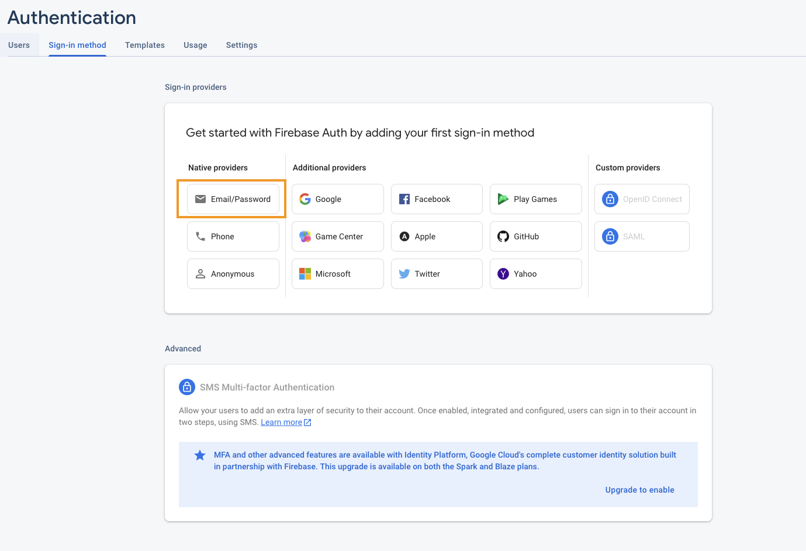
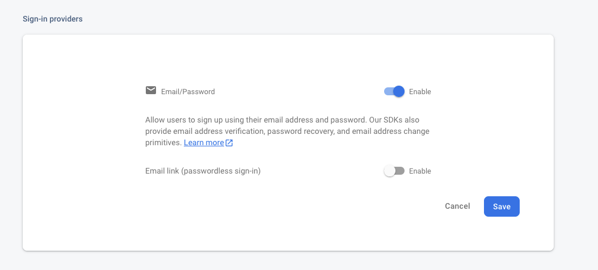
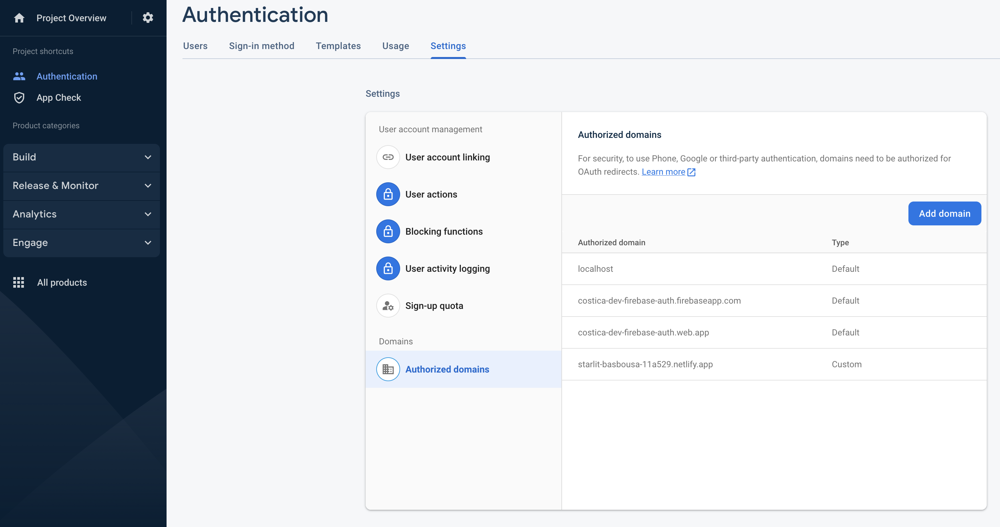
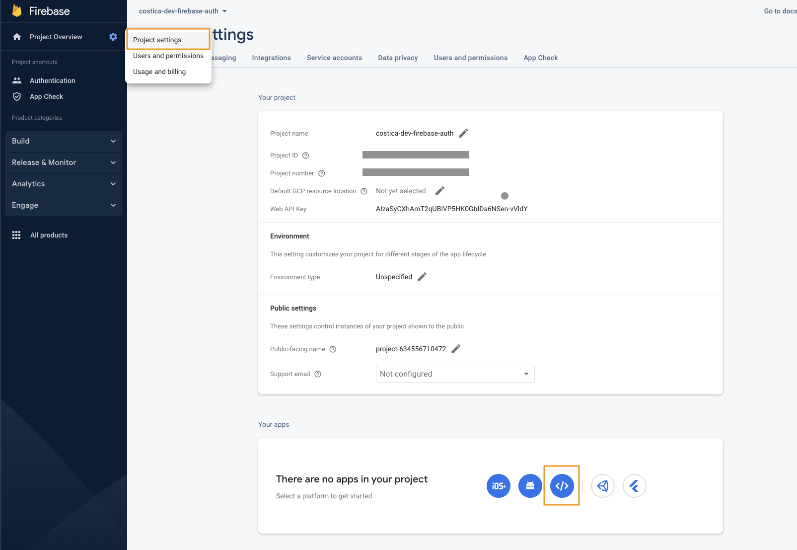

Just in case anyone else wants to piggybank on the system described [here](https://costica.dev/hacking-a-free-blogging-system-with-emails), here's a quick guide documenting the major setup steps and some _gotcha moments_. 

It is not meant as a complete follow along tutorial, and it assumes that you have some knowledge and understanding of how web generally works. 

## Prerequisites 

1. [Netlify](https://app.netlify.com/signup) account for hosting
2. [Google/Firebase](https://firebase.google.com) account for a hacky subscription mechanism 
3. [GoatCounter](https://www.goatcounter.com) account for analytics
4. [GitHub](https://github.com) account and repository for version control
5. [Hugo](https://gohugo.io) installed locally - for building the static files


## Do this, then do that 

##### 1. Repo setup
Have a local git repository up & running, synced with a publicly accessible one ([this](https://github.com/costicaaa/hugo-blog) is mine).

It can also be a source of inspiration for various settings and tweaks that I did to some of the Hugo / Hugo-theme that I use. Feel free to explore :) 

##### 2. [Optional] Hugo setup 


[Update](https://github.com/costicaaa/hugo-blog/blob/256cfb6f2bfc8c5cfc04e92c7816d0ce9bc87408/config.toml#L1) `config.toml` so that the `baseURL`'s value is `/`. This way, no code updates are necessary if you decide to change any DNS settings later. Btw, the last step was to complete the DNS setup, so I just followed this simple yet efficient [guide](https://dev.to/easybuoy/setting-up-domain-with-namecheap-netlify-1a4d). _(Thanks, Ezekiel!)_

No need to worry about not owning a domain name yourself, this free :sunglasses: guide is free-to-follow as well. We are not going to change the website name settings in `Netlify`; instead, we're just going to use whatever random URL they generate.    

##### 3. [Test] Manually upload to netlify
With a basic Hugo blog in place (for example, I'm using [this](https://github.com/costicaaa/hugo-blog/tree/5342958b77f409545fd0c8cb64f7e6e4abb4b52a)), we can generate the static HTML files and upload them just to test everything is alright and get the public URL for the site.

Generate the static files locally using: 
```js
hugo
```

Upload the files manually: the `public` directory - that's where `Hugo` generates the static website by default. Check out your live website and save the URL generated, we're going to use it in just a moment in the `GoatCounter` and `Firebase` setups. 

##### 4. Setup GoatCounter
For the GoatCounter setup, follow the [sign-up process](https://www.goatcounter.com/signup), using the URL generated earlier by `Netlify`.  Make sure you add the link to the `<script>` that `GoatCounter` sent via email. 

The `Maverick` theme customized the `Hugo partial` `head.html` and I don't really want to spend a lot of time figuring out how to extend it properly. 

An ugly hack, for now: I will copy the entire file and [add the link to the script inside](https://github.com/costicaaa/hugo-blog/commit/9ed8eab6a7f6a6d652c26f8f5d3d1b42b34ec8c1#diff-96dd75a968976edd5e03170268ed9085733f75c3fb24f992ae613c89e6de42dcR22).

##### 5. Setup Firebase
In the [Firebase Console](firebase.google.com/), create a new project. I'm naming mine `costica-dev-firebase-auth`. 

Uncheck Google Analytics. Click "Authentication" and select the `Email/Password` provider.



Then check the `Email/Password` and click `Save`.


Add the `domain name` (that you have set up in `Netlify`) in the `Settings/Authorized Domains` section.



Last, from the project settings, add a new app to your project: 
 

Select an app name, but don't check the `Firebase Hosting` option.

Copy the `firebaseConfig`, but don't bother with the rest of the settings. 
As per `Firebase`'s docs, although very obscure, the `9.15.0` version of the `firebase-app`  does not really work when you try to use it with `firebase-ui-auth` _and_ import it directly from a CDN. 
I lost some time on this with no luck - and I ended up "downgrading" to version `8.7.0`. 

On top of that, adding this in Hugo markdown is not a pleasure either. I won't rant here about it - what I ended up doing is creating two `Hugo shortcodes`: 
* One (`firebase_load_library`) to import the library and instantiate it: 



<script src="https://www.gstatic.com/firebasejs/8.7.0/firebase-app.js"></script>
<script >
  const firebaseConfig = {
    ....
  };
    const app = firebase.initializeApp(firebaseConfig);
</script>

<script src="https://www.gstatic.com/firebasejs/8.7.0/firebase-auth.js"></script>
<script src="https://www.gstatic.com/firebasejs/ui/6.0.1/firebase-ui-auth.js"></script>
<link type="text/css" rel="stylesheet" href="https://www.gstatic.com/firebasejs/ui/6.0.1/firebase-ui-auth.css" />

<script>
var ui = new firebaseui.auth.AuthUI(app.auth());
</script>


Yes, the order in which they are being loaded matters... so script cascading for the win. 

* Another (`firebase_subscribe`) to output the button that initializes the "subscription" (sign-up, actually) mechanism: 


<div id="firebaseui-auth-container">
<button id='show-firebase-ui'>Subscribe!</button>

<script>
var uiConfig = {
  callbacks: {
    signInSuccessWithAuthResult: function(authResult, redirectUrl) {
      alert('All good! Will (maybe) keep you updated!');
      return false;
    },
    uiShown: function() {
      document.getElementById('loader').style.display = 'none';
    }
  },
  // Will use popup for IDP Providers sign-in flow instead of the default, redirect.
  signInFlow: 'popup',
  signInOptions: [
    {
        provider: firebase.auth.EmailAuthProvider.PROVIDER_ID,
        requireDisplayName: false,
     },
  ],

  // Terms of service url.
  // tosUrl: '<your-tos-url>',
  // Privacy policy url.
  // privacyPolicyUrl: '<your-privacy-policy-url>'
};

document.getElementById("show-firebase-ui").onclick = function () {
    ui.start('#firebaseui-auth-container', uiConfig);
};

</script>
</div>



I tested this code in a previous PoC when I explored Hugo and validated the `Hugo` - `Netlify` - `Firebase` shenanigans. As a logical person, however, I have basically 0 confidence that my copy-paste works without any issues. So let's test it out.

First, I need to [create a new page](https://github.com/costicaaa/hugo-blog/commit/4a32eb3b5b8056681d53eefec48509e4b897db6b) that will contain the `Firebase` shortcodes, and with some explanation of how the subscription mechanism works.

Btw, if you want to test how this works, here's the [page](https://costica.dev/subscribe). Yes, this actually tricks you into making you subscribe :japanese_ogre:. 

##### 6. Pipeline setup

So, we have a working static site generator with a VCS (git), analytics, and subscription system. 

Up until this point, we generated the static HTML files manually, by calling `hugo`. Then manually uploaded the `public` directory to `netlify`. 

We're not apes. **We can do better.** 


As per the `Netlify` docs, go to https://github.com/apps/netlify and install their app, giving it access to the repository containing the blog. Then link the site created earlier with the `GitHub` repository that contains the blog. 

Luckily (or well done, `Netlify`!) the default settings work out of the box: build command - `hugo` and publish directory `public` are the default settings and they are pre-completed. 

Let's test it out with one more [commit](https://github.com/costicaaa/hugo-blog/commit/b78e98434852c4523ca35ee354100fdacca6823c)... aaaaand it seems like it does indeed work out of the box.

##### Pipeline caveats

However, I'm not entirely satisfied yet: 
1. What happens with the stale files in the `public` directory? Hugo doesn't do so by default, and its CLI option [doesn't always work](https://github.com/gohugoio/hugo/issues/8433#issuecomment-822988001). I assume it does a clean build as it would be simpler for `Netlify` to do so. But I couldn't find anything in their docs to confirm. 
2. What if I (somehow?!) manage to run out of build minutes? `Netlify` provides 300 per month - it is absurd that I would ever need more, but still a "minus" for the current solution. 
3. `Netlify`'s app behavior is to redeploy every single time I push a new commit to `GitHub` on the selected branch. While creating a new `deploy` branch that I can merge with `master` is an option, I would like something simpler: why wouldn't I deploy only when, say, the commit title starts with something like `[Article]`? 

Nonetheless, good enough for now. 

That's it. If you followed along, you should now have a publicly accessible blog that is being updated each time you push a commit into your GitHub repository.  

## Closing notes 

Hopefully, this provides a good-enough guide so that anyone, or future self, can test out the [free blogging system](https://costica.dev/posts/hacking-a-free-blogging-system-with-emails) I came up with.

That was it. Hope it helps. By-bye! 
