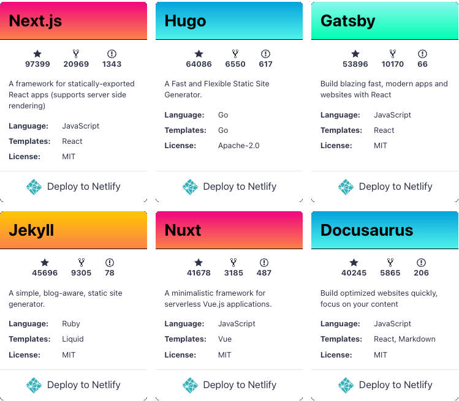




I managed to spin up a blogging system, publicly available over the internet, with email subscription capabilities for basically 0$.

This post will describe my thought process and **how** I decided what pieces to glue together.

In case you don't care about my twisty mind process, [here's| todo :: add link] a step-by-step tutorial, just in case anyone wants to copy this setup for their own website.



## Writing a blog... 

So I've decided to start this blog. I've already explained why [here]().

As usual, I started to overthink it: 

* What platform to use? 
* How much is it going to cost? 
* GDPR? 
* Where do I deploy? 
* How much time will I spend on it maintaining it versus writing actual articles? 
* Am I willing to incur an additional monthly cost just to keep this alive? 
* Is it worth it? 
* Maybe it's better if I don't do it... 

Ok, enough!
`</panic-mode>`

___

`<engineering-mode>` 

With that out of the way, let us use some logical questions to figure out both the problem, and, hopefully, the solution should follow suit: 

1. What do I need / want exactly?

2. How can I accomplish that? 

## Let's define the requirements

### What do I know for sure? 
> So, I will be creating a blog - and host it somewhere. I know for sure that I want to finally use my `.dev` domain, which I own for a couple of years now and it just lays unused because I couldn't bring myself to start publishing my experiments and thoughts.
> 
> As I already pay a yearly fee for the `Domain Name`, I don't want to add to that. Ideally, I will run be able to run the blog with 0 extra costs. 

For the rest of the story, we will consider the `Domain Name` cost as a necessary evil, but already accounted for, so we can ignore it and focus only on the "new" costs of running a blog. 

### List of features that I want 

> I **need** it to be as cheap as possible
> 
> I **need** to enjoy using it. If posting a 200 words article with 1 picture means that I need to gather mental strength to do it, it won't work in the long run. I also like writing Markdown, as it just makes sense for me.
> 
> I **would like** to see if people access it (analytics?)
> 
> I **would like** to have an RSS feed so people can subscribe and see when I post something new
> 
> I think **it would be cool** if I could give people the option to "subscribe" using their email and get notified via email when I post something new (yes, on top of RSS) 
> 
> I think **it would be cool** if I could have create a sense of community and to allow people to review, leave feedback, start a conversation, etc

Please note that these are already sorted out: 'need's are must-haves, 'would like' are priority #2, while the "would be cool" thingies won't really matter in the overall decision process. 

To sum it up, I want an easy-and-enjoyable-to-use-system (standards: :nerd: nerd), that is cheap to host and serve. If I can add some sort of analytics and an RSS feed, all the better. 

## How can I accomplish that?

### The Hosting problem

It all boils down to how I'm going to serve the content. 

> Options that immediately crossed my mind, not an exhaustive list, of course :)

#### Option 1: AWS Ecosystem

The first thing that comes to mind is to use a static site generator, have the HTML files of a functional blog, and upload everything to `s3`. Then some `CloudFront` configuration magic to make it serve the static website (which I have to upload to `s3` "manually") when the URL `costica.dev` is hit. 

:white_check_mark: `s3` is cheap afaik, so it shouldn't be a problem. Being in an AWS ecosystem, I could then use a combination of `HTML forms` and `lambdas` integrated with some sort of `storage` behind a `Gateway` to store the emails. Store where? In a database? Another `s3` bucket? 
It seems a bit complex, but totally doable. 

:exclamation: The big "no" for me, in this case, is that I expose myself to potentially _huge_ costs. Yes, there are `budgets` and `alerts` and different combinations available. But would I want to risk it? Hell no. 

Still, might be a valuable lesson and would make me go really in-depth into cost analysis and budgeting, thus learning something new. Worth considering if nothing better comes up. 

#### Option 2: Blogging platforms 
:x: I could use an already existing platform, like Wix, Medium, Weebly, etc. Although it might work, and have some things working out of the box, I don't think I will have the control I want over the layout and overall feel of the site.

:x: WYSIWYG editors are cool, but they usually end up disappointing me and making me hate my life. 

:x: Then there's the behemoth, WordPress, with enough plugins to support everything I want - but it also requires an up & running server all the time, with an actual database. Seems overkill for my needs, and, more importantly, goes against the main objective of keeping costs low. 

#### Option 3: Static hosting 

I've had a scratch inside my head for a long time about `fastly`, as it is something I hear about a lot in my day-to-day job, but that doesn't affect me at all. 
Between that and my bias towards `next`, `nuxt`, `nest.js`, I end up googling for `netlify` instead. :facepalm: 

:light_bulb: Surprise, surprise! Two minutes later, after a quick comb through their offerings, it looks like a no-brainer.

:white_check_mark: Relying on `netlify` to serve static content which I somehow upload (but it can also integrate with `github`) is the same as the S3 option which I first considered - WITHOUT the costs or the risks of running it in "the cloud".

#### Option 4: Fastly
Realizing my mistake, I looked a bit into `fastly` as well. 

:x: But the conclusion was that it looks more like a caching PaaS that relies on your site being hosted somewhere else... sounds pricey. No, thanks, back to `netlify`, as I am now biased and want to explore what it can do.

## Choosing a Static site generator 
Now I have my hosting & networking "architecture" figured out: I will rely on `netlify` to serve my website for free. 

The next step is to choose a Static Site Generator that supports the other things. Let's explore the options: https://jamstack.org/generators.

I'm kinda tired of `js`, so I'll skip `Next.js` just because I don't think I can put up with javascript bundling errors and configurations in my free time. I'll save that "fun" for work. 

The next ones on the https://jamstack.org/generators/ are `Hugo` and `Jekyll` (ignoring `Gatsby`, `Nuxt`, and `Docusaurus` for the same reason as `Next.js`). 

 
> :exclamation: It might seem like I'm being superficial and that I don't consider all the choices, some of them obviously more popular (by the number of github stars). However, before you try to prove me wrong, I am only adhering to the requirements (more specifically, the second requirement with priority #1: "I **need** to enjoy using it").
> 
> Yes, it is a subjective choice. Yes, I don't have arguments for it. Yes, it is my personal project, and yes, it is going to reflect my mood. Moving on.


Both `Hugo` and `Jekyll` seem pretty similar: customizable enough and pretty straightforward: install, write, generate, done! 

As I scroll through the themes of both `Hugo` and `Jekyll`, the `Hugo` - `Maverick` theme by Tran Duy Canh was eye-popping due to its simplicity. I'm sold.

A quick playground with the `Hugo` installer and their "getting started" tutorial gave me the confidence that `Hugo` feels right for the moment. RSS feed capabilities, check. 
I don't want to spend too much time on this, as I risk losing myself in the technical pieces and never getting to actually publishing a thing. 
`Hugo` it is, then!

## Analytics 
I got help here: a friend recommended http://goatcounter.com/ for the sole reason that it doesn't require a GDPR notice. It is also free and "self-hosted", I can get a dashboard and see how many times each page has been accessed. Check, check, check. Moving on. 

### [Nice to have] Email subscriptions - part 1: "subscribe" and "store"
Now, to the interesting part. I got most of my requirements covered by my ``Hugo`` - `Netlify` - `GoatCounter` choice.

Up until this point, everything is completely free. This is a refreshing win, as it gives me the energy to go forward with the project. No extra stress from another monthly payment, yay!

When I think of "subscribing" to a blog, there are two options: 
1. Use a (paid :fearful:) "platform" that offers a form and then use their dashboard to send emails to the people already subscribed  
2. Implement it myself: create an HTML form, have it submit a request, save the email in some storage (database, file, etc). Later, I should be able to iterate over the emails saved in my system and email each of the saved addresses.

I'm ignoring the first option because it seems like a costly one. At this point, I'm decided that either I'm going to find a way to do this for exactly 0$ and create a blog post about it, or going to postpone this requirement and reconsider it in the future.

#### Compute (backend)
The thing that worries me the most is the backend that would link the HTML form with the call to write to the storage, whatever that might be. Also, how do I protect myself from spammers? 
Costs wise this sounds like a serverless solution. Also, a serverless solution can be used for the "sending" of emails, too. 

And while looking into various serverless offerings, I found https://www.scaleway.com/en/pricing/?tags=available, which offers 1M function calls per month. That looks amazing, btw.

#### Storage
Now that we have "solved" the `compute` part, let's look into storage. I remembered reading about https://www.ilovefreesoftware.com/01/windows/internet/plugins/how-to-store-files-as-bookmarks-in-browser-and-sync-across-devices.html, and then it struck me. 
Yes, there are other free storage offerings in the cloud - found by a simple google search. 

:sunglasses: But I'm not going to use them.

#### Compute & Storage - `Firebase`

`Firebase` is a Google SDK used mainly for real-time database, authentication, analytics, etc and it was designed initially to help Android developers. But, naturally, it has grown and it has support for other platforms as well. 

Now, why do I think this is the magic bullet for my "email subscription" issue? It offers, along others, free "auth-as-a-service", using an email & password mechanism. I still don't have spam protection (wow, google!), but I can just ignore the unverified emails when I go through the list. 

So, when a user registers (completes the "`FirebaseForm`"), it will be stored directly in the `Firebase`'s storage - no compute / backend needed. 

### [Nice to have] Email subscriptions - part 2: "send" emails
The next thing I'm going to need is to get a list of all users "signed up" in my `Firebase` application and send them an email. 
Email servers (server, that sounds pricey already, no thanks) can be tricky to install and maintain. AWS' `SES` (Simple Email Service) doesn't have any free quota. 
A few google searches later, I find https://www.mailersend.com/ supporting sending up to 12k emails per month for the free tier. 

I don't expect to have anywhere near a 10th of that subscribers, and I'm not going to send an email more than once a month anyway. Good enough.

> :exclamation: Yes, it is not a complete solution and it requires a script that would crawl the users registered in `Firebase` and then call the `MailerSend API` for each of them. But it solves the issue at hand and I am quite happy with it. Moving on.

### [Nice to have] Conversation options
By the time I made the choices for the hosting, static site generator, and "subscription" system I realized I don't really want a "comments" section - or at least not for the MVP of this blog, anyways.

Maybe if enough people hit "subscribe" using their email, at some point I will reconsider it. 

But, let's be honest... most likely this blog will only serve as another line in my already longer-than-should-be CV.

> Later update: I got lucky here, as this comes out-of-the-box with the `Maverick` theme that I chose :facepalm:. It also uses the same mechanism I wanted to try out myself: embedding github comments. 

### Final solution overview 

Putting it all together: 
1. We have a guy (me) that writes something on his laptop, pushes the article to `github`  
2. `netlify` is integrated with `github`, learns about the update and deploys the new version 
3. New site version, containing the new article is now up. RSS feed is also updated 
4. Users come in and read. `GoatCounter` knows about that  
5. _[Optional]_ User subscribes to the emailing list. `Firebase` takes care of that
6. _[Sometimes]_ I decide to email the subscribers using `Firebase` and `MailerSend`



The one major sensible choice that is not ideal is using `Firebase` Auth as the "subscription" mechanism: 

1. :white_check_mark: It is free
2. :white_check_mark: I think it is a cool solution and allows me to write a nice article about it 
3. :x: The "subscribe" process needs to be documented - users might find it strange. Since this is a tech blog, and because I don't really care about marketing and conversion rates, not a real blocker
4. :x: The "unsubscribe" mechanism will only be done manually, requiring my intervention. Again, I should make sure I let users know how they can reach me so I can remove them from the list
5. :x: No sign-up spam protection 
6. :warning: it is a Google product, I know from experience that docs are gonna suck big time

Ideal? No. Good enough for starters? Yes, as it allows me to move on with this without being stuck in an "I am not doing it because of costs or fear of..." kind-of situation. 

The most important part, however: **it does work**. Proof to that, you're reading this blog right now, with 0 hosting fees, and it is implemented exactly as described. 

The next step would be to reduce the amount of work needed by my laptop when I want to send emails. I could leverage `scaleway` into running some functions for that. We'll see. 

### Takeaways

1. While this is not a pleasant task, rather a stressful one (see `<panic mode>`), I managed to get it done by following the rule of thumb of "deliver an MVP and build on top of it".

2. Defining what's important and what's not usually solves half of the problem: you get to tackle the must-haves first, and figure out the ones that are optional later.

3. Break the problem into small pieces and tackle them one by one (hosting, generator site, subscription).

4. Don't take anything for granted. I was really surprised to find out about the `Firebase`'s lack of sign-up protection against spammers.
