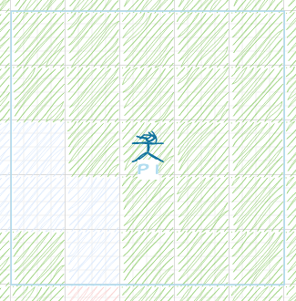

Time for me to get back to work and get to the architecting & coding of a project I've been thinking about for a long time.

And to have some accountability, I will be publicly documenting this whole process, and, who-knows, maybe some people will find it useful, or at least learn from my experience.

Considering popular frameworks like the open-source Godot or the top-dog Unity, multiplayer in games is usually handled with a client (player) serving as the server.
On top of that, the tutorials I've seen are full of combined logic of client/server decisions in the same file.

For me, that's a clear no-go.

**It might be just me and my superficial understanding of the gaming world.**

But this doesn't stop me from learning something new while trying to prove my point, even if that means contradicting my initial assumptions in the end.

## The MVP

So here's my idea: what if we create a "platform" for multiplayer games?

What if we can bring "web world" best practices, and create a skeleton/platform for multiplayer games?

It should be possible, as there are some major components that seem to fit naturally in this kind of challenge:

### Social / "pre-game" functionality
* auth mechanism
* "friends" functionality
* matchmaking

These components are boring, and will not be the main focus. But at the same time, they are rather necessary if we want to ever release this as a "get started in 5 minutes and create
your own multiplayer game" type of tutorial.

### Server logic
* we will have the game-server act as the ultimate source of truth
* it will be able to validate all clients' actions and discard any illegal ones, thus providing security and anti-hacking protection natively
* it can stream back to each client only the state of the game it has access to, making it impossible to "peek" into other users' locations, for example

### Clients (frontend) logic
* by client we mean any game engine or rendering option available; it should not matter what platform we choose or how the client is implemented, as long as it can communicate with the server
  via one of the supported protocols
* at each frame, the clients should re-render the screen given the state they just received from the server
* when a client performs any action, that action will be sent to the server for validation and propagation to the other players

## Surrounding Ecosystem
This is the general idea and basically the MVP of the project. However, _if this does work_, there are some cool things that we can build upon this concept:

## Automating tests for the gaming industry
* for server testing, we can emit events (player actions) and check that the output of the state emitted and transmitted for each client is the expected one
* for client testing, we can get state updates and just check the "render engine" does its job properly given a new "state" of what is currently happening in the game

## Game history & replay mode
Since all the game state is sent to the server and back for each of the clients, if we store all the events in a game, nothing is stopping us from replaying them and being able to "watch" a past game:
* a simple "client" view where you see exactly what a player saw during a game
* a "global" game replay where you can see the full state of the game from a godly perspective

## Cost & experience optimizations
* since each "server" will handle some games (limits TBD), ideally we will scale to 0 while no one is playing a game; when a game needs a server, (again, ideally) we will calculate a server location that provides the best ping for the majority of the players in that game.

## Let's have a look
I know, I know, I've written a lot, but everything is kind-of abstract. So let's take a real example and sketch this whole idea of mine out.

Just for brevity, and because this is a rather huge project, the focus will be on 2D games.
I foresee no issue (take this with a grain of salt) in extending this for real MOBAs and MMORPGs but in that case, the work required to create the client/frontend skyrockets.

## Demo

So let's start with a 2D, battle-royale kind-of game. In a 15x15 map, 2 to 4 players fight each other in a "last-man-standing" battle.

Each player's viewpoint will be a 5x5 grid, with the character somewhat in the center of the screen. Each time the player moves, a "move" event is emitted to the server, which processes the update and then sends back to the client the new state.
The new state here means what the _surroundings_ of the player should look like.

If a player doesn't move, the server will just keep sending the same _surroundings_' data again and again.

Using this rather simple mechanism, the client will receive real-time updates if a new player is now _close_, in vision range.

So, when a game starts and there are, say, 2 players, this is the initial state of the game, as seen by the server:

However, the first player will only see its surroundings:

Player 1 view: 

Likewise for player 2:

Player 2 view: 

### Step-by-step simulation

And let's do a "3-step simulation":

* Player 1 is not moving
* Player 2 is clicking the "left arrow" 3 times

#### State after one P2 left movement
After one left movement, Player 1 and Player 2 viewpoints will intersect, but they still won't be able to see each other.

* Naturally, player 2 view of the environment now changes, he no longer sees the rightmost row of the environment he could see before moving.
  Instead, the player gets another row of surroundings on the left.

* Player 1 surroundings remain unchanged.
  

#### State after two P2 left movements
* After the 2nd Left movement, same as for step 1, nothing changes for player 1
* Player 2 state of surroundings is again updated

#### State after three P2 left movements
After the 3rd left movement, however, the two players can now see each other.

* Player 1 should start to notice that there's a player in his/hers bottom-right view range, while all the other surroundings remain unchanged

Player 1 view: 

* For player 2, update surroundings + display player 1 in the top right

Player 2 view: 

## Outro
Yes, this is not a game yet. No interactions, no weapons, no nothing. This was just the basic explanation of how I expect this to work. We will build upon this later.

Actually, in the next article we will be defining project steps and the main architectural concerns we will want to cover, discussing trade-offs and prioritization of features.

So, until next time, by-bye! 
