## Intro

This article is part of the "Continuous Delivery: HTML to Kubernetes".

While I can't wait to get into the nitty gritty details of distributed systems, I found myself in an unpleasant position: I think its best if I start by writing about _frontend_.

That's because **web apps** are _the_ standard nowadays. And it doesn't matter how many 3000 microservices you have in your ArgoCD-Kubernetes clusters deployed in multiple clouds; those are all irrelevant if users can't or won't use your product.

## Why in a browser

To say delivering software in the browser has grown in popularity would not serve it justice. Heck, it is nowadays more or less the default for everything. [Adobe's moving frigging Photoshop in the web](https://web.dev/ps-on-the-web).

Ok, that's an extreme example. Nonetheless, web apps have grown in popularity even if we still have the joke about JS' world changing weekly. _Despite_ Javascript's ecosystem state of the art, we could say.

So the default is now to deliver software over the internet, piggy-banking on the cross-platform-runs-everything-silver-bullet aka `browser`.

## With great power comes great complexity

But what does that mean, exactly?

* What's the difference between a "simple site" like Wikipedia and a full-blown web app that can be "installed" on your phone and even send you notifications?
* Or apps that _you can interact with_ while you don't have an active internet connection?
* How does it differ when it is server-side-rendered or client-side-rendered?
* Is it plain, static html? Or was it generated by a server and just returned?
* Does the browser flicker when you change the page inside the same website?
* Does it behave the same when you access the same URL from inside the web app versus when you hit enter in the browser's URL bar?
* We can do PWA with SSR... just do it, right? Right?!

A lot of questions, a lot of options. Here's my mental model - it could serve as a "WebApps - associated complexity & when-to-use cheatsheet".

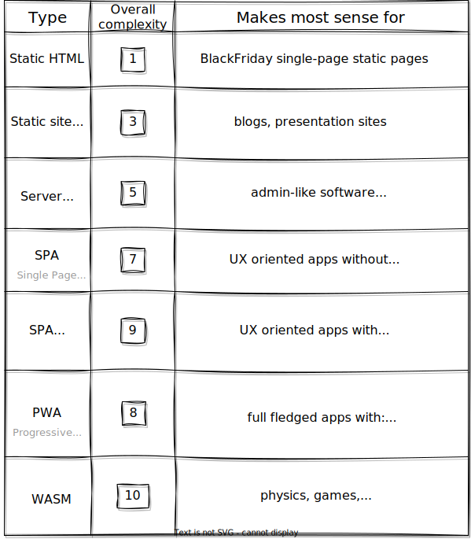

The "overall complexity" that you saw in the [table](https://costica.dev/posts/types-of-web-apps-wip/images/table3table3.svg) is the sum of how complex I think it is to build, maintain, evolve, test and deliver such an app.
Not only for the first 3 or 6 months - but in time:
* when requirements change
* when evergreen browsers get updates
* when libraries stop working with the evergreen browsers
* when you need to update said libraries
* when security patches
* when X
* when Y
* when...

The list can go on.

I think there's no reason (except for CV inflation, maybe) to create a PWA with offline capabilities for an admin interface that needs real-time data anyway. And that's just one example.

While there are different pros and cons for each of the types of apps, I think it is worth looking into how complex delivering an app is versus what it can do. Versus what it **should** do.

> Please note that my list builds upon itself: the simplest "web app" is a static HTML file, while the most complex is a full-fledged PWA.
>> WASM is a beast on its own - not detailed here.

### Static HTML

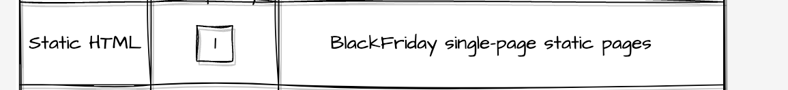

The first one on my list is the classic `static HTML`. It is how the web started: a simple `html` file that is served by a server when a user hits a `URL`.

The process is quite simple:
1. User enters `site.com` in his/hers URL bar inside a browser. The browser (after some `DNS` fun) will make a request to the server.
2. Server receives the request, handles it, and returns a response: the `html` file.
3. Browser receives the `html` file, maybe even requests others (`css`, `js`) that were referenced in the initial file. It reads the whole file(s) and displays the contents.
4. User sees the information in the browser. Simple, elegant, beautiful.

Behind the scenes, developers working to write & deliver the files to a server looks like this:

The dev process is simple too: just write your `html`, `css`, `js` files, "link" them together and then deploy to your server. No fancy IDEs are needed, and no compiling is necessary.

✅ **Pros**: easy to develop, no tooling needed, loads fast, compatible with all browsers
> ⚠️ I'm considering `js` to be light or non-existent. For js-intensive sites, please see my definition of **SPA**.

❌ **Cons**: no code re-usability (for things like header, footer, etc), user agnostic (displays the same data for everyone).
> ❗ Not that cross-browser-compatible if you want the js & css to work the same everywhere :)

### Static site generators

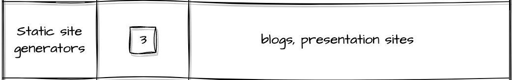

For things like code re-usability where the plain `static HTML` runs short, the static site generators come in and save the day.

❗The caveat: an extra build step is necessary for the developers before being able to deliver the site.

While request handling looks the same as for the `static HTML`:

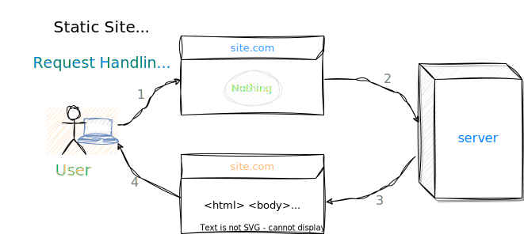

The dev process requires an extra step:

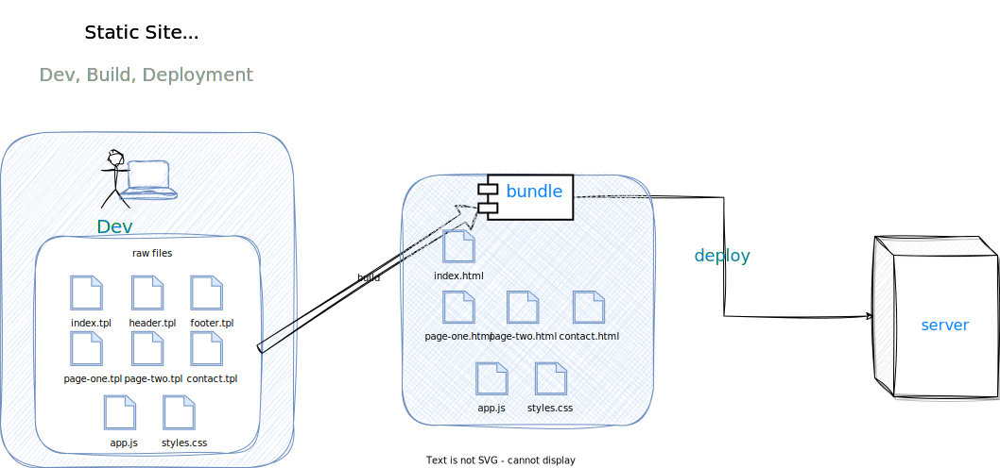

While this is not the most complex scenario, it is still worth noting that now a simple refresh of the browser would not allow the developer to see the final result. Not without a local server with _hot-reload_ or by running the build manually.

✅ **Pros**: loads fast, and is scalable in terms of re-usability for static content workloads.

❌ **Cons**: user agnostic, requires an extra _build_ step (compared with the `static html`) before the site can be deployed.

### Server-generated HTML

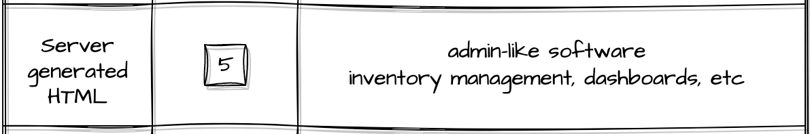

What about sites that need authentication? And to display the logged-in user's information?

Pure `static html` or `static site generators` are not going to cut it anymore.

We are now moving to the "real-world" web functionalities, where `server` is no longer just a dumb _content delivery_ mechanism.
`Server` is now going to refer to a full-fledged machine, that is also capable of **processing** requests.

<iframe frameborder="0" style="width:100%;height:672px;" src="https://viewer.diagrams.net/?highlight=0000ff&edit=_blank&nav=1&title=ServerGeneratedHTML.drawio#R7V1Zk5u4Fv4t98GP7WIxGD%2F25nTdSjJdk565macpGWRMGiMH5F7m148kJIwW3NiGbjvX7aoEhCy0fOfT0TlH8sC9Xr58ysFq8QVFMB04VvQycG8GjhPYAfmXJryWCY4%2FGZUpcZ5EZZq9SfiW%2FAN5osVT10kECykjRijFyUpODFGWwRBLaSDP0bOcbY5S%2Ba0rEEMt4VsIUj31f0mEF7xdnrVJv4NJvBBvti3%2BZAbCxzhH64y%2Fb%2BC4U%2FZXPl4CURbPXyxAhJ5rSe7twL3OEcLl1fLlGqa0b0W3ld%2BbNjyt6p3DDLf5wvfU%2B929jv%2BZPv6YgOeHP5K7z39e8FKeQLqGohl%2BSsq7miNSrOPH9NoWiaT0ejpvGH4VnbnAy5Rc2eQZ6xkY8btwnT%2BxG4vcFGidh%2FAe5skSYph%2FW4EwyWL%2BEIM8hrjhYUGeYo4hn9zDLKrdLUC4WOfwE1iRhBFvwxQsk5SC8zIPFwkmECpInW%2FAmgwpzHkmXohNS8nQbUQQwhtFK49yvEAxyoBoG%2Bnx%2FPU7rxO7%2BYveDD1vLBJuXuqPb17rd1XjRKsEMujNE8xxQuB5mSZxRtKWSRTRmrB6XqMU5ayr3cCiH1F%2F1qPkwQJjIjeO516SfwgU6D80QzGMEYpTCFZJMQzRkj0IC5Z1Oi%2B7iFxKneQ5V7VuKh4hDhf14ZwmGJdDQ5N%2BJHHMesypgFHHJgdaISraCEguLSUMtmR0ynwwksSbQ%2F8TRKSDc9ImixOVNbTs0bj8DqcqmxNVDlOAkyeZDwCnlbgqqSr8HiVUBETJ9sSSiiVNsJyhJxfDIV9%2Bsy6kSmHOSCvMteSiuICoRV3mOXitZVvRDEVztR1Pe5MtEQi5KMs0f%2F9C7syRXEk0nxcQK8XVxmWTxFhqB8YaaYw1%2FnVoqH8x3oPtJHqCLwn%2BXrsWxMdvN7RHb15rNyrpNdHZO%2FGM25JmBB%2B9yTMHsshIFfyJ5w6d%2FUjEc5pEu3cSCUbW1qo5rvoFfwvpdMUZY40zCkiAlWvEQaC%2Bopfhekan3GcqRFT0adpzTgX6qsYts5JbPs%2BqhEol%2FG2N0yQTIhWB%2FPE3yiCYScTQ8uREh6UyWcM5eoRCLiI4B%2BtKG9tZk1FEzLLGVDsl6Uma6q%2BIcxAlcPONDNH6b6TfPlJdQ1WYMFptYwaaHb4MtomyEKOxKka2QO%2FzZqVQCe6itkpwJ4q81QlAmhF3hXJgUNgVEFMErpRhJsM%2Fn0M%2FDDWMiWHuhHa1zq3WbWAmqmdt7XTbsYe%2Bq1Ch72ndPjH0ut9Xp0%2F263TRtT3091Zs7D8IH9XBYnra1sNsLoL57ROkU5JBNYlAsaiUuxpNy%2F1PJMEPAzib6xISARjMqYSkYAbTe1QkOEGUUkKYlcQkuOazkmGGMCZE10RGgN9V5aByeriubBp8Gcgmn%2BVLTE0twycIwXKYglVZyKmolU4HWtxWKWxN4IpKZess4pm4uzeQ68YWAhMyME1ayHqZXoYYHQC8mhQYIXdSmFLUmen0is7Q70uljVhzdM3AfVcGdQwMWrfk1QDm%2F1wj8eCiYD1MBs%2By%2FdUL6yHxnE0cor83ie6E%2FdWTSnPg7%2FDnGhb0XXcgi1I6ArwKs3xjMmxnSSTdjmUAayTaaCnLIWkUn%2BsoQPgqhpTrXQ28G1rWGqOCa8pNM7RhJq8r2JNdpMWkhfekcTUidOJripVtB%2FZw5GjItU067ag36LoadL%2Bx5dlFDDOYA0wmdQKphy%2BfW6Ck7VC2R5NpEbixKp0ci7437Hx1EUVEwIQ5x%2FN0zI17w5xuRnQ1dMGaZWxjFavZyxQcSF2rgULqWEPHb97wGdHJuxwNiPErHz5KWjLYhTFOXJfGOOcNY1yD88K2vcEezosjxbq9zcbYCOu33RPclPS2e4KX2J3d8DC8exre%2FdPFu2x8HrfEuz0kc6%2BMeW9inzHfGebd44L8PgD%2FOEgPvTqotyL6FOGnmFqgHXlwrOlrdHHhj13gD2q%2BOtnjPrRsWYYnk73mLebDu6QBJIOapY6kTROKM%2F7FSMlBUmrPK4uTzW%2FuASZvyFiKYx3oCW8tdn7Xcmf23YwtW10%2BqMvZBrdSV34cW3fk7LzItbRFbrkCjQBcoozkSJMCw4wtXq05QSXtN7aupQJGcoMlM%2BktSy8DeYjXOc9OFp4rlBWw2H%2Fd%2B4bL6TB%2BOlLicPYjiE4WJ5qnNNANOVXIl2QmVF2q3U1cuo9Ht4Yfva52pFiz%2FfpsckGmE1eeTlzS%2Fdunk6YpzjjN7M%2F%2FTkv6F6TYNhKKtpkqwuxL%2B04J%2Fcf52JPTw3y1Hh9azlhao9juXmvytzSbYxWypqAfSWE6QDTslrIhiPNIliSO7uYcnS7K5SWL3RLgG0z%2FJUH6pAAujP%2FGALbdFhZhCooiCR8WSSatL95JQtzJ7rOH7R0YOdv%2F7OHovtYIUb3cwgtIaxDiNaClrHIUQjIATH9H8ypDLnxZZ%2F2cL%2BwbYiWaoys60M%2FHepDyeDRsFw1EUKpGYXdH5Lq3lTQqmScMYoQyF6TNSQiYl77aAHJGUReYCPR4e8OazYSI0aQvOOgezAhgMAMFPI9%2B76NviOt539HXfYkFmcdpl8MlSFJycV2ajhSb0BK80jDj6RkjPWNk4n00RHT3W4FRzmaLgryDmh1RXJxR0CcKgmDywSg4LY%2BUZMBo62OV7RfjEzVgGNZ3fG9vp%2Bs7eSHflXHkREMUHN25k2TzJCODRXsCFcksScnNmSX7ZUnHa7nA6o8ngz148pSNYgprnihp2l2SWNv9mUL5PhYSO2GvxRm63UC3reNOYPxIoOvqi9AzdP%2FPoDtqC13vuKBrn6G7DboSPI4ZxwdA12sL3bbhEu8EXd2ToGF5cypBnr5e5SB8pC1863QC%2BeSTeZqs7vi1ur01L3X6xk2G1VYYsWkmhfN6fm3LzHnFtW0flm7BHvuGJZdtm6LOrL6izlzdh4ERBintIgutKBSow9RsyY7gilu8mb9L8bHq%2BZPlKoVL0oelh4wFUjbHTNYs5qwnHGsGyy4gYsKKMn6dPa%2BHZ0pBn2VmkfcuqZpWRnayx38UMP8KqHmWp6qhnLNaVTebJjUBPvrNjK31m8Ml%2Bx2EtgMhJTKp%2BhDGJrtIFQFdF9LeDv9wdU%2FTebI43smi5V6I6%2Btbj1mWcyT48GbS0WTjB6p5b6T7ygMDhvvb7usafGGUxGn0RFQ2rijDJlg4DpCIW5zbtGHbM9WeONX6AhACor4pBH9sVIb6gqivQfRrnGQvpY5wSViUKjj0%2BgEtQ4DLazJcitLSYjuK3bAdRdFoDiqpLCZKng4qh22FKUMWaGDDDEYRk1chkl3Xl4wcq3K3rYAvK1Swes9ehaZqft%2BmYVKMYAqyeE3PFN7VC6Wc7jMDRRIOwxSto78JGZH%2F8S87Gdr6pNdif08jTzOV5Ko6a08h29osesG2tJfZUR7BXD2EqzzV84GZbKjbqZtz4ybBUKE0m3TO0A00WnPsyTDQic0eEV2zN4uD7mf9iiI4%2FGGIUzpA0O7v7jst77%2FgCXRa4CfUaXGU%2FZt08bPMM8luETPclcwrkm3JXGyi6maW6IASAms0tDVO2OEgFLs%2FA6S%2B29DTgHw61vTBPieh0JMhlG2AQbVP8Bc4GOLot6uIXSjdbXZ8J%2Bu9fjLoAyRrWcBilmAWJ5xBjNG%2Fj2X8J5EN%2Bh5cWSuLen6RfUZ%2F6oItfQ3GR4sgZEXaO0vLvSvlNvRyxtJKYmJjLOYcV2Xc6zKfzx3Dybl0RvNnvtfRXvSxZ6lqY2BYCQeToWl%2B6G03urAD1SB%2Bv447VZ3YaYHwCuTdaqC3XKNVBe%2FhOYmVBx3rfeel4C5qYQvxOlwtZGLNzdri%2Bk8xHnVlkekMXah86oH%2B47HBrGVyH2inquwjy4HzeZ0vfy4%2BffGW0fy3m7%2FDi0fjr%2F0o0C3PsW7d%2FJ3P93bVEzcCU7eYLNJ2f65PQ7fUrE2yAYofNGM8GHU6DSzL0jmiIHJRik7DITBvWrwOr8MOR9KYa9Owtl0v02lOfaRv%2BphO5ZhMdlaDFv3PDxsWKKU4Jk0S%2BHQtA0uVZzAfeODmVkF%2Bm40%2BTqp0G3ob%2BN7c0o8RvjXHPFdhJae84rufoejV7LevS4DypVWjp1%2BWEEvEC7ADvP9T01kObxt5WUM1tlSc6vGGBuu5TD33i5zILMR29xOZ6V8TQR3bz510zhDVT%2FlI87JriHXo60BzYwOcY9BVVJOd8XSw96VVU7%2BclZWzslIjNNedTFhAyXEoK06DPB6TsqLHpMjwLXH1FeFF7VcN3poxyXuTVfGLg%2B2WfQb6qt6jH20qp9%2Fw6Weg%2FHpP08%2BPfSgghUdXngdG%2BtxoCk8Z7X76DLnd%2FCBweRbS5leX3dt%2FAQ%3D%3D"></iframe>

From a user perspective, it is exactly the same process as for static websites. However, a more complete description of what's actually happening is this:

1. User enters `site.com` in his/hers URL bar inside a browser. The browser (after some `DNS` fun) will make a request to the server.
2. The `server`, listening for connections, receives a new request.
3. [Optional] Depending on the application's logic, it might call other services: database, emails, authentication, etc.
4. The server passes the required information to the `templating engine`, which transforms the `templates` (defined by the devs) + `variables` ("passed in" by the `server`) => into an `html` file.
5. Browser receives the `html` file, maybe even requests others (`css`, `js`) that were referenced in the initial file. It reads the whole file(s) and displays the contents.
6. User sees the information in the browser, not knowing anything of what happened under the hood.

A lot more powerful than the static websites - but also more costly.
It requires way more resources than a simple content-delivery-only server.
It is also more expensive in terms of _dev costs_: while `static html` and even `static site generators`'s only requirement is to understand `html`, the "knowledge bar" is now higher.

<iframe frameborder="0" style="width:100%;height:731px;" src="https://viewer.diagrams.net/?highlight=0000ff&nav=1&title=ServerGeneratedHTML.drawio#R7V1Ze6M4Fv01eQwfYucxS7lqplPT1V9qZqqe6sMg23QwogFn6V%2FfEqtAYnFiHBzLD4kRmEU65557ryR0od5snz%2FHTrT5ijwYXCiy93yh3l4oimHr%2BC8peMkLFEOR85J17Ht5GagL7v2%2FYVFYHrbzPZg0DkwRClI%2Faha6KAyhmzbKnDhGT83DVihoXjVy1pApuHedgC39v%2B%2Blm7zU0uW6%2FAv015vyykAu9iwd92Edo11YXO9CURfZJ9%2B9dcpzFccnG8dDT1SR%2BulCvYkRSvNv2%2BcbGJC6Last%2F92iY2913zEM0zE%2FuDHuH%2F%2B7vd%2BBK%2FhHEt%2Bm6Gv467I4y6MT7Ir6SGD8COPiltOXsprw3Ufkq7tb4n%2FXTxs%2FhfeR45KyJ4wMXLZJtwHeAvjrklQL9O6WVUFVWb%2Fv0sAPYVHuOfHD7%2Fg0fkrwI0uy3ixUslJyZJLG6AHeoADFuMyDK2cX4Oe%2BXqEwXThbPyAnuIpdcmNumuC7v3V2uNnws%2BQHFdADVrFdngq3myybpN1wuR8E7CXWseP5sP5FiMj9X1cNCsoroF2cVcgmTTF6FV29wn9wg5A%2F5IBEWiO0DqAT%2BYnkom22w02yQxer%2FCHw18Zj6Mo19SDJA0zdTXFNd4ebauGnqR%2Bui6I%2F%2FfU6azJccdcsQsrmhnEKn6miAjGfIdrCNMY3IZd7VbWAb8HvS6CTTVLyVNMFlEdtaKqYRaFTUHRdnb6GKf5SIHUP1CoMau8z1F6uYQhjJ4Ue3vvl%2B9c7Bsb4sdMmVJu4KpqWxkFR5AT%2BOiQEwJWZNQWpRB%2Fbkatix9b3vKCLG3FOCIJmcnnH3exi%2BJnsutX2AvH0EKO4osjvArk24qyyhEKcouss4iYDnMoA7hY%2BXij4ZPL1zseKk329hVGAXrbk0YdxNx5PMUz8v51ldirSIBHycTuT8%2BrXF%2FotOdcuRUlh3vaANG0V7X1QSJlOO%2FvsC5PAWcLgutKE1n3le1Hswbi15yDwsiSgthBm2hyEKRybph0AYX84P74n0f%2FCS%2Bfpt38%2F3yUv%2F%2FplXGqsEjMgIpUVja%2BCymcqsNPwO3hVY7aJZ3CqRQecatHVA9TLNz%2B0%2F%2FrP0282%2BLWFX26%2Fe7%2B%2BfOE4KEy11LYVDHsmDZgydrgBUg6I52ynaYJjYnoOtFYuYw3wHsO14HLFZVM%2FNIc5dhSccG%2FSBAwuoIcd%2FWITxekGrVHoBJ%2Fq0ryFvYMgo77AHUJRafNgmr4UbURsdBOK8NlPfxQ2nXz%2FSX2%2FJfWsV1sv1K5vMPZxnREMZGUzxSTjZ9f%2BdJI6cXpFYjfKmSZlC580ev6koVce4QZOkvhuXlgcAvaHb1I%2BfteBamFa8J2sYd8ZC%2FUg%2BOplQwwDJ%2FUfm4EmD%2FnZT%2FHjOi%2FUAYXM12f%2BRgpqa620%2FCTQCv9ah2ta3%2BH4S379moHVg7yelGWNUtY7QNjFIfkC%2BAgDFOXOkvzhg07jjIPOt4pKuddqAlhRJFxUfwyNDUt5LhwA%2BkQapLJhwlgfbr862tuzAy3u24Yk49C%2B%2BrARvaJabNVh30ECRv0xtYniLW1sRXaGEhRXufRqOo3dEYeTRHnWceU%2Fk8Ovcc2nDrYlpfyObMsKG69vy7LxWk2g6GMb7wC457aWzrSWj%2Bv2WUqjgGm22QfCe7lUHN%2FmzfHFEQz6WzHbaWcUuwFOwzIadse0JNuizA6LXINjsA8RM3Bxawxbmao5K7zB%2BNMjzGEHaD2WMx8i2dRJvq4cIwnOjKWhG2zQtlqtFNctDdI3jOXUR1xy3LUOWKI0xVBg2ZOSaOQa5Q7QTdWJIvOYV%2Fpb2%2Bc16eyR0GrluxBjLHRhhHHnIXdHPLZfy8AJH8YY334GkKcvI7QEBb53UlE3OIT576SSakp6gzyaItk65e9oLHtUVVIbH4PDJiz9jWMmIpfJkGsDHayvQhXOThUsW9Jps2%2FuKQrmMUXBEqIgRGGuogBkRZK7qXRiEmEzVFshlAqJOEOJAHovsGemEWU6RYiEEIkZioSh9flbJyYSgO0BJmPyLrEBFjpxdjqhyBKNbBVoDWyTwR0ynYFisW0dVSjYDjAhFEIoZiIUTIoJyGDIz5qVNLD9bZk0pE9ISMPZSYOlSxpt%2Bu15K8OILk6hDEIZZplnOjWdYDuos158NxUycXYyMZBpGqETx001iU5qoRPz1Yn%2BVNOp6QTbZ%2B1EkfRnIiTirCTCsCSzGRgrsi5Z9LgmBsf6UUXh%2FTqpLWWpGhxR8HRoeZoQBSEKiqlIdk8gbtiNFK7GcmlWmsB2Umckw42QCF04L10ASi%2Byh0XiqJGD8n6d1EIkhEgMTsNupmvNVkfeaalESa0G14wMIkv8ZZ3NOHGeLuqZbvlOfLFq%2FwUhbOs3GEEwGTo4LgtTuI0CJ4V4Z%2FFDcpCzJQzJ%2F2bsdzCB6kPOTcFogzbI7z30jiZ7MdeXw%2FX8icsXDSkfQBQ1%2FuBeehYeLzY6xIsU%2BFQUbwx4zRsDqmnYb3xZwB4A2mc%2BW9VT3ZzRNtXbBBTW62dA9D4zOasZUo2pnGyNaZqk2%2F3iWJ3q8C8zGVt7JzN9swLE6xuwgeeW0dR44J5qmjLbG%2BY5cIvCS%2FwkK399fi7BBwpqO3HaE9RKMhW16pbVsC%2BmLFm0fWYsjT1RTMt9vPfrDLMNU3U4IS0EOKg1RUh7El7PPiHt%2FkxiZ2wCyaSt%2FFxCWO7zsh5PDP%2FawSS9xDY8QmEChTCclzB0uJBjhaF6Ue5RlOEdp%2BSoQFN1jZUGQzMNS0jDCUlD6w1Nq%2BwztWTIrHEvYztgYo7VO5XZJEH5FGQzL9iGb3CdYQhnyBYCck4CYkvApEJcuQVuXZUsza4%2F7xtZvONMnSrF1vUGT6EfJ6If0%2FlipinZCkUWTqBB%2BWLzjjREhv5dM%2FR7oK%2BAFzbUNPYUU2HwdfwMfXePq%2Bc%2F1t2kh%2BuE5XS48s9QlXFuhCoqb0JOfC%2Frst2FLrHf2BCnL11nOTcHSvTWHlZI9N7x2pcj%2BuKANlFvLv8J2Smex3LLxPQH4ZYNTpPDbhmgpLGZIjup%2FK%2FCdtoW44lII5%2Bd8Jx35C5Lskz1CTajjcHM71TDXPlPx3ZnH0shROL3oyjE0RO%2FuXJ8kMSvwnbLe07qLB3RZ3huwtE%2FHXQw5TvV67%2F5j8dO9xTKIZRj7sqRpYI%2FinKwE1nh1vGDM5yXcNa6Qab79Iw1GRaOqaZf88e42ww8h9eaa64AO7%2FF5sxqi1Q6WSTptJabAxeMMV4srvXssRoLzhXLyX3f%2BGG5i1pUjl13rjhwJmvPlT7K4Rafe9tIf%2FmEqSDpXWRocCHbCHFt%2FaA3ftIbFIOyTYpCZFtw6MAc6p35Nbx%2B47w4xPZkZotLtyORwjffbYMrN0VviAUoKnDDgtNanbxnhcbxiy3OY4VDtbXCoWZLxsAKhyrH75lsWteIvrgTHhXFxBNccrRD5EcIna0UOFF%2BkplSpXf90XmAX5Ob4NeHwc%2FLFk23QDsbqnowCtDL6TlAcwVpe8XoBkhftWY01%2B8o%2Fb%2Fy%2B8%2BGL8j3%2F1jYj%2FVKyhwo7ZXw3zQ00ikp%2BCJLwCjs77TrTAOlxcxLoBdX7lprmvMTzehZb7o%2BQXlTaLVKcG21SbvfmtR8L3HE5GQx%2BpAZfUgrb79Wl6bPjVGSXG6crHK6CbTHC74N0i1df0AblZYucd4dYOiSpbJCoRhTLYersv0KS4yngO0Mq5wJ5O0yYSh9kACuMreUrEceru%2ByrbxNBrOeuR%2FyyoFzXPf%2FNSl7%2Fsi5GQK9V3T2Wpn9AAi3dcbScjHNnVqnmZKqAE2xdDP%2FO5UjpJ%2Bex8NP%2BZR79kr5kFeD0lmfZtLnQ2R33uhe8TJeo%2Fyn3tkCg1kd%2FeBZHb5zY5iMb9PuH8vvtfjdm1wYPgON82agIhg4EQPflld9Rwaa4xi4d%2BxTdjVWVwKgEcew98ZEPvv%2Fonwabqx0KCNSNlbv6JfCP82yzUNh0AiPs4B19%2BuaPmQsxaM918XE5Tc3n%2FSs%2FADepGExwLLZMei8JJo1VRJNZ1PIy50feJ3IWwXwuTB5HOvXROAhFW6uUOqLVl6T1%2BL18HfJ7pDqvt7HK23RYI6sTN4MKszA0JCy7I1CZNoMw%2FQWdfJnZ4SIOZWlMaGf3DrVxF6lPmIgfcaUMi8m%2BNjPx04%2BDDtSxqxgbrEeymthbjIZDqa78kCum8k4iard74ixj6mq%2Fb%2FgPI3Vk%2BY%2BGFN5r8Fj5hffwggzlFCE9H5ejZ6XXL0yOlwm0QVnDnX%2Btkj%2B3Gf8QHL%2FlZbM%2FOfACdc7ByO964xd066ro%2BiJajIM137YcbKWOWMHlY4d%2BTl%2B8CnPbW5ZRuE5jzWvdRL2AP6xCRj2liJM51p5y4KCtjYfzkMesbTPkPCeBxYarm%2FlstZeKjtAj3VZG%2F7M6%2F1X40SF3ZZtSTNsW5UtWweq1qKDauiSqciGpsn4itWbYffVfCArDNHMaUTfYkJeVRsQfeYX5b1NKuElYsZkX%2FwtEccGw%2FmdfoMDnzrEhZ63kl3sqnxrdtbj2H6FdnE%2FBe0J6THlF64XKpKfvUIaa1uc831B5gHif6QcN9viwScOyQK7Sc%2BAzP1YbEnk%2BRKR96ssduFDiJ5CKSKmiKeKQvcmzRexVNABZzWHcs5OQw%2BVlm043Buf90hTCqIIohyDKDY7IGoGRBmzoLwgiiDKMYlSYrBOHFmcCOvIRBnzwhBBFEGUYxLFYDKsFjvJ9dhEGbPahiCKIMoxiWKb1Wje43hfeDNGKKXDfzLx5yvyIDniHw%3D%3D"></iframe>

You now need a `local dev server` so you can have a feedback loop and test out your changes. Ideally, it is kept in sync and works just as the production one. This adds a ton of complexity.

The _build_ step might seem similar to the one from the static site generators, but it is way more complex, as it generates actual code that will be run on the `server`.

Add configuration for the daemon listening for requests - congratz, you now have a complex setup to maintain.

✅ **Pros**: re-usability (due to the templating engine, similar to static site generators), **can return user personalized responses**.

❌ **Cons**: significantly more complex than static responses in terms of dev - deployment - maintenance, requires additional resources for processing requests each time.

### Single Page Apps

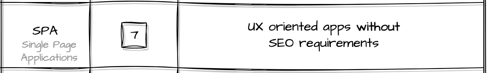

For the `server-side generated html`, for each request, the server needs to do extra work to process it and return the entire `html` that will be rendered by the browser.
That means extra work on the server **plus** a huge response (the entire `html` markup) being sent over the (possibly unreliable/slow) network. To top it off, the users see a blank page while the browser loads the new page.

[comment]: <> (Response payload Non-SPA)

<iframe frameborder="0" style="width:100%;height:463px;" src="https://viewer.diagrams.net/?highlight=0000ff&nav=1&title=SinglePageApplication.drawio#R7Vtbd9q4Fv4tfWCdmQeyfMGGPJYQ2nXaaekwK22eZglbNjqxLSrLDeHXjyTLd9kYhgTSU1grsbZ189b3be29ZQbmTbh9R8Bm%2FQd2YTAwNHc7MGcDw9At3Wb%2FuORJSuyxlUp8glwpKwRLtINSqElpglwYVypSjAOKNlWhg6MIOrQiA4Tgx2o1DwfVUTfAhw3B0gFBU%2FoVuXSdSieWVsjfQ%2BSvs5F1Td4JQVZZCuI1cPFjSWTeDswbgjFNr8LtDQy49jK9pO3mLXfziREY0T4N7j5%2BmE51bWTshskIImt2vfw%2BlL38AEEiH1hOlj5lGvAJTjbNwbKWkFC4VS0FWGU9FE%2FLcAJxCCl5YvVkq2upH4mQ4diWgsdC3%2FpEytZlXWeqBnKN%2FbzvQg3sQmriAK0YCq3YARt26qIf7NLnl5nIw0wl%2FKkDTERl%2B3uC0wrmfD7R%2BCwLUdo2RhReOTjM%2BmCzTLupds3EigFPNIes7Yoohu0zmxpOGL43%2FDIJgzkBIbucPq7Zcy43wOHyR2YhmGxNQ7YWM51fAmedEPiOy2cj%2BRhzEKKAY%2BEtcXhzh8ZsnBlI2LpDIistcUJEp2tKmSEwLPMt%2B8PWnP%2FhFeIrH2M%2FgGCD4lTR7IYTi6pzLx2CXVYGsYxpfZjUHOmmLN%2Fk%2BmVanVpjjT%2BjRKmp8VKOT5OXODkQsyVvA%2BRHTEgx10D8AKmzljpwEvIDzhGlKPKl6H%2FI94VSjVzNZeJ18rjOxibrzscqs5VVXfCdiq8SviDk6hQ9CFRlEnlfq1ZZYbYJ1ao0GVBrtGl0%2Bh4NjJu03t65a%2BLTQb1MwADC4FzwbLWHkm8aE2UVGnPd%2B3R8JIVWmrVU6m2xFTWrwOCYr08KbyDJ4DBEC6bVWRIi1%2BXNpwTGaCe3EU6nDUaM2bxfazqwZryvhOJYkpQzixL8ADOWRjjivXgoCOoiBbd72Z2SAZBr22LFXsBAndeMyLuGVdm8Tau5dZsKI2M%2Fl40Zde%2FcWga%2BgpMB9Gg7Q7vYPdH4t9n2TxhvcBQzPmsL8BRg4O7ZWAuGLilgVOBW5q8%2FPgoiMsRouXTJkMD%2BvYMRJIBiEhdVIFt%2FUtyDbrmTjo2%2Ba0dvcrcvwTI1C%2BV2MFzlIDB3M3KhKzlfQXmDahWMKzhwoQ6FoSkpeTD7JjXX%2Bfq66TrbtoJ%2F4%2Bfin3V58cRkcvZ4wv4VT%2FyKJ15VPGG1sPFM8cTOuvs8Gro3u%2Fejr8uHIXq8tWJl7qIM3xRXnzBdc1309FfZuGgT%2F%2BRguxXf2tbN5J7Fv419nrew%2BZffybJYHI8%2BAS6CRddy9z8vIOVdq%2BqZjpqbwFiB1pF1gi2AoP8a8f2dFw0XH4zZbvFFWwyzfGYJrc2tEbo%2BXMoiJnSNfRyB4LaQntQ5Kkb4iLkhSdcGUvokocOjqyro4RbRb3Jwfn3Pr68sWZptS7dmT7JwqbzQmryQHn2HbxZnc2TFvxbu5z%2B%2FfEX3%2BO7u7UJzp992fhaAUEB82IVnufh8xTvRTGDAnP8f1Wz06dHZAGcsA4qWTdlJVj1s5CpF68dVLgDOgy8w%2FDmhAYqywN0F5OEz6wZRgZorzaoKDSFtRiAu9ECSm%2Fx%2BKJPLb6tC%2BvF8Pq%2BZxWKINmuXWUT95XB8kIVdY4J2bFiQrYLajThBPGLZ9YBEU%2FjeqoSAYZ3C91ZBu933%2FjeZu2PyAnQNS9F4u1OsEnc75Cb7NMcjIgkQMhbxeOvo7ttV0SsH2qYNFIsWYYijWo6iZG%2ByRnyAYZroY1zSdG2zTbtqWZ7DlHtgAPQc2AAOwdwAMHv%2FPYGxMFy%2FNdLEHubqSXEU85DI0JKYW%2Blm4vh3kaU%2BRhvqIPGlFcLqrxIqwIAEyWMoOhEqOBFWNMhcJm5zIk4UyOwct2XcqrO%2FXqrpHiH1pea%2Fyw7NniT4QX5aJWqVSfB%2Fn6Z7gV3TBfFa%2BM76aba7UT3%2FZinyb%2FmbDCfPf6t2u8n582%2FmaFTViq3Qim4bilSB%2FlxqaT8WkLZpvxmxGmbksN14cN7zyj7b%2F0so4bznpid44Is%2FgO23L%2B2J3LI4L9z6%2FMWuqxWIkXPlYicJhcX4ic9l2iJMRaKqywIfljl9WXM4PiomanPVSHHeudlz3nk5zlG%2FlwOO9YvSz2vxi54V2ZrC%2FTGfC9h6M5GlN1B3%2BVnWiOkiT7PyQinPyotFolWUfvpMa9ehajnTqszI9s20SkgPefZRr7mwujwW6J2Nld0vuFEqVcGeF7PJ1mGez6IX8pVPab9CmGeHCfkBwn3pjvowoaBGwYb7ChnU1OiIjF8JaeqOSA3Px51WGD05ZKopc%2FLDia5Jlmw6Xr%2FJU19aIyj4pg4IstSaOAzWUOThQf5qfsGaghMciHu85ACsYDDNzzS6jkEPJlQDsbb4vCLElv2gtoPm1qRDA83thw6NF34UZ73XCi9kdAIvRAnY8f%2BHLf5lU9ttZQ%2BbOjqnTW2%2Bi%2B9xAPJmVOY2iiivf86lSAv9Mqw%2Fn2Edj89sWPe83Z3CMID0P3zNKAFR7GESClCLLZ%2FyLV%2B%2BFf1m0PVm9DF5kN8oDDecvMLBgJGPIvj7njTdwe9kXy6NXHtlWxdPoxpdPM9wnOeii%2F5ydHEgAuNPybdb%2BInuyOTvLfiQG%2Fkj%2FRD9rKkPHoZrZjX%2FYdvXe8I8UVpAgpgC%2BfoLYeXYjxcWgLK7PJs4YeqZdLoy6Z3sp78XnLvWrY4sC4yyn1bbRzs7XQdrldfdWt%2FCOb2zw4rFD6jTVErxO3Tz9h8%3D"></iframe>

Wouldn't it be great if we could tackle all of these problems and reduce:

* the time users need to wait for a page to load (not applicable to the first-page load, that might actually be slower)
* the load on the server - by removing the templating and just returning the `dynamic` part of the data
* size of the payload that is sent over the network
* the size of a deployment quanta

That's where SPA come in and solve all those issues mentioned above:

[comment]: <> (Response payload SPA)

<iframe frameborder="0" style="width:100%;height:419px;" src="https://viewer.diagrams.net/?highlight=0000ff&nav=1&title=SinglePageApplication.drawio#R7VvbcuI4EP2WeaD2iZQv2MBjCGGys5md1LBbm3kUtrA9MRaR5QTy9SvZkm%2BSbQgkITOBqsRq6%2BbWOd2ttuiZF6vNZwzW%2FlfkwrBnaO6mZ057hqGPTI3%2BY5ItlwzHg0zi4cDlskIwD54gF%2FKGXhK4MK5UJAiFJFhXhQ6KIuiQigxgjB6r1ZYorI66Bh6UBHMHhLL0v8AlfiYdWVohv4KB54uRdY3fWQFRmQtiH7josSQyL3vmBUaIZFerzQUMmfaEXrJ2s4a7%2BcQwjMguDf4cDsL%2BfBbd3F9PkelfXn3ZhH3eywMIE%2F7AfLJkKzTgYZSs5cFES4gJ3KiWAixED8XTUpxAtIIEb2k93mrM9cMR0h%2FaXPBY6FsfcZlf1rVQNeBr7OV9F2qgF1wTe2jFUGjFDumwEzd4oJceuxSiJaIqYU8dIpxWtu8TlFUwZ7ORxmZZiLK2cUDgmYNWog86y6ybatdUrBjwSHMQbRdYMewus6nhhOJ7zS6TVTjDYEUvJ48%2Bfc75GjhM%2FkgtBJX5ZEXXYqqzS%2BD4CYafmXw64I8xA6sgZFg4xw5r7pCYjjMFCV13iHmlOUpw2qlPCDUEhmWe0z90zdkfViE%2B8xDyQgjWQZwpmt5w4rTqbJkNQS8rg1jGpD5MZo50k5cvcv1SrU6socaekaPU1Fgpx6fJSowcAbUl52HgRVRIENNAfAeJ43MdOAl%2BgLOAkCDyuOhn4HmpUo1czWXitfK4zkaZdW%2FHKrORVW3wnU6mE2ukhC9YMXWmPaSoEhJ%2BX6tWWSDqhGpVZAbUGq2lTq%2BCnnGR1eucu5Z%2B5LlTPFD0qtn2SZoDrSBNo3PitJHqgeVaKs01mIEa4SnSctVnyAUc5w4Fa0qiOgFWgeuy5hMM4%2BCJewjGlDUKKGlZv9akZ01ZXwlBMecfIw3B6A4KAkYoYr0sgzCsixS03cmklLjNl63BQL2C7XlbC8HvGlbFL5uW7JVNhf2wX8p8DNqdsibAV9AthEvS7PfaiDvS2Fdu%2Bx3GaxTFlLvaDdiGCLgdPrNg6JwuX5g19Ni%2F8%2FWaWgFAAtpfyZwovXGb25VZuCtVhMJSNbVwVeXFaUwYudDl7K3gVSJNBa0KNJ%2Bo1zc0Jbn25tGoFt%2BOx3J8a9sKJg1fiknW6QX9o9GbB%2F32R9D%2FEfS%2Fq6DfamDjKQX9w46gP8PV34j4TBc7Rp503GAd%2F%2BJgu0y%2FNddN5UuLfSU%2Fz1rY7MvuiFQTw6OHgRvAomvu%2Fd8WkPyuVY0xB7ITGCrQOrBeCKxjCawxpIrBjWbPSRY7oHCRBUvXi1wAnDsvDaG%2BJSQMIrHJcQG%2B%2B0a7CQhTiHamWVWhkUrlGM%2BFS5DkpNoN3xx4tmr7M5zNZjXgFUM04UlgTn89Bu2FYbVdPkKAZ9n1YEYR4Sn3Sjngj45kkT5XQFlDEVOsFsPIjZWZBOLDbEfCgwd3G9HVcMrRhBZES4RX6fall2e4TyI3UGzfOhME2jMTBHn%2Fh298XoElLoj9dKumHwfvgzrebUOB94HKcL8Y3OXkgC5HDa4H57yIMPGRhyIQXhbSo%2B5qixGuEbM0mUGChGw5%2BhiIqxShS4K3t3z0tPAjNfiWKE435ZvTLS%2BdalBjtTCnEYexmGPHPo0A7EHe1EweV7eXDhyFaHt9NZl9QZ%2F%2FFQkvtuq7oLrP3K3AkUC2ziMNDENq6h6q0FKhmHd%2Fw0xWqQpaLmM62TrM81nshPzV08%2FlODGut3%2BF90%2BXpmGTwXXLq6rnJNUzy7%2Bl41JXzt5h4juWBmiIynfKgTel0oI48zQYprk7DAHLVmt9ZS4sm9f85jw1MqlWuBeLIOWrcFl1pyR3A9g8A%2FbHRTCO%2FmBXPnhoSsb%2FZn4tT3z%2Fln5NtyS%2FJue8DU3h16wj%2BDWlDRsc5MT0N3Fim4DcFm6Lln6U7hQejBWEAyscX%2BHrflRcndrxtRDk3brEmr%2Fq9JFtvq%2FTRxpqQuzs7g4Ct3z2BPns7WcSp9uU3HwLY3xbMtKLkhfC8D6BcYrazAWoNiRVVnRs2EOwgOEk36S3ZU72ppSEWTv9nDBmNRmz2afXnJtqsL0KNDdvq6V3BIr00PiFdhlKwFof1vjDGj%2FDGhs7WmPzLa2xvJFYMuim4fKnSjpIMsz14ywl41zKGKlSTR9G%2Blcz0kPFi9xXNdLyKTMMSYKjCoQFYnN0vhsgju2hCU4eiFXAQd214PClAKe%2FHuCU%2BaiRBDj5OMXppx5FnFCKEoqYQR0nnCoCD047ttmVshNvOzu%2Ba9qRZR1HoyqkRRbyuVlHwa0qUwbV9kdJSaqT8SfwowKzfupqqMlmQtcVduLFzi%2FqnanaQj%2FCMbEb%2FSwjyFKfurXe1MKq7gPFku473Jl4t73aeOw3PWcLEAfOmYucZJWu02912q8d4PsdvHldtHWetu9E20gC234Zflwcll13HJY9nSz7TifLR%2FvgWBWRv4v8%2BvHZIGK4immWc%2Byq8M04AlEevxv4ZzJe9p%2F8r8Nr55%2FHC8PrH%2Fae%2BP0kdWjhBuKAKo0tbjXRw959akav%2BtJ5MOzI96Slep%2BVlzKscAMIvRulrKE2pTVPlN0Rv7M8YW%2FRGmPCSPyO1X52Hqk1guiMQfWG4OjomSQlow7b%2FrwJoz5QW0NtYWL08bhsZM403TjQ0JhVQ2MPRs8xNEfklYJWzWctDmBVwzbNsKtbFdus%2BbpsYrzZPvs1Wix%2BX55VL36mb17%2BDw%3D%3D"></iframe>

However, that's not for free. We get extra complexity: in dev time, of course, but, we now have to start considering the implications for the request handling as well.

Let's look at how a usual SPA gets loaded and is able to process the requests and display data:

[comment]: <> (Request handling SPA)
<iframe frameborder="0" style="width:100%;height:650px;" src="https://viewer.diagrams.net/?highlight=0000ff&nav=1&title=SinglePageApplication.drawio#R7V1Zk9q6Ev4t54E6T1DeMY%2BzkdxbWeZkskzOyy0DApwYmxgzM%2BTXX0mWF1ntBWODmQBVM1h4Ea2vW92fWlJPvVm9vPGt9fK9N0NOT5FmLz31tqcoqqwP8T9SsmMl0tAISxa%2BPQvL5KTgwf6NWKHESrf2DG24EwPPcwJ7zRdOPddF04Ars3zfe%2BZPm3sO%2F9S1tUBCwcPUcsTSb%2FYsWIalpi4l5W%2BRvVhGT5Yl9s3Emv5c%2BN7WZc%2FrKeqYvsKvV1Z0L3b%2BZmnNvOdUkXrXU298zwvCT6uXG%2BQQ4UZiC68b53wb19tHblDlgvFnc9F%2Ff%2FX7aWL9%2Bjbe%2Ffj38%2B26r4d3ebKcLZPHw%2F3V3xsqW0TEaW0CcjAPkE8ObZ8eO54168U%2FLNhFwsS%2FcU0%2B4lpZjoMcb%2BFbq556vUa%2BvULkHpnv7pMvrp%2BXdoAe1taU3OEZww2XLYOVg49k%2FHFuv6AIP%2BTYsSbIuY4b4cZzPHL7GZpbWwdL5HrzEwXTJTt7aU2XWx%2B9IXe91XDBD3uxoNXGDXE93fpPaGwHge0u2AWbwPd%2BouiuuHFNZaIaBqmI5wZja2U7BPJX%2FpRUexoQmd1aWwwU%2BmPISQ%2Fe1qc%2FZhkEGM2Krl7hP7iByB9ywmaw8DxcC2ttbwZTb0W%2FmG7oqeN5%2BAj8kXuIrlxnH8NkolAhOU5UZ9dzcfn1E%2FIDG%2BP9yrEXLi6eeEHgkUZhTY%2B%2FRi%2B5mJJjpGITgDzcVj6uk8Qu6OuRNjD176sqK3hOlElWR6xwmdIkzWSFFtPgRXz7BMX4AwPyHqA2SkC9cbAe4nu4dmBjKJLfY7khno1fW6KP12i1DnbJIfk9S%2BSSf2hCjJFvPTvIJ7cM5RF45L6I3D1YotBcBUSIiuTNiXgwFPA%2FXA98U2tFoO1ONuvw1t1WI0FzBM2YmLqG7eXZa0bgrbNmAzAMnOGgMkMEjOT3xyZeaki9Yh2J1EuO%2B81S%2FTKNtvRLlQXEohnuVNmh5wdLb%2BG5lnOXlIaSnEXG9SDTnDzgnUeaLGwWFAQ71uDWFusjh3oBs9f03WHMmuw4VWeJvnD5zNosY1mSg3srwHcgGDZxxcmlGGH%2B7pFAcSCr0fF3fNyXBpKiRyW3Lwyt4dEufZQyKilAk5YuhjMGRiSqXASpzNOz%2FAVi194Ed8%2FjofqIO5V7%2FRF99W%2B%2BGH0F1g8fOVZgP%2FEVOQTnj47%2BSb1Z%2FB7%2F%2FDGynj9%2Fsd%2B%2B%2B9o3hX5EwD0xmuuMdcEtNZ8jYzoVcMfszl4WJlfIgGVhPrI1iaonweKLzIuaNS%2Bxs5qyLpBtacK0gCIf1RN5JNgWpF2IjPpNcCoBR91HkYTXno2dF%2F%2FuCQthExnQdNcW2x%2BpxMoaUxNN5qJ%2BzCxkzqeR93HvbbAn5hHzNUVuaAqjvvld5oTYe4U7b4sdxffxtoFju7hOUfTI%2BmnqX61eFiSqHTwhZK0GjrUObyJ0SB3tIxSpJXiPcuCda0k03o7IumBFdADkamsglwWQY5jghslztLcr52oaeAcAL6UFIOTOClMZv2M8vtaHbWEtz5TmYg3ootSjWlAFsKAGDZWI3DiARfEj%2BaK%2FoRLGjSfJxvqFSigVX05jeSeF6oi%2B0kXGgvz%2FhH5tEWVi3uLI1SEtwKow8aNzopJeiJKkOKMDWOwBD2DBiGYhv7JnM%2BrU%2Bwj%2FKNbXEYDQnoMKXL%2Fu6bfkXtgV3yTRJthDAz152hMe7aMtnLs8JGxca%2F5WQdim6LxfpUvY6069ZDGG0yCKpDUMqwKGH7A8HMJc3BPCVJGu1mtsMi1i%2FTYVMFO1YatjC%2BIx%2BHD7rGzq8UGY6ZT7ui5aTkXXRdgNG4Cdqbzb%2Bqtfyzfv9dVs%2FvH2f9P%2Bzz5kOUHvvr2YR1YzqmmaAKFiAsoYE%2F%2BNa2N%2BhzKzn7LmnPUxYHcxHpuEIBC6C%2BzEoBDFOV1CXAw8sKE67NFBwbXJd93GvrXKsxgpE3Uu5kKOaKlUX6ZiV4D2ZRFKVUoExfhUpVzP9EDDU6jI5dbodFolDm3x8A1x9cELlin3qcxZws%2B115tXDrY7%2Bhaj9rlO3lCcf2eQd5YmwMH1zEbJrZshZA4EJPtW57sBTYxYh5BDph8O1snwSflqfJK23x%2F%2Fufu0m3388t3pawJYxa6xnGNP3KOTkOwpzlmSONJZGmAE9mpwzgLSYg68q%2Fqki%2FpkSuQdg3lfBr3IZ0gT6CCwSpxE0lKmxqlCFN9W5tjp3a9839qlTmCRYPLwe1KQYowMM%2BOHqZn0hbILZJnVNNG7sBKZ66MaefP5Bosqq6mxUOorL9TT5Lu1lX3YfUYKDUXKSmcI%2BLUQC9cIDZePPU4ubFS8P0MORhb9ARuETY%2Bf695Nt5MKve0kNHzvJnFBPKD9MWTjetFgmf%2FzI76NHexCO6XzhQotFQPaZDi8ut1hBsEQDULMTKQ72OQRef1m1LfKx7Nse%2FXVsP%2BZi%2Fo0uvP1qtilPC6gAdaEJnTgJn25oj9VmmDIOflE88qbbZ00D%2BKgOY3QCPzcxTt6FBIGpUwJc%2B%2FTHlf1nCiQP%2BFak2Azcjc2nkMEk58nFaXOKR3umYERdRastgDSeGBkIGvaUDVMDYc6usL3YbhkYBbzgqYxYJcaJNlyJMJd1wfK4XgHR9870LEJfM0Q4P%2FbiyxBsYj5ZRe%2B5sLXnJCvKbFb%2Bbp9Ir4GrNAwV6sufM258TUNAvLkfA1YWTFPSRWx13m%2B5sUOIrpGY8chW6Or0XFC1pCDXergdVM1MZclDyQ5w2Wp6rAOl9Wrxf4URdal6ZMGrFP7UTsiFZMdWTSyEVdYMXZZomr7kkRGVLeY1ZBGxSyRMB9h%2FysM08iYhxStVIMyAhsGSMPTztCAREpCk4o1Xkt0s1aW8esyI%2FV0vijqqMv4tkvn6kZWi4Ylape9QJZYpNeu3omc5OlDWh2gauN5Hhyz1ZrzHYkhP6kNDB4ZzoXgcULmZRJWt5qXzpuxEk%2B95Xl%2FXbYyBxCsBdqQPzokaxmkApP71NYoWBioZcP6FbIvFSH7MsTll2VPwbWS%2Fms9WZupb6%2BDv3p0UmDNzMoLrKvBukUAZ02tIsaNsgIAuInsYRi%2F4qQif0smltrBBT%2Bdx48MzW4%2BLn4qz5A6xIGpIyw5IypAUgYgKbmJaeBwffN9mgtPf%2BHpz4SnDxW%2BmKg%2Frl4pUAx1Yer%2FHKY%2BD5Ixo8Z1BEBwe1SqXhaHa3URfZ2n2nK5%2BqEWff%2BncvW94xProdfVOLMe%2B5cCNdQ0sy7y5FIxYSdcofMMX0t8HTQqDLq7PFwKc3oOp%2FB0YQREqmjlWnN2KyxWUdKxZmfFT6yNPR3MvOl2RcXyOiNIpXL6VwFA8%2FO%2FBuqw4lB1W8hQxTDIWq8HP6rM6uzWTGBzHxRxTj55NQLgI2CzNSzK0kCRRiNFi9%2BcDSOehZJ6SQqQjgjNUlZaCzQqrFXS9mCNOqRyGSZv3vAPRxDPMRqMRqlLVFFo7eVRlY7k1CfIDxkSite9c2IbE5Ww7yX%2BlIk322VPKSQ2RAZkAj%2Bc0h%2BREKN6YpvIVbqoajGFAlduUl6zA5pib3ooVfFwVIM82J9mfz3tEfIEsKfg6wFElDKEAfEsCExlFFghF3FxlJp3lErm5cMWs5Tkas2KilM9bBz%2BvwxCrF0cp1flOOVhM%2BUZqamXpEpRXJoCKITP1lyjWktwdobC0nsJgVVCXiVTiuNssu%2Fp73JSy86P4FJE9WsjiyzyX8sZLhPWicaX3iysJmd%2FsdDWPpnCe0N9i9XaJjPtyIG3DuwVESQ9wrhOfbgMqrc3qJ4TO8UUITRX66jD5RGf%2Btrt5MXeleSLldu7HPLkOPZO6wDVIUcpG0my1MmnWmr5Y82XHI5LDgeLUrqew6HlxBcn1CtxwSEO0xWYKbMaSVjnRrD2sC5NeOA7z5rhJhsMBodpTdejeLluGB%2F3q688jM9Ts2gsLjOFVOzcwG1qWlNBkWIyLs5qN3udSjNFsQikeFZcmJsjUTf3SDNFC%2FPNS%2F1frcJKYXpm8CtK%2BT006yWTMdZXs7xZTtZLS4t8wfIRJ56cIweXnrEZJpIlaNXMWvOaz0%2Bdi%2FbWqad7hXttpHUvfzG%2FYtUzVE5FIgVpd1ZnP6uYSsmsTuECkxHVx1yjD1ZfMQuUbQlBtm3b0ObEz0hnLCfRmNULtzykX0qbqY%2BQS93Nc1N%2FcYMW%2BuqwqgI0UWJecpKoK2yP1WAPW95xKobJa29sGQ7sOPuxxxorqHzSnvOD9ObbGI3H0ge%2FP3x%2B4z7eqB%2FAhX2OTG0Jy2OqQL6mDKXlNeL%2Fg2IB9qi5%2F0%2FvsiDmZUHMYk0qppGOi2ExhPWWZM70lk7%2BT6ZORx3pI5wlhe0g3c8m7F9td%2B71gF1Rmxi5gybKHL41cOd7UUlUuTi3I68XbRymUUblaEB3CR%2BxvxHrwUwzNOYgDwfx6eSvKWK8NYiLYd%2Bc7vlNZmyz5QESPpJHO3MwwbzAhOuEyP8L8v9A5MvQlOlTQl%2F00zof4Jw0xyimBLuqDAdOoivy7tNhUpGrkOZC8u3tEYbhwYeLJIGPgq3vcnY%2BMuuxCT8baz0yhqrVeWvNW2Ukz3Q0PKFVhvYHO6VVPsd1Ai9WuaNWGciOyjeMp7LK4tTW4RnqQHrkRR5ykB4oQ6ME1q9k5AXAelznyErIA0mSU3ZCGqiSUmwrgCUOKmjOfgxvBS0pJiFxu2tDfq8lhuxDaWA%2BsUHhr2%2BE2H12r%2B%2B35p2l29PRbrf%2B5xYtHgEGU1DLo%2BcsyhCx21puFSgWBRDLJWXxkrII7ajehZTFfN0%2BUcYiWCGRaq4C39vr22vdbHU2cloDMhethZu%2BtcOZKVXqnpfvmKUV09r2l1AHfIJQjdKKtzH1NqPwnc%2B2jNR2%2F23nmT8DGqiuDVE1biHYXRTeJ1GBdVdVwH40MREIrK3I7IzOL4Z4Xf5%2BPQ%2B9yOUqTbSSizOEcSAWPzPOqGgoVUMWUjWyXWVDS3slN46n4ZUkbQkXyPyeGUfJ2gLbVYz8zfPT2iiuTTbJiANbU907rk1vTBMnF4d3M4x4o5o%2Fl0WoZ1WKMnTSViXf%2BhxAjtVScz1rT2Q%2B1VLctSebmymX7bgspGVr%2BVahhsaPP5uL%2Fvur308T69e38e7Hv59v113gFLRsshi0kzK0PUcTzgsolHxGofIkKz1ntlZRMCFI%2FrIuzkHr4uQDvjjQPirWSuPsUqxVnc%2BXtxAUju7WnrtBVHo7knf9WmLKyzo8tXQh6vE4qywGlNDsvSYW4AGrKiY1B0s6mYBwl1X5HZr0KuD%2FgSUAS7mwz%2FI3U4tkKMxI1uTEC9guNs82%2BQSkl4UV9amQSLpxQHpTkBIqVS%2FBdbymb1gRqusi1M8kTjzRzj90YRZg4lIscW7WQyUdLFa3YXZoRYOWuoSULp7P17jW1Yn%2BTs%2FSJEpxPrASRmWlgTYaccFrMkpbPXqtMDWHNkJ0SpIFwoe6ZVtLthsF5vcIh0aBQhA2NLNaWHGv1aYCsjo06UXlDlK5fZWkHtir7n9wTLBnOQ0tm0XX1PYHeQ9qldtQxdjq4f6Kem5o4%2F5N6odt5oZSq%2BTP3PbpQR9048iGcZJNkOy5Dv3xxAlEq3VADuhYe3fCoxLXsIlVTuL7854it28Op1lH8CG7Em2VTFFVBS4RmougQDt9tsdD1NmkhzOLQosdkrWXyUKNv9uHaK9g119FRxbXOZ3RZ3K%2Bo2kcK6MPBpdWsZ87lNo%2FTAXqhDstqsB%2BLvhBaA%2B%2F%2BcaMz7mG5MidsdOMdCTFaQLZH6ZjmtDOesD1BrO1zE5LZslYdvb8viYfw7MTl9P7TFm256VH1iiW6O4SobdmOT6ySG6VOD3a37ouv2ViepK07W7sGblZSODFe6yDM0jzHMaQKmTzranTSL1FKyBrnNAzXIRmpJ5zn6gGe1jOogQXj%2FLiUcIepZRh60V3UoMWzK%2BxaSk%2B9D1CoCcKTUYf33szRM74Pw%3D%3D"></iframe>

1. Alice enters `site.com` in her URL bar inside a browser. The browser (after some `DNS` fun) will make a request to the server.
2. The server receives the request, handles it, and returns a response: the `html` file.
3. In this case, it is safe to consider the initial `html` file returned by the server as an _empty shell_. It is usually a blank page with an **empty** `div` element that will be used by the actual app.
4. The `html` file references the application code, so the browser will make a new request for the `app.js` file.
5. The browser receives and **starts processing** the `js` file. Depending on its size, it might take a while...
6. Only now do we have a SPA loaded and run by the browser. It might give a clue to Alice that it started to do some work for her (in this case, gather the information needed to display her name).
7. `Client-side hydration`: the app will then make an _asynchronous_ call to the `API server` (might be the same one that served the static files too, for all we care).
8. When it gets back the information ("Alice"), the browser can hide the _loading_ indicator and render the page.
9. Alice can now interact with the loaded app.

A few notes:
> Steps 1 to 6 need to be completed only when Alice _first enters_ the app.

> I made a clear distinction between the `dumb content-delivery server` and the `API server` for clarity - nothing stopping you from setting up a server to serve both static contents and respond to API requests.

> ❗ Not all SPAs work the same - while this example covers a lot of the work that is being done, it is by no means a complete & accurate example of what happens in a SPA: simply because **it depends** on how the SPA is implemented. Not to mention the browser cache, the fact that the `app.js` could be split, etc.

Now, for the development & deployment process, things get tricky too:

[comment]: <> (SPA - dev,build,deployment)

<iframe frameborder="0" style="width:100%;height:660px;" src="https://viewer.diagrams.net/?highlight=0000ff&nav=1&title=SinglePageApplication.drawio#R7V1rd5s4E%2F41%2BRiOJECIj7k07b7b7WY33W27X3owyDYtNi7gxO6vfyUuRiDhS2I7uJbPiWPEXXpmnhlpNLowbyaLt4k3G%2F8RBzS6QCBYXJi3FwghbJvsHy9ZFiUmAk5RMkrCoCiDdcFD%2BJOWhaAsnYcBTRsHZnEcZeGsWejH0yn1s0aZlyTxU%2FOwYRw17zrzRlQqePC9SC79FAbZuCglNqjL39FwNK7uDEG5Z%2BD530dJPJ%2BW97tA5l3%2BKXZPvOpa5fHp2AviJ6HIfHNh3iRxnBW%2FJosbGvHKraqtOO%2BuY%2B%2FquRM6zbY54QY%2FPP4zeZjDK%2FpXmtxm8R%2FTr5flVR69aF7WR0qTR5qUj5wtq2piTz%2FjP%2F35gP27fhqHGX2YeT4ve2LQYGXjbBKxLch%2BDni10OD9YFWwqqw%2F51kUTmlZHnjJ9z%2FZZcKM4wcYwG4WoryUH5lmSfyd3sRRnLCygA69ecTe%2B3oYT7M7bxJG%2FAJXic8fzM9S9vS33pw1G3uX4qASepCU29WlWLsB4PB2Y%2BVhFMm3GCVeENL6jGnMn%2F961aCwukM8T%2FIKGWcZQy%2ByzSv2xRqEf%2FEDUmMUx6OIerMwNfx4ku%2Fw0%2FzQu2HxEuxn4zVsdC28SPqdZv64vKc%2FZ011F2ZZOB2VRd%2FC0ShvMlZx1zJCquamSUYXQlGJmLc0ntAsYQ8Bqr3QsotzSvm%2BhAQ7Rln2VAsMNEuYj0VhccpCrxTS0eoGNVDZjxKrO%2BAWSbh9YJXA3hyBey7wCFzNZlHoe1kYTzkYJECzCsiaoG0irGxkERFlkReFoykXBVateaPw6mS3iq7KHZMwCKIuKUkK0eC45rf3%2FPE8oW%2F5rltrJzgfHmyC1CDwCuAjoAk9BKt2FICHbFsG3sFwZ0q4u6WPF4hdDFzPQ0Y9%2Bc9bOovi5YS%2F%2BWbYbQ%2BnhKbhT2%2BQX4q3xywOWTPz69rXF%2FYtv9Y8i9NSz%2B2AaFE9uruAUNChbv7ZFSWRN6DR9YocWs9V7I2TgCatPftAFzGg2QIYIAqAIYVms%2FYAsL%2B8zx%2FT2b%2FTS%2B%2Fp9%2F8t3qfL377iS4tICAtyNElIogGzY8rNOMnG8SieetGburSlahrtIumdRqsoWq2%2Bw%2Fs4nlVNSbNsWQKHQ68J7J6qsrUGQJp5SXbFzUqB53nZXcjbMa9IOg2qI%2FzIS9PQ%2FzgOp8WO8jD%2B%2BnQRZp%2BF319yU8Yut24X1dX4xrLc6IR1WlVRp2IqrW72rCOabbb4OHq2kRJmfOGSbBMaMTp9bNrNKgHIL8aqyFsKB5TKqr7XPS8QLA1gIQO5bWPDhaWxcbfTeQ5xm%2BexH8UTta5SPV48HKY0k8R3VSEvMFUsSaIlWa4lFW42rl8myD2VytzAEKmJSWXgUTL0JR5je7BP6GBYnlEpQT%2BJ0%2FRy7OWVsw%2BGcABHFlh9YAtkLpTtYOYRG8SUCYOVH8okcTp9OEZSmNXW4op7YAxh3D7u8OsmcTCPROs2okNuqKTcD5uO3udbRSttNFgyThC1ewS6eb72sVagVlrFDVCLbZ7GEa8cFdAL0FQ%2BPeov9Pfnke4D865Cm6qAvuoHEVFu7wHkSrPIlg3vQWFvd%2BB5GNFFydIKwm4q1H3aSaeIMYaWZPl5Zd2wjS%2FiRm2q5Fv8xUy72rynSciamN9vZc7kVo8BgNmwfKBVWUJq24dvtK%2B2lT2kBMyqL3GTPVSpz20NoktgIAywJA%2B2ShzAcywnycSxidLCQUZL2opKKU9eYzJh1fUIctvXK%2BpOut6ulh22Wn48xBiuf0DpDEIanZtHseaUuMJyj2mnDgoned%2BzqGrUVFmVvucsec88eN5rxfYO4ixjgt9Jn0yIh%2FmHHZLf7CqdFX3kOU9XG8NwwbXbdfk8pcbh%2BoZpmzs%2FmCIj9OPpMGRaMClUzV3gZR77x8tZ0959DwP%2BDyKyYH%2B85ricLmeUl86n36fx09SYcS2o4n2VB38ealbop27atjc3b%2Bxc%2Be6Ds5FKni2s6qZFRFZTq8K903blOmpp0dLSG2lR9jP0Qlq26CnQ0qKl5ajSgi2FtAC3B9Jia2nR0tIvaSFAxS2Q9EBasJYWLS09kxYLGBC9siV2H07dHx%2Befnfh1wl9d%2Fsx%2BPrunSIsShIWPWTzzCGbPQDHbgeGAEVgiG0peuQwOdTAvalydfEqRO2CRzBWlYF%2FzHnU33UeMkgA70mvi%2FCI%2F3%2B4Z00HophpV%2FY%2FoI80imdFRAmohneKq18UTVud2KnVTz9yD7eUlI7c2yF4iilW13CFD1EoWVUMHzzUmE5lKK3Tshx5s%2B1rYxUmXEZJXYihtqpaMk3HcFoV5QBFEJBlGbYr1w46mD7Zoi%2BgqJwtBlfVwtFksG6LR7LHWB1nHtME3aM069v7%2Ba0mtojJfFCmOzFhPqrt2tBStI5pMchjx3UsYCOID2Vcy54o48FJPL3MrdOR1HC9DwIEu6jnNYP5zzZ3jqCQX4ra7phpZACCbQBdixCIVoPnpYJxsIGwBQGyi29J17gKLWweSs1s4xaKoRk53Gjy5pEWqINtzynw0nEd3twVXc0DRrFjelg2ISkMbOpUGknwKiXZ6HQ71d5qXNgvN6uJJMpgllVAzGLEZ7wY8XAY%2BpRBbOrTGYNdEPtzbod9HUTe9Ps22ncv0Sw99QHgPvR%2FNzs7huVyKXItB1ugMllKQbK4cncs0ybFd9V9LoiSaRqmiYjjAmzZ2HWwQrKIQYDNXElUfB9IzmRbJ6E%2F5jTNLplCn8XTVA7N0izxS7NEblFCEzMTEjOd7zRj0TeyhDL%2B6mA0Uc3WewWeMCETbkvmCcx0AtE8cUI80fLdV13Ah%2BQPGzCdzn7ZtsVIwmrIGETYIE5FH65ThYL1kkCg3CfJVPiYVVk5y03zx1nxh2tAx0SAmJAwYGLc7MWA2DYwsTC0zfwbyb09R3Uzqm7%2BV%2BCPxlwBVVe15o8T4Y%2FD2WKOY7jIsR0b2sTB3KxoOBq2AUBtiqmif%2FvDE0iPXT1n7Go112%2F7YauXgq9ClwFRrahNBbgKPxg72DRNG9iuYsIzshwDu0x%2FO%2BX3obo6kUqRFwNRQfhYD0IVRYOqIPGeVANXg%2FoEIJ3Dmoem4o6kffnmFVZligcRilaTo9Iw4IkChvOpzxU709DZsusq52ZaPW%2Fu1mYNIbJQOWN466lbp2yt2czZJ4g5GRYmjCxAO%2BrBWJEL%2BzZNx5X9fdVw9sGmoaNtguu0v6%2FttV75%2BxAwOw5CghEmJjYJaIbinZS%2Fj%2BSRGR7bNvB0T%2FG5efo5dwDLMi3bgdhpcscWnj4%2BpqeP5Onomjk0c%2FSdOfIeAOACwkTNtU0XnzBzyCmE6MQLo1TzxlnxBsQuH2EEeY4cBxLQGv3YTByqOe37II73H%2F8Z%2FPnfu2z4e%2FITfPvy4fOn%2BRtFSr%2Br%2B99YwcOvnpDy3MJaFfF%2FUmxnJ6gtJMe1yuGah4tkVUIXbh2s2VUB6gDIXSrGadeLMozVdAwgflQstY9OBWU16URYW%2FdMN9VBOUlAYfLe3bmuaW4rWmvAuyHW1jkQTpQpWeS%2BJz7Da2Fks0ibMKdhwqxXkzuY5QaycP1pjss5xHCJsPd4nq8Stq8XShvgAbYVobTMaUK%2BHuI%2BDcXfMcS9J0kygWE74uyfpjNgIYN5vfXH6RjiFj8q2wEboHHMgURN7mMaU49PAtYUcW4UQUzDFjHX7PLfTBHOMSlC7pnRFKEpoicU4bqGiQRJas22OC2GkOdbDOM40wxxhgwBbdMARIRunyniFWdaaI7QHLHRIYeGBWUVf5okoZhTwdf7umQKWPPE2fGEYyABu8gxm%2FO2oUkMANcm0CBHJQp5wEwThSaKnhDFhv4mCOAmq6tXRGGqiSJ7ijVRnB9REMMGwqAE6jdPbJNVWPOE5okedjqdGk3II9d5riw%2F0yxxdiyRdzs53dDeTBPH7XfSw9eaJnpLE3m%2FE5C1%2FInyhDx%2BXWZ6bc90LSarGjqP4BkSCDKQJfCD1UwQBV1iEHlxyg0JPg4Wswdfb2hbJxLU9LFNb5RAD3Z7KgRPjVzvlmdf94o95LHtXMhYI6R6js95cUThZIjIbgAbgU0kcVQfA73e2DZBAxMrSIJRBAksTRKaJEofoyvY%2FLQ4ohIsRZqeQWOJCWUqniJbT5l%2F59z4RKe%2B2fNoSStAt%2BnGAL5OtPABJoDy5OpD5SpUvqLciTtL4kD2zfMFyLVr3nuza5%2BT4qqgc2RgW%2FDN4Y6uucrqOti0S53iXxtd%2BzG6DiBJvOeWmIIDcyKeufJd5W7dYuLqtzM0o86aH6BrOCKom0N%2FiHA8CrtNCdVHzbzxel23OjezJogNooSIAbC4bl3Tf2CS0vIges0QctdtFI9CP4841yxxZixBgMGzd1SfpuWzBUkcqu9W%2FS6v13erWUKzxAZRcrFBxGlJzVngJ0YSHUu9aII4N4KAmI9bC4Drtx%2BhF3nRFNFfioCYGG53COGpccQWvbqHTjmInNbS2QhAuGGNcdVIDt6DQlLnTJXq6JY%2ByiqpFNL5JLrys%2FgFSkHQUEr9IAlvTwURybkGm%2FlNt09V%2BsJl79djf%2FMYpCi9x0SePF9Qgt0Jk5%2FEc0q0t8nvkVJvYkTerLhIT7G%2FNh3vK6N50UTyKvhd0rKqvIcHG1%2BsxusFbNNgRCs7JE6ycTzi6yu9qUuv60Sv4MVmfn2H9zGHVtEUNMuWZZuW4RaCDJ0Q%2BFbJX4ta5lXbaReVRWn10BvUU%2BYlI7oOm0iNw4RGXhY%2BNp9j%2F7giGlcnhisk40qNv9cFlnt6wGJNkSw%2F87sbjl1tfymfJt%2B4XTS2luXWmSNyW03X4TtuDcj81Ksk8ZbCAWWPWn3le14gELmczN6EIrylM5BF1p%2FBfhRPUYvH6nWeLzHVc56oxCAtMS%2BSmDULzR5dZGxZZMBakTFdZ%2F0ZBxIZ1Tq8eOVB5x0wVTviH%2FO4CL2uEvoLRUWwKc8jwJryMqARq9u8ortmiwpB3cWdOhYx%2FXVWUCE7d0uc8QoqEFp2SyBsLLuQUNVfAp09OJF%2Ff%2FovtR7ffv732wfgfLj7%2B%2BkfkF52S4uwDm8ecb3lEr0VuocRXTDx5q3K9HxQ%2Frz1Iy9NQ7%2BJ8X0yVl9ZRCErq0VE6CLMOGNCvt55uZ0zpkEcXG7XpMk3lsLGPU1CBgZ%2Bx5pVP4sbm9jXXPF0%2B1rP47d1q9CI%2FGb%2BHF7f4Ltr%2BMX5MPtkerN%2FP%2Fzs8n1LKWIaDGPYkiNZilTjb1XZbkQp8ZrDJ4i7VruvffUwpksMS4hCR80bFPVUXnMNfWKrTbgWaCmBoiqlS%2B1K7diU74TWP5t0hu2sofb6%2FOqR4uEwpdlFW3ntRv9K9MgdwAGdRfHypO1oRqoNUTYcDNeIM%2BiS5r7qRqWF3daNDb1or9WKz9Na3dpomx67V7HKiYvWC6J0BgR22yx%2FxinWnp1fZdWrTJOWEOtly4ply9r5myjO8zfJGZ8cdwCqMyrt5ydxml6Ovbxy9mHpOoAzpDQPa4UeDBzDligbYdsgpkzbCO9h%2BcB1si0ALJ%2Bayx08VleLq9zynfKgrS4jdxIH85wrqpG5iA5zh5C7XNPR%2B3yraKON8WHF6Nwzp8EqR7mfE6KingfbQ%2BCvNah3cj73gXiXI16CuQxyCFSj4YcC%2BDbJgY6oQrtXUewpxtRrQu6y8uMG2HB3RmJwE6m0I3INQmTswLZTsD%2FwyHMmill1OR7aMNIBsacSELspa4BjIDGjX9vyc3jGv3XReoeaHaGmcL1qiw59PUro6waxsW0Di1ll20od8KyzUo6b1w9yVUuV7Hqxip6FEQ10rrNfWPkT7ritVf6WYTnrwowPlWFfDVPZgTuW8tdpzbTyF7LScOXflXWAKX%2FIB3L6N8FBLVRyD7o3m%2Bk5cL%2Bw1nc3a31i1cBDEn4PNdtNDdDXW1dFz3bTWr%2Be%2BgzAepM%2F1%2FqSWB1d7bPNJOYxTfXYDEfJH3FA%2BRH%2FBw%3D%3D"></iframe>

For the local dev process, the _frontend & content delivery_ `server` is most likely handled, along with the build system by the framework & setup of choice.

> Just in case I wasn't clear enough with the extra complexity: there's already a build step in place for the simple process of having a feedback loop between the files edited by the developer and what the browser displays.

On top of that, more often than not, an additional `API server` is required so that the developer can get data for the SPA.

May be still on the local setup, or it may not. The fact remains that it is kinda necessary and another thing to maintain.

Oh, there's more! Since you are working from the `local development server`, additional configuration might be needed only so that they work together. Fun, right?

💡 There are some nice things about it too, though:

If you do separate the two of them (`SPA` versus `API`), you can deploy them independently - thus, in theory, you should be able to deploy smaller chunks of functionality.

⚠️ There's a caveat here, too: if you work on a _vertical slice_ (touching both the SPA and the API) you will need to deploy both of them. The good news is that the advantage still applies: first, deploy the API functionality, validate everything is ok, then proceed with the SPA update. This should allow for easier rollbacks, more granular deployments, etc, etc.

To sum it up, for **SPA**s:

✅ **Pros**: code re-usability (due to the templating engine, similar to static site generators), can serve user-personalized content, reduces the load on the `server` compared to `server-generated html`,
small deployment size, good UX after the app loads.

❌ **Cons**: multiple build systems to maintain, a lot of configuration on both `local dev env` and in `prod`, content not index-able by the web crawlers (crawlers only see an empty page)

### Single Page Apps with Server Side Rendering

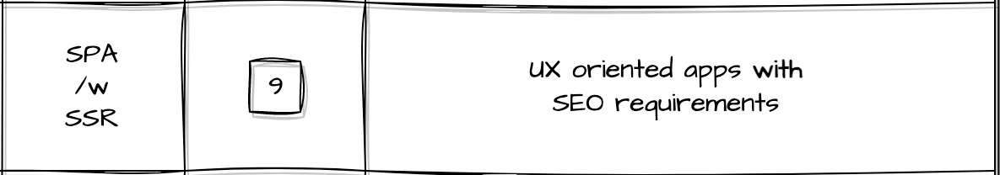

**SPA**s are awesome - as is `static html`. That's what a SPA is, actually, `static html` on steroids.
And just as `static html` have the `static site generators` to solve their shortcomings, welcome to the _Single page apps on steroids_ - **Server Side Rendered SPA**.

> What does that mean? Do we move the whole SPA on the `server`?
>> Not quite - the SSR-SPA still leverages the browser just like the usual SPA, with one "minor" change: at the time of the first request, when for simple SPAs we would have an empty `div` - we now get back from the `server` the whole `HTML`.

The immediate benefits are that web crawlers can now index the pages - **and** we still keep the same application code as before. On top of that, the user's browser's capability of interpreting and running `js` is no longer a bottleneck for displaying information - the browser can just display the `html` the server-rendered as soon as it receives it.

Sounds awesome, let's make **all** our SPA to be server-side-rendered, right? Right?!

Ofc, do as you wish. But please look into the cost as well: for the first paint, the server needs to do some extra work - and handle the generation of the `html` that the browser displays right-away.

[comment]: <> (SPA SSR RequestHandling SPA-SSR)

<iframe frameborder="0" style="width:100%;height:660px;" src="https://viewer.diagrams.net/?highlight=0000ff&nav=1&title=SPA-with-SSR.drawio#R7V1Zk5u42v4tc%2BGq850quxA7l705mVSWnnRm0n31FTayzTQGB3Av%2BfVHEohFEhhscOPE3VVJI0AI8bz7q1cj5Wr98i60N6tPgQO9kSw5LyPleiTLiqrI6D%2Fc8pq2AMNKWpah6yRtIG%2B4c3%2FCtFFKW7euA6PShXEQeLG7KTfOA9%2BH87jUZodh8Fy%2BbBF45adu7CXkGu7mtse3fnedeJW0mpqUt7%2BH7nJFnwyk9MzMnj8uw2Drp88bycqU%2FCSn1zbtK70%2BWtlO8FxoUm5GylUYBHHy1%2FrlCnp4cum0JfdNK85m4w6hHze54d7TvipXy5%2FTx38t%2B%2Fnb3%2B77j%2F%2BMzaSXJ9vbQvoaZLDxK50g%2FI6bkXK5cD3vKvCCkDQriwXU53PUHsVh8AjpGT%2FwIW58hPEcvz9AB%2FNt%2BASnbhy7%2FjJt%2BtddLskD0DRc8m%2BSvtwTDGP4IoKBPaPDy6cSYRQGaxiHr%2Bi69K4xMNPpT%2FE5NvS04Tn%2F2lbatCp8aHqZneJrmfWdzzH6I53mFlNu7TfldGJ7mO1aZOz%2FCd5qgilnqZvhTeD6MQxvntAkROksZQQqoQPHjlbQSQ9W8dqjF5XmH9GBPjfhbMHTh2NDc4Hpw7Nn0LsNIjd2Ax%2Bdm0P8ZHQCT62LGNFH5oJZEMfBunDBhecu8Yk4wKCw06Osn2Abe66PxkQZpJS8zAa%2F6%2FpliRn35AlCez3x7E3Sycqer7YhfGejg2sVjz7w46m9dj1MJxfhfOXGqLMIzdq1vUXfjDwJX3QXbMM57nkVx4hFy5pygf5BHwz%2Fgy%2BIJssgQHCzN240maMXwSfmEbl0ukgegf4sPUSTL9nHJIJClnqCt1UB70pOopb5CNA4LqIJQK70BnLAgRzBBH0YFukUCNu1dzGPgwOAV6ACIeROClP4uECt0%2BmlZvSFtSpWWok1mRdRSk8c1JQ%2FbsP1j9W7T9raWXy5%2Fv%2F5%2BHEsNxVR%2FQluoDByG0iAn5VMuhenJdPQOic60bzoXozFhfuE%2FlzGBBRJE0YYeW8KMv3HNkguQHAzJTzKvCm5F5EiTPCd9DFK4M92jZoFD%2BxoDPTeWSh4bJPRVDOgaWivsb7yjIn0bmMTmn8ObYa7nAojAQrPSBTFspAJgN4xRakiEd5I8alIlfz1QNZTS8m7Wc%2FbUZVWSVVFtH0O4hWeiyosMqhDz0UW5C8OthvyK7DNNPwr0lZvdPzLKrtIRXRcmHfdjVlxICDTs5pWkgMqr3cZArTSyw4B61V88zw1lHt5rN1q9%2FCf8OpvfazyaAU8%2BJwlvEsPgzBeBcvAt72bvPWS%2BA2IfQHYieYAWZpmwWfIn%2FAxwIwk%2BTYwjl9T6NjbOCiDHn2j8PUeHYyliSSptOUB42GimgZtuH5JEZIcvRaPbmHoojnFOE0sDhZrEvkZMEWZPEVlY65UbSI6xl3mZ2yHS1inFqakgMHShBDQpwJAlRmtKD0OoWfH7lMZkSLwp93fYvu3cEmwWERosCx1ZKNoRDCfpXffp3A6lT6HY%2BP5nX9%2FpXweG011yWouxolY%2FCO0xckP85XVfj1MpsQqqkCgqBqqgElZXViHwknnjcOSkihRH0Ku%2FYVkWJXKYKpI5h%2BNXohPjCMy1YhWJVndvCS3MR19sJ%2FsaB66G9xNuPVjxDt26JVCBbSJpjnfzhoI%2FlnCgj%2FOsobMofslMW%2FTdscOH7%2BgbtyY8L%2BJpJUbZdLKO4ccuLC32ew1Y4ApZnURZzKmRLEsUkn%2BiCoRTsU8OB6LbaU21Pu4ElSK6LeW17TSdo9MmvoObXc3jQGjgsYcG64DH13huVEMfaItSwsEBywffmxhRCCHrrbXZJLJv%2BRkvA3Ty0MYbQI%2FglFTRbusyeygOeILvczorE7fbK0GcdLA0g3F1luR33H1D4mXeRA4GjT6QHx6Vkf6HSgJLANMNJX3rCjWRLN4wjCBll1%2BCG180P96GLt%2FPmjP3s%2Bfxvfvzs%2B%2F7gT%2Blbtb9AUQySgvFwlWZwg2XrWXcx04W6JgUw7iwQVxrGBW7S8%2FkqPEA8j50Sus8qKhVIHfnA1nEBY6REsQxl%2BeGglR4OGJqYY1DU3KA4azQJ1OfUz9wVmTzYlmmJopA90ygFSGtqlNTFUHmpL%2By9uOQAEToCJuD0xZsyxFM3nIG%2BbEMgr99IV%2BgUv%2FAfPhA4xLzqN9VOMyMxUfSlYkb1MqWpVROVSsG4Qy7TC%2BwCkImIt4dhS5c9o8dT06He2gXzQvhShReeuyjpfutC4bW46HcXZRTHa3jzo1xzlN53PQ2A84eGp5cWNCLBMtPXoonMmJBR%2B8DpwqBBIg84e%2FERlQW3wgdKByZODizxavYK6kU6WdtYJtgmw0yDm%2BwsU4nI6y7KKCRr4K1rNttFsbPwzrAwWhXKdVV9sIfSkowCq7hxTeNySM7XaSOSCmCB6DJ6lmDBR%2FtV7lt1EZRB5p8YXKoJilrHBIxYL%2F1ICa68MTYOglnbgYfGkTaxkq9oV%2ByxPBvj4o7AuTGKkaTER5QSnOvHaJe4%2FRG1zsEnz%2F7dPHs75wAvoCk6%2BsCIJJwkzDLGmseyhqp8dzBwq2Y1pIVJifmqdA4ASGCBLhOHIdzOBWr05ok4xVEbMLFgVzijLFU0NvQWMwDKupF%2B2sLRyPZoamLfCacjngvzuoaFYEFVtHJ2s6SltiuN6gWYElFQb6S6yopPRMb0o7rU0JmAnaWmbNDmF%2Bwq2fsS5uHqYh6gX6Djp3FRA2%2BJ%2B724v%2Fq52a%2BhY00hAxKXeBUerioSMuhKBJ2KouEW6EE8wLbFQ440kU2Z9FaTCZG%2FqB306q%2F3xdwLJpujMjRn5HbVkUs14sFrJgJSBeA6XPdK1PbVm11AkoJ4gCi4%2FyyZJIYTZ6U5j5HI%2BIqDAYP4kS4wVL4sbljbE26RS%2FJsRMHmLZYrrq5Xd9QSyzq1J8aQZvkKmihHmlC4Ps2b%2B83Zo3tubOrdfXzV%2FXcHkvzO5jYHT05TlZGuTOdQRqX9PCGw7n1Tnn1TniZX5HX51TS8gdrM7pjaqqLYs6%2BF5fXl%2FiXBoBfBOFkfRAUEVbCvpe4ZJZ4LyylwiU2fJNG67T9%2B5Iviook%2FskHaTra4XU9gc3BnQBN4ydA8caseCF%2BatEM9fcDqhgFY11abkrW4jvqDU3LMxLll8ehfNSD%2FZmM%2Fk3Kt0umLlqBlprBiDSzbCcsIKdmYVr13ESPxNEk5HKXMx6SFkCQsHa5Ui7xn1t4yBKGRqn%2F6R5s4IyESI%2B2IhHi3wxQo4%2FtETyzlku1f%2FK5oUiSpUVJZD3ZVzIfPi%2BNdnpDcnOIj882X3NElXe277jFZZltreiB08%2B1t7kky7Y6KkWTvVCsWz1Y74kSaSdi9Y9dKFGiGHLr5u8Q1OAU7mlW1yiSZYuNhskYYlrPyJDRSOVpbu7rw0w0%2FTDNseWSAsuhwVORRHuoobKHiDUJRaEgspLii4AYW%2BOGZlfjMibzoOPDg0UZs3DOVkpqzyWQ1NccdALTCTSF82FlSaaqozq8mHxARv0qsTwzgW8ncdDmTW3lH7YkkJjg835S8JQ6X059tE82q%2BFy1KxV%2FkkhX2QpenF%2FnbfYMr1NxjGoTcYplR7A2D9cPvcoZTuQH8kM7nvemcxj%2BGdv8qZxwyNx0hl%2FlLPXfJovGWpo1L%2BnmFkS1faROQbMafG%2BWx13tCm1QWkiSIrRoleKPm043OtmZNslalUt2qotKfKBWJKblwcsz8%2Fu8ZqUYbWMLwFeksgpx%2Fs7BLszCVY4Xo6JN79e%2FvoOozENMNtB57b%2FQI4u0LETB3QmR2584kTzLdrwq1%2BzRiyLBay9Wy%2BVRTmyDyXdlxcOIb0w5dJAqcT86mZbZAjrPxzMGiPgMfu8fdKdTVJUpXsR7YUS%2BaUApFjpbcUcYVPSTgnjXdm9Fg8JeztWDFLho%2Biq%2FWmz76OlS5MElybDmhyWf%2FdzygROAfYuvBAYgtcVnhfeAuGzYUxNKanZGYO9uOoVQ%2BqGhl3AwA77hDMC3PL29ljdKuJApPRT4%2FJ7OOB%2BGUZE%2FWsIM4kldc5TGSQuVqO41kRVBQQVgCVm7KxA1mUyqwcH2tscK4j9zD3IEvX6tkKe4NqgmoWsQf5C%2BcdtKkkyWQsV6LicA%2BNznqZc0GyYwMMVkp0VqMWNHBcnc3G5mZjPRyb16qa6DLvvDsqMgQilPpdzibkSZiQHWERKBMgG5KqZb8lJoYtTNnIfzRZAxxyRfkjvVmYKo9c9fSUv4HyvYMVuUZa10E24YHK1BiwZZqNhuZeW22KWY7EhrN2Xk%2FH1WuQWh1AaItbQiILVtb0l%2Bwunpfq0Fbna0im0XY%2Bh1F1od3zapIhschBrSapJ%2BqBLCcRDpKqtsV9y%2BZpNYcNDBdBuIZOEjo9MY30t82zPxSMzKZnqTjQBYn2Io2zt5Cbxsc0rLPGORSNk7pRSZDAKPlSLdBTtmhdPf%2BdFUOoajGQiiE0rlLcx4jnuWd4D9mgqsXZzu2HaLnx3k0vmTO9espzHnMZ1bJUb3zxd3SdI7z85D7e%2FzB%2F%2FOP%2BvNkGX77%2B%2BeGbSo3eVoR2Jq2OSIsrIWFK%2BJfOGy29kW0Aze%2BXlrWk%2B6UBebR3pIqhvp00L8QT4Em%2B2tnSOYFrLAmx7usK8u6Kmip3QpbmpJqRj9CAJhHilqS80iZZcBaRAxtRljOiG%2BWMR6KSSrNtnN1sbzZ4RBHpmRTr3vrEgrHxSF%2FT2PdALBcE70vyu9t82dejnvXPqALC3dRrNgESbKIyfNe8wA3GEXB1gku2I0m2bMbkXWCKKELUxdbPQmLax6le4ptHl1MlbFUz96GKM8EGh3toip2IEaUX8aCwGUXHlg98BZNvhJE%2FrwKy%2FJjsMYUQ75KufAgdjApSDW%2FGVlRukC%2BvVSTe%2FxeLCkwbibQJMXBSkZJVB%2BvwUS6WLJsQKRzOSLjpGyk3OHvNBjFDMIvSUZykANPaUPlZgHUhwLKtTrNolyDDQRZ5mLtY4y2kdn755Wei%2F1GdEHGajLy3Ua4TJlygSRWdbwU1kKernIyK2mfge8TvHoSPwqekxQ6y6p85QTdYm0TqTPCRJspULm7%2FrI7q5It60GfHzygUUKY9CGp8niSD2LeSx5lB7MsgOAVXWANCpOACNjzfGYPYy835tipuYQWyoitl74O0X57siWvNQicQrbdzXK3Z5J0vNctmj%2BDvrxslpwS7vhu7xHNR2EMk9Y%2Bs7CgXXannJITo2222iVa5tsNHnCMi2aQytevj8C2tzW%2FPAuw1EazMfV7ZWNJAryB%2Bc7EZrYKt51BlGftj8MZnXpAJp0SICita5yo8Gd8MogGVRHxERp3U3kUvAjNVwHMX8HQl29l3c2zJBlivJ8jq%2FRb3FgcC0Wb2JtnaFQZunMLVal5Yi0AT7HinCDew6SKSX7tio2XBglQIcop1xqqOt0F6l%2FQ1RHGuCdhokijF468e%2Bq1yn46NQ1F2YTV97v%2FS7XMxmTIjApoFogXFoIsyl%2BKU9mqaPVfzPudfEu0l2znr6PmX9eTdLv9SSFdd6AjiRbSiVXTn4j2HFO8ZYD3v4Rgx59TZPvmIeA2JKpDeohrV%2FTEZ3tuQJHn%2FcZh2%2FGsqvxZDH%2Fvud9MRmJiC50CwASmQBWjqIiVB%2FAq8yMqCm4kUwC4pF8dy8UGwid01nlpyhABT%2BONsmu1lmnVvhNGzZbNDkP1yZKjxjCuJk7t8VtcZPMMCjyi0dGT08DXuGf10%2F7KNf68SNvbBfrKTGop%2FjOrC1Wev1Gmhl0%2BbOC52aQW3PRd%2FvE1YlJZSysonPRTO7CzmnFVufiieqwiicopYZnoMFb0yby5lYd2WqC7GQGtVtN3Fk1IBe%2FxVUGLUH7bk6WRQf0ZvLXq1pug13gq9whfcp8TmUBJZSrx3squI%2Folnqwwtx7sxo34rZBsnjOyJqctFdIOJpJ9TtN4U9E3XaCvHAr145S6%2Fs98%2BdPDW9U0rFGywgwR%2BbRjvsw%2BVaKuXWnd7xyu5Wy%2B%2FBtzy6x1bNCmaVntDT8WveH%2ByeXp09lvTyzHJgK%2FYxtWS01i3TEcFDXS20C7dLrGKoLgbNP0ggkKHYYD9kPnluBzsp8CB%2BIr%2FAQ%3D%3D"></iframe>

1. Alice enters `site.com` in her URL bar inside a browser. The browser (after some `DNS` fun) will make a request to the server.
2. The server receives the request, handles it, and returns a response: the `html` file. Since it was the _first paint_ request, the server will, under the hood, call the SPA methods and render the full web page that should be displayed for the user.
3. Server sends back the `html` for the browser to interpret & run, but also adds a reference to the `app.js` - our SPA.
4. The browser renders the `html` contents - Alice can see her page. For the moment, we can consider the contents of Alice's browser as pure `static html`.
5. The browser also starts the request for the `app.js` file. The `server` will notice that now a static file is being requested, so it will simply return it.
6. The browser receives and **starts processing** the `js` file. When done, we can start considering that the switch was made from `static html` to `SPA`.
7. Alice can interact with the site as if it was a usual SPA. Let's say she performs an action by clicking a button.

8 & 9. The app makes an **asynchronous** request to the server; the server **knows** that the SPA is fully loaded (information sent via the request headers) and that it can take the short path - returning only the "raw" response, without wrapping it in `html`.

10. Alice can see (almost instantly, maybe?!) that her operation was successful.

[comment]: <> (11. Only now do we have a SPA loaded and run by the browser. It might give a clue to Alice that it started to do some work for her &#40;in this case, gather the information needed to display her name&#41;.)

[comment]: <> (12. `Client-side hydration`: the app will then make an _asynchronous_ call to the `API server` &#40;might be the same one that served the static files too, for all we care&#41;. )

[comment]: <> (13. When it gets back the information &#40;"Alice"&#41;, the browser can hide the _loading_ indicator and render the whole app.)

[comment]: <> (9. Alice can now interact with the loaded app.)

For the build and deployment of the SPA-SSR, things are even darker: we have to say goodbye to the option of choosing our own server-side language. There's a hard, non-negotiable requirement of "run javascript" on the server side as well. Say "Hi" to node.js, bun, and deno.

We also lose the flexibility of separating the Static Bundle of the SPA from the Dynamic Server API server, because we need to bundle together the `server` and the `SPA`.

[comment]: <> (SPA-SSR build,dev,deploy)

<iframe frameborder="0" style="width:100%;height:660px;" src="https://viewer.diagrams.net/?highlight=0000ff&nav=1&title=SPA-with-SSR.drawio#R7V1Zl9o4Fv41dc7MAz5abEl%2BLFKpzkyn0%2BmuXpJ5yTFYUO4YTIypJb9%2BJC94kQBTYMoEkXNIIWNjS9%2B9312kqyv8Zvb0U%2Bwt7n%2BJfB5eIeA%2FXeGbK4QQcbD4T7Y8Zy0YAZq1TOPAz9pg2XAXfOd5I8hbV4HPl7UvJlEUJsGi3jiO5nM%2BTmptXhxHj%2FWvTaKw%2FqsLb8qVhruxF6qtfwd%2Bcp%2B1MgeU7e94ML0vfhmC%2FMjIG3%2BdxtFqnv%2FeFcK36Ss7PPOKa%2BXfX957fvRYacJvr%2FCbOIqS7K%2FZ0xseys4tui0773bD0fV9x3yetDnhDbl7%2BHN2t4LX%2FLdlfJNEv8y%2FDPKrPHjhKu%2BPJY8feHwlL0ZCceHhSHwgU%2FnXv%2F7xHpbjOFgk4nC8mifBjP%2F7av18yXPRp%2BJRF%2FLP8Wok%2Fhs%2B3gcJv1t4Y9n2KHAk2u6TWSg%2BQfkDsg%2B5%2F360blj37K%2BrJAzmPG%2F3vfjrr%2BIyQSLBBizg1BtR2iq%2FuUzi6Ct%2FE4VRLNp8PvFW6bNMonly682CUF7gOh7LGxsnS3H3N95KjLF48OxLOU4hyz8XlxKDDACVgyzagzBUf2Iae37AyzPmkbz%2F4Xr0YfEL0SpOO%2BQ%2BSQTUkYOvxZsYPfkmv7C0plE0Dbm3CJbWOJqlB8bL9Ku3k%2BwhxJ%2B1x3DQsPIgy688Gd%2FnvzleiXG9DZIkmE%2Fzpn%2BC6TQdMtFxQzHoSSDE4joMpnPRNgt8Xx4cennDWDxUelkVeAWKxCX4U6UpB%2BJPPJrxJBa3C4qjDstRk6uNAWQ0b3kspXAtO%2FcVCURu3ujlkj9dX75Ev%2FgjF4A9hAEpwnAnOkt0AgIfpRZB4HqxCEUnJUE0X6a3Ku4Ugbu733VSIPoiqSO9DsscGVUY5U1Kl28cHJ1oxZk8SWGQP%2B%2BN71cx%2F0keurH3koHuEVoRNQT2RewRcOg0UIggVlFoQw0KaVcgxAoIb%2FjDFRIXA8NVIMgt%2FfOGL8LoeSaffDfs2sMp5svguzdKLyXHYxEFYpjldZ3hlXMjr7VKomWuHPdAdFWnuvuAsKJ43fS1L0pCb8TD4ZpRGveVHY1in8eNI0dAF2MWxA2AAdZSzdlHANjHYO5%2B%2B%2FD4swu%2FzPi7mz%2F8L%2B%2FeaShfgVCpQeBu%2Bq6NhqJtamOhGas%2Ba6MqjgX%2BfI%2BzyVgBvThCxoyPJh2pJIBUxDi2BjGEHQEyv3mf%2Flgu%2FpoPvMef%2F%2Fv0fvn8ny9kgFVmLKxD2WepdV50Bvm2khbtMDWHGZDWctmU2ZF3H8XQgTASGkh6DvyBh9Ei02WgMD%2Bzq19lQ1uc%2BAMbmuRiDM1jKFbFeLRdy628mCIxUKdjIXQ6khjk7tayEnmL9r2xdoFzfq65kbpewphatNFRFGjox7Ytx9UY2p3pE7tt52yk74qkaYWjzmCbWd5bLrKgwiR4kl8fij5OPKEJ4twCUsdn%2B3i%2FfNSqI4JdS3hIgDBEieM60NaMDrYF5Al1qQ0cBAnraKwcZawED86i%2BUA81ySYnp%2F5CV5ifpbIOtzcOYFCPhS1mx13ZAFGHABdmzGI3EKB5gqGEgsR4S8hJ3tXdI2r0cK4KzVDdquZ9Wiu4cbjtw88Qx2s0ilITYDlfelYb%2FLrpatCKPaIakJy6DucFhrpo4CyDCXoZON94wujKEkEElThSSKpJqPMfnmzDpICneAV5tLsaSqjuVY0mQRjLiA2H%2FOFgJ0fjVfSDvsyCr351zbad7sAyKe%2Fyzt7GYWBf1Y%2BADyG%2Ft%2FMztSyXSlFrk2JDQqTJRckWyp3amOHZe%2FEVkQJYwtjxKgLiO0QlxKNZDGLAQcihrL3juRMtXVi%2Fm3Fl8lAKPRFNF9ywxKXxRKpRQkxESYkETqf1qMgO1linWM5CU0U4b1X4AkMhXDbKk8QoROY4Ykz4omG7z5JXx3zhwOEThd%2FOY4tSMKuyRhExGK0oA%2BXYtpjAoFqTFKo8HvRZXmyxfDHRfGHa0GKEWAYMgFMQupRDEgcizCbQAen70iN9pzUzYC66Ohp%2BGMdeN4Uqjb8cSb80Z0tRqnlIupQBzqMEmlW1BwNxwKgNMUIID3mCWRyVy%2FJXRWZgT3SVoeCr0CXBVGpqLEGXJkfTCjBGDvAcR0VXMimFnGF%2Fqb5e1ehTqRT5Fkiyg8eyiRUPi%2BqaIi9R13ialSeAJRzxPDw5ZVukpX%2BCus2zY1UmtaTt5aBL%2BerTFbzsVTsQkMnz5uucmmmVZVpdxLPHhqiykLyMfVKI3viYqoh%2BgGsNUc4%2BwwJJ8MmTJAFQDWCGUBrTS7iHWPqqv6%2BLp19jAkQ%2BidUUxrG3zf2Ws%2F9fQiEHQchI4gwTDAD7vn6%2B0jNzPhe4o08Eym%2BNE8%2F5Q5g29h2KCS0zh0tPH1ySk8fUcMchjnOjjnSCABwAROi5jrYJWfMHEyRQD7zgnBpeOOieAMSV2YYgbSLbAoZaGQ%2FdhOH0xFxvP%2Fjz9Gv%2F3uXTH6Ov4N%2FPn%2F49PfqrWZlyfXH%2F4iGu9xfb3KImdZ6idNabaTOa1Wna3Y3k1ULXdh6smbrDth7Jitt9ot2GiumFqi%2BdCx1jKCCtpta9JKJTCON%2FZMvEtCYvLe3rouxVrS2I3W3wNVh0xFOtMu71NhTIEDxZCWL0Jgw52HCHAq%2BtVluIZuUr3pejjLLZZWjp%2FN8tbB9vam0PhkRRzOVVjhNaGxS3Oeh%2BDekuI8kSRhYDq2u%2Fqk7AzayhNdbvuiGFHf1pbMdiAVq3%2BlI1NQY0z33fB4birg4imDYcqqYq4f8d1MEPSVFqJEZQxGGInpCEa5rYVSRpMZqi%2FNiCHW9xSSKEsMQF8gQ0MEWYFXo9pkiXnGlheEIwxE7HXJo2VBV8edJEpo1FbKW3UAoYMMTF8cT1EIV7CKK6%2Bu2IWYWgFsLaLCTEoWaMDNEYYiiJ0SxI94EAdxldfWKKNSKcylRJI%2BRIYrLIwpmOaCSlED95okWaVfDE4Yn%2Bhh0OjeaUDPXaa2scWJY4uJYIg070c3Q3k0Tp407mfS1oYne0kQadwKqlj9TnlDz13ml1%2BZK12yxqmXqCF4ggSAL2RV%2BsOsFoqDLLOaWMzmhgnhdgY%2FO5uzB10ttm0KChj7aRKMq9OA0l0LI0sjlYXX1da%2FYQ81tp0ImBmFp1vhcFkdkTkYV2TVgI7CLJE7qY6DXy20zNMJEQxKCIphvG5IwJJH7GJsmm58XRxSCpSnTM6ptMaEtxZNV68nr71wan5jSN0fOljQm6NbdGGCB2kGAAVQXV3dVq1D7iGoQdxFHvuqbj%2BRWU8Y1v0SziyGLOBXfHO7pmuusrs6WXZoS%2F8bo6q%2FRBaDFcMWBORPPXPv4alg3W7j6zwWaURfND9C1aBXU9dQfYhKPlcNYQfVJK2%2B8XujW1GY2BLErC8IsQKr71tX9ByEpDQ%2Bi1wyhhm7DaBqM0xnnhiUujCUYsGT1juJVt3xakERXsVv9471e7NawhGGJXdMIicWqy5Lqq8DPjCQ2bPViCOLSCAISmbeuAK7ffoTZ5MVQRH8pAhJmuZunEJ4bR7SI6nZdchDRxtbZCEC4Y49xXSaHHEEh6WumKn10wx9UlZQL6WoWXo%2BT6AClUNFQWv2gCG9PBRGptQbr9U3blyo9sD7oduzvVcQQnxJ56npBBXZnTH4Kz2nR3iS%2FB869mRV6i%2BwiPcX%2B1nK8r4zmpzqS15PfFS2rq3vYWX6xyNdXsM39KS%2FskChO7qOp3F%2Fpbdk6LAu9goPN%2FPIX3kcSWtlQ8CR5zsc0n25RkaEzAt%2B6%2BOtGJl8W97hDGyVePOXboJgrKTl6W3EY89BLggdeu4vj44oZXPUbV0jFlR5%2FPQOWe37AEmMTP3%2BSv25Rp%2Fj8Ob%2Bb9MPNU%2B3Tc%2F7pshDZVtPZxwZkeup1HHvPlS%2FkEbXyyh9lQ4XI1WL2GFbhrZyBbLb9DPFHdheleKwf5%2BUSU9znmUoMMhKzj8Rs3Vf2tUXGUUUGbBUZ7NLtZxwsMvEH74HfwD%2FR8Jvv84d4%2FhtmA9xiB0U%2B98Uvpw7fOPSWy2Bch3B9N4TDJEjxGrO5iT3Gu63ife2I8acgyWRbBpmyz6lsW7ZTfC7FW354rnz4yONAjK%2F8xVL%2BP1U%2FfG7ojQ2qIv3UvJpWTl5oYEFVOvVoIzvjH7pUQNG2n8wqIkZwUygd1vA2s0fNz9sirYQ1L0Wa%2BYqsM5RL7atJiK3eNNp%2Bb8oZFJ1Ak9i6Aj5kHYurqRTybRUVBwZZ6k7IKIBs8ZQiszieBnsLsSobCwGrNFXmuldWi2Q%2FvGF35H1Mg8MV20GmQVu7ADqbpP0H0aug2GDGi5OCk9Z7oou220CCthbXm4T8Kf%2FqC3XeFlXWRue5ep2XS%2BtAcAErUqLdGiWuov%2BKzZc2qRLlDATAFlVSnl%2FcUjSZLHnSOOM4hkub9QI5BNJkya5dmlosqMqRlh2NYp%2FHza3NfsStniDUSaImnSLah%2Bm%2FtaRpkneKrG1ekaVwLNXsoaaLITdZ%2FSUhGT3HtZhdZqzlQ61lKCtO1axlRvHRrGV6Qmt5W1Cn78YylBMNICUuAwyzxtqxAbQZsmwsRk98Q767LzOkqe1YqBksIqgbW3q912D5FDsIUD3DcfY9o%2FAVurW%2BW6RyKxMtWs%2Bq2Edhu8ytTauoz26U0y4cRX3bqL7VI1QBTWhX6hy36DSz1WOmszfwvJrlT1%2Bqls%2BnGbW0DLZgfKtCtJFmC8juANSmUkgmdZsmnhwkjnv1UnF5mG4hXgpcXUqJamGtM%2Fe1CWSwqz5VZxUbmdRPfdo0j2b7zJsi5DGOo%2BVycO%2BlnXOAVG6afXcSBGmrimB1gesy351b%2FKSwqvDTdRosmssZ5pucxlnkr9IoUDGNKOSTdKqY3GF7Pn2ffsoGYudk9mwq0Qtrdmin5L1kPq2%2BaEcP0Q1ZS49z517je2F4n8lNTmPXDc3m3kBnnB9hb2%2F9E%2FRKa27RQP1EnE6f3qavTnRjuW%2Bwy6rGb90REh6WajBDiiyAVGRBSq2uwKWayfPI54O86qtZ79Pn9T5dwLZe7KJZgQw7lgMrRQXaza4%2FxnIfvT28WzOa1T5mtU%2BL1T4diJLNLIw2Vg1wXcuu7Ajp9KZcuPZR1Zkk3mIxSAsHGI64OI4Ah5JEV2UDtE%2FzesXHDEkYktglS%2BgHYgm1tIxA%2BiyamwqVl0gTjtzVugQ2bVQOQKr%2Fe1Lf4RWryZiilIYXdggPE7RQqavh1DM5kMGqBUaLshc95QXcorzf4Qnsl2TMXFDPUNdnQmCmyZgRx2JVwla7FZEjBOvw98nwDbkdws%2F0w%2BJv7C3%2B%2BvDd5M9eGu%2BdTDgZa%2FNnPnVHADS0kS5%2FthNqa5TvVRMgxRM%2BJYjUdEJaht%2Bkz841fXZ7K2v4NUB%2FrPTZHqhe69S6oadLdOjyZ91pzRb085oJtHL8%2Bok5BLZgrjMYQVrnWVSPMlEVVQJ6VhFsqqXPwBF8CD2yVI83K7edgsW4u711dzvAK7b3CYoSFb5dBUX1RsDreb9mr90fy%2FvtQJYcvDMoWvHaNji%2FGmli6%2BkVxxco1TcTfbwIQu6bTREvjgzcHRkyLIC4DcDspFygeoSn4gKzJ6Lhgl1%2BAJJkUEknozoZEIugppy9fhxUL2jqZDtvsTATKC6NHSDbQQ9yb7fKUdVX6Kqoth62Zpqd4Yf%2B8oO7fQaF5IdSs9uqLPUqU6YGlO7ufr96g66ugQnRn2%2BIvly7v3%2BI%2FpjLKdexVVRbKKg6IKdd4WKr80t9vgijZwXf51rYx3IgvXpBbYLzqwKxbX1Xm9o%2B2ZAfp45Prk2r5Ri0qwq3MwywMClmBnRbxQfatJ48Gwh2o1XxanPK1pJgx6njIz7GkSzPVX5dGkK%2FRD6X3%2Fg%2F"></iframe>

To sum it up:

✅ **Pros**: SPA on steroids (see `SPA` above) in terms of functionality, responsiveness, and speed.

❌ **Cons**: locks in the server language of choice; bigger, riskier deployments; considerably harder to maintain long-term.

### Progressive Web Apps
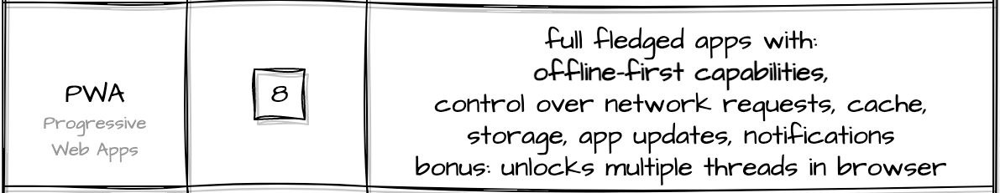
We've seen how strong `SPA` & `SSR-SPA` are; we've also looked at how expensive they are.

What about Progressive Web Apps - PWA? What purpose do they serve?

While they have a lot of power and are quite flexible, I tend to think of PWAs as the "offline web engine". With the help of a `service worker`, we can now intercept the network requests.

Consider how, no matter the type of app we discussed so far, there's only one common need: to fetch some files from the internet. What if we remove this constraint?

> Well, we can now access web apps without the internet.

>> Wait, without internet?

> There's a catch - you need to have that application `installed`.

Basically, if there's a PWA you're interacting with, the first time you load that app, you will be asked (ideally) if you want to install it.

<iframe frameborder="0" style="width:100%;height:653px;" src="https://viewer.diagrams.net/?highlight=0000ff&nav=1&title=PWA.drawio#R7V1Zk6NGEv4tflDskwhu0GP39Mj27njdse2NsfcNQUnCjUAG1Id%2F%2FVYVFEcdAkmAUDetiBmBOIriy6zML7OyZtqX3duPsbPf%2FhJ5IJipsvc20x5mqqqbugz%2FQ3vesz2aqS2yPZvY97J9Srnjyf8b5DvzEzcH3wNJ7cA0ioLU39d3ulEYAjet7XPiOHqtH7aOgvpd984GMDueXCdg9373vXSb7bUNudz%2FE%2FA3W3JnRc5%2FWTnu8yaODmF%2Bv5mqLfFf9vPOIdfKj0%2B2jhe9VnZpX2falziK0uzb7u0LCFDnkm7LzlsKfi3aHYMwbXPC6o%2F%2Fae%2BHf8Wu95%2BFpng%2Fel8Wy3l%2BlRcnOADyGLix6TvpINjuPfoK7%2BQEAQiiTezsZtr9HsT%2BDqQgpn97LH%2B4f936KXjaOy66wiuEENy3TXcB3FLg17X%2FBggm0HbgrEBwX3TslyiI0OU9sHYOAXzK%2B%2BQZpO42P3rruNtDDH5EV33Q4Y4%2F%2Fc0GNxt27r17iF%2FA0k9TP9zkJyRpHD0DclX4wmx1pZkmakgUpktn5wcIxnexi5rtpgnsiQfnAF8%2Bfhh00FN0iPHDbNMUIlQ1tDv4D%2Bx09A86IJE2UQRb4ez9RHKjHf7BTfChy3V2C%2Fi1dhNDvadvk%2FeJijspCEibwyiE%2B%2B9fQJz6EMN3gb8J4e5VlKYRein564Q%2FgzchTpQCfVCsQQTfVQzbJOcnzA2C8Fyk56qW73gtBUTRFvnObUU6TCvf6eRSuSkuXyITfsnBeQJQVQ5QTQwJz3%2BBXzfo65%2BHJIUHBf4zwKoghv%2BGUbxz0OWfIA4CtP8RaQRVvtvvA9iHqR%2BF6D3P0Rl%2BjC%2Fgh%2FBNOC76CT81fGiolbboLGe%2FR9%2BdZ4BOSiHQSTvgY1WaMm4xYiSHkYyVbehQB968ZKTRnlYbHMVQUxy4zwACI3r%2BQm3LHYmXblPipRRjYaN8LXqTL40BLPDgOJlvRnG6jTZR6ARfy71ZR3pEt16kmcsbfIvQG8veCkjT9%2Fx9O4c0qoOegew9%2FowYsna%2BXWmzjP%2BQFnOSbdGXaOPRSeEVEIRt2HB0KgRY%2FP47QqKkaGT7D7g9lyVZNcieh7ccrNnWe3WrolMqeEZv%2BjiaITBIV4kAZOq58ebEG5AeQ5rOl48YBFAZv9Rb0jnO9WaDBynNPaVd4Ktar4Hpugzwcr1zkoYRqpHcyHVWpC2y4IWI1YtmMeqF1S7csbsv1WKc1%2BWkY6%2Fb22IQsa%2FgWh1sNnfwPsI2zdcX%2BGAJUaDVka3QP3KDljVdG6zWrHh4DrDXLjE%2BHqPEx%2BaT9uCCMFOFZGj%2BRh1QGK%2F8sdvJt4rrRIc08EPYJuIQ5sM0Nq92bxvkqEovADg7KXD22UWYAWmkY4Qqd4buRhQbRxWJXlcjisEoEYODca0vjFsMxiFK4HsRmdmHXXDnptEFuKsIARdxNwUpyuxYLu8Na0CoCRRmfhXOAKUNqT9tBls%2Fh0kKPTEn8wApiMGnT%2Bv4YFQUjaid73nYZI5B4v%2BdDzio%2F7Fexs9j3M%2BMB3QtaOgmpSvHHf44w2TVzlycAsYqGyKjTy%2BoaPKJKG0z1xfQpq38KayDpHAgovcFkQUDkccYeukgSZDFqsrfwSqjFGAPm84O6Y9wlexx98gtENT2NbdHGo8yqHu2N6XArg9Jw2DVlGoYLAh789EJ4pst6f78C0Uz6t1i2xzywubIZkGcd98vPBabIQfJLoQs3BVE75l%2FHaLsADgu2sgdr%2BzKzoU2A8hwXHB92WXql6YpwE7bQM5dxZzbtmmN2FJaxs5OpDMqSupWFIZCSKDK2KZpi8VyiZ4xh6mGaZcCoJosNAQHspEUmS94V5QrMelexdu%2Fo3SLekOERppXDAJ%2Fn3xwuH3FHw6JZKAPz6%2F%2BaqIP7ZZDZ9bzQXnpTvmPsyGZX8aoDwU66yJaPBvN6AuuGgNXdnxsZrVLI%2BkqtHaF5ZXlGs0rSxCDszNYXgZrBes8Vokyjjgns%2B44a2I4NHLWynGuBBHwsq3XpIEoz9a0Nr76XRw775UDcv%2BwvPkj2lFhaUybMsc0Kgug6QRFyVtail7WCOp80qJovU5gX9HCWnTKBfLbmpvvz7w1VZnuHotj3%2FKor%2F64L4Vl0OGTpvCR5h4IILbwEyQAqp9YaOa5h1WLMXeVKb9vq2JHEUX%2BNSPBZiREFT%2F%2FCi%2Fjp%2B%2BZrjLqO1W8l3Vtyxh0e92TKwWTVQqybC2xVVcdZstbiEZPMsIqw2m3k0Zsvh16wTjeHLAYGtJszOLpEXY63K293WW0yQqCLhAzvLvIOwRVTiQAa%2ByrIQCGm294KyMPGlmT3NCvWl7tU5G4XErtfSJ0EqMjiQLUM%2BL0JJKFpo54fOZEsnO3tQ%2BYFhEJSdF1SzNtHTo9hlofyOAeyT5OGdqmlJ9qaophLVjAG4ak9oV4NoIx%2BOjGkDcWh3of2slk2feJvJnIm1sjb6zmEXZguWJDFhN586nIGwEkx0nekIGoAtdzUhKvTd68%2BSnhbvR8O6NuDI1sl8wN2nivbHxs3qYgthRJVihiS9Osc4itWYdUUA7sZirI5ovVaTwPy8vQ4UaT9r2yluWnldJ2KmNkkrYVDIe8OE4ZMfMBTj%2FDtE1KQ1Q4pq74I5UNA%2Bo3qEKImOCsXr0uJ4Z9Vprvx1IkXUq93VbqBQRwv%2ByuYdJyZDUIHn2CIucuX7%2BSxwsUXtu3NTjErcpLGiqSdbs3atiIVBsnMkc640Su0GxHRPG2s9XriqzBXu955t2Y9UzXbGsGfnGwSNEppOosUDVucm1vdKzKC73UgFriiqAS%2FTDPMhXhK5IVdf%2BWYZVC7X%2B3MxW2Sv6n8%2BIkbuzv0x9mSLxbEyITrM%2BCdY8AplWtyjqPxayTQTJ4VTZCFh%2FQ3E0%2FnfAzevwovPnFw%2BKnxRSayw2YczpLobqK01Mmp6cKsrH7ruLFMSa%2BfuLrb4qvzwT%2BOF8%2FsFyJ42ATX%2F8Z%2BHoRJAtOrTYQcJzbQfl6q0XlmPFzbQVdb8xKsp78wifqPxaXBkLvDhVRKtE%2Ba2bXjnJAjZyb2iKX0rDqDgaxgi4k2edW3ZpipuoIOPY2WZCNN1NominrKeZmnZFybADYuGURpSNqln5cUD9%2BRK2FqHYe%2Fsoozc7DX4ULyLC3XYe%2F2GCWfJxTZ84w6iR8P5Q66Y9WVTMqeDmagXc5y24wYUq5pSHSW%2BGiFoZIg%2B1L145YOYnvSl7kHna4Wz4myaNelqypHZ8bpEua1TKlpDdksFEpZ7%2BX%2FkwYfIx9Rr99Copqfjj66wTAA2CzNywqsqTKi4WqF5%2BaDkOmhVr5k1VO7rDOQa7aG3J5ccPO6cjjml6zcL9Y5aeu%2BK0Fq%2FgVcyEtFpVTNLbT%2Bst41HoMYl0Sti0qQgSFkiF78t%2Fl%2BiGryHunDzlKPrIs5Yp%2Fc0xRkl4k7cQlLSuNPta0gubkN27V3LILXsXJFG6l4VnkEd04dumnx0OCqANO7PjzAML2Mg8D7FE8MDXR1Ef5wslS6sFSErhM%2BWX4KrORiO5PjbKxVD%2F0wJuUgW0ynT6W6SQAZ8U20ip%2FsiaTiUwVhPIA2p9xZDIgvCEWqz3RXCkEUCR9%2FlH9TZABenscl8qKXx8cl5YDt5njujTZ8zJ8swF2XLtzHyPC%2BQs2LnZ7H82MRRvRPvV3qCPxFsR15QslJlPmS4eZLwLvqSAJeTMrB81p0ezPoScnfdeQ1NlckVswU2wgfcebqDgw2VFIZhlwvPrEaMI4TYlWU6IVVhs3mWiVSfeYJkbrDdUiW1BTdjuW8JwL8aUnH9KYG36LHA%2B%2BMkmSLpOasXvxyrluPL%2Bk8Qd04wViRqJx1GRvdnDjLVjQW2SOBGAqIvhJnPrbM1ZbTemGXSAXk1ez9BwZm7lnTFV14vT0lLS2hfz045HCPpPPFCqDc67RFFmX2Wf0RFCNHk97zj7T2RAm8VtuScSrk7Gz%2FLMS4bp9VtGC21MBx9at6tBfNVvKsNJQuR29KlOrwZ9IWr%2FTtee0hKsN07WZE%2Bw8m%2BnqtTh1Npaer7ciJwAvfZige1SnIpQenAN%2FDjLLFB3oxgCE2ES9NfFnFz%2FCfyMWVQ61VKoXweyIFkvPdSjlzSOwatp16S0WPrg0%2FVtlll5UuhuCOxO91uul9ceHmXQ6rspJ81R42Xw9Og3sHM27x59nU%2BHbqfBtgywdZ58GRjEb3Yu2qCDCAVf2KOsikMH0d356FdSFfx1AkmZjrB%2BuoxlnoaEuIn68WXCXr7w9%2BpFUZoWuyAkRjaTdA5UkYy4kKPOWucj%2FJXRJrp55wQrFkorD0b82i%2FL%2BQM7OZV0jSKHzSPWPksms4z03M7kphSVLygsbTNj%2FjNhXeCURrgr%2Bxe05OlfNTyroxLGKw4Vz8I5a%2Bc3%2BUtusJf3SwpSXLfLMRqtjkB7isKbtiXIvFPnN6OyFaWnO6HV2XTcDxTOAdU3dzFsb8Jq62bhFDnrSzaPVzW3LhxoC0msg3cyGW60blINqLEaxarCWVMtsgPYHicVw8F60mWgKRZJlpaIrZEmT1eP6glMroYX0nMb5trFhjtfAgS9et%2BrLrOUSeCkzTNUFqZ%2FfH9drjGCip8LLVB42JcsQz9ycUh2nVEes5ZbLe1R4Y8SpjoZgKtUV5YoXSmoG8MP9w71h9zqRuSoD1El75qI%2F%2BdmcljZtF2VK0rRiVd5%2BYNoAD2Ca0djwPmbtUiI%2F%2BjxNIrin5mkWNgxXRY0tTNW9jsgvo9btEI1TV1njaJDe5hAZbMz1BtnNj2Xld2iXE7ur0S5vMsvV4p5lwkA3hrnCpGzQo2VHhcHmRX2%2BelBNmLtFHz%2BvL4pzvdwtgw0x3%2FBUwHIZnMKbtbWTndnq4lNFXnJ2NdMsFqP6vNRBl85%2B2zxOQ7Dca79Jmkw5v3rKJWfBdCaT%2BqTjzQFWvjJ4taMHphF0KmWMV9Oft%2FpOf7YLb17pifOzDMFEr2PeBNPzU02d7mvqGIJg59XQRi58AdraTgYUlZGCDt4%2BChOA%2B%2B8dJWB%2FFLdyKuJznjSQoq11u5bRy7y5f72V7zHZ6bfpFs8rQBRmW5IHZ78yEvCUZwLLQuDTJI7roAQFDyVPrqI0X6nq1UffODlmWUNj3Eso7zhFIyqXF2oUMMZ8vMcfvii0l0beWFMa8kg%2BP2ldF84cpqLHaxMgWknhcVPIUiiTUefVyuRJXTFHsHuxYy3CZhfw%2BkxNKRW3gysmHitL%2BmJR82DL%2BGx7F7bFNB38EsghZQ5I3d9tWkH2Gq6gKRCoC9kjiyaP9JaLKnflmJFpiJPUDSd1p8pJh3hvvYpCX3inKUmdzqTrahUF0Y16pTlMNk3g6fEO228gCf%2BB2gcVZ4JZVvTP2o%2FxxpxrzKGlIWUfYTkKA%2FzwyBQEu32KNnDgfTxuUoOB2EWplOL6dXuxtkJWTbYGsCTH4nU1zDjXaHFQeLMSVN6avr0REtYIOEG6rNoIqqpZYlZwSjWaUo2wJhx%2FqpHVgv4cVq7I3Spy9XOYpA4%2B09nvA9hXqR%2FBnlq2I0jGxUBOiS1nIpKf2MIbB3iJLb0teG%2BzLKTCovKUIPnlRebO9ty%2B5704Zv6NU8Ogj5q3RlsPzBIUzBtmRoZ9Dhs3YW1ArHXum881mhWmTf%2FG2jMCq7pYI36g0m6kOk9Vd%2FLn1X1DHmJ%2FwzodTj5nfKaAcaYbdETIxV6jLKm6VZ8wOc%2FveS7W%2Bk8us3lTNa7sVqq88MrA5q84035yKye38kbcSluQkXdFuWIT0H%2FbOuEzEv7o8MPkR340P1IEQX4ha44fyQur9%2BZGWmrzaFjBIoEetoseIZQyRuRhFaUpfCccsAo4dlR4B%2F%2BJNUbNWlcZtMIreNZiJYsp%2FvyXWm6iHyWW5MMRPJGgfYHefnKxKzJSDa5yCmqs18B03T7xTReJtliAD8uTsHMJlBv0XSv1MJgyzuYFlQM%2BizfcgnlpW6bIvnRxtfNm92iUYGn6AHn5NhuD%2Bw2nEOIld7Pgcwg1b7VEkp%2Bx5lBWqonAKISdZR%2B2s98XC7SwI%2BNDgPglK%2BL8GsXPKFNSYL3L8SFEjYON8T1Q3HsVR68Jp9Tq%2BNMb8zvdjPvQOl2xe7OsYZqHRfnenMLAKlnSa5jURvucKakTfXrWgFHLnBJXi6pBtEyDNI1qCStZMiySFnmVsjTEem8es65aWm%2FBOhkCvvU45BmUdzqV%2BmPguz6YdIm1xVD2kQBrcDOOkDVQGjjIpfsl8hBF%2F%2FX%2F"></iframe>

While it looks 99% the same as for the SPA, take a look at the final pieces:
10 & 11. The app notices that it is, in fact, a PWA, not a simple SPA. It asks Alice if she's ok with installing it.
12 - Alice gives her consent - the `service worker` is now registered, and the app is installed.

With an installed app & **no internet connection**, if Alice tries to use the same app, this is a rough look at what will happen under the hood: the service worker will pretend he is both the API & and Content Delivery Server.

<iframe frameborder="0" style="width:100%;height:660px;" src="https://viewer.diagrams.net/?tags=%7B%7D&highlight=0000ff&edit=_blank&layers=1&nav=1&page-id=SC59zgeR45n6f1LxVF5R&title=PWA.drawio#R%3Cmxfile%20pages%3D%223%22%3E%3Cdiagram%20id%3D%22_aw2-MK09EvpN9wpFLSt%22%20name%3D%22Full%22%3E7V3blps4Fv2WefCjWUji%2BljXZGbS6aRrMt3JSy8Msk2CLQdwXfL1LQHCAgmMq2wXLmOvVWUECBD77H10dBuhq8Xju9hbzX8jAY5GUA8eR%2Bh6BCG0TET%2FsZSnPAUhw8xTZnEY5Glgk3AX%2FsJFol6krsMAJ5UDU0KiNFxVE32yXGI%2FraR5cUweqodNSVS96sqbYSnhzvciOfXPMEjneaoD7U36exzO5vzKwHLzPRPP%2FzGLyXpZXG8E0TT75LsXHs%2BreNBk7gXkQUhCNyN0FROS5r8Wj1c4YoXLiy0%2F77Zhb3nfMV6mXU6Yukb67ePlN8P7GutfrpL0f6k5NorHvPeiNebPkd1t%2BsRLKHtGzHIBI3T5MA9TfLfyfLb3gYKCps3TRVTsTn7g1J8XG3PPn69j%2FI4ddG3QhO%2FhbJZlS5%2F%2B0l%2FH9%2Fg2TNNwOStOmJJleustwoih6SL22bX8NKH3c%2B2t6TvAcXHQHVnH2R3M05QCBZrogv6hz87%2BsAMSbUYIvZa3ChPNJ4tsh59kh95O80vQn5WLmPCyfpkcrrRk6XYYRVckInFWKijwsDP12ROnMfmBhT2W7%2BDJlO6R31Dx0u5xnOJHIal4Y%2B8wWeA0pnemF3tRYUyFdY2BZRdwetiAFXFbmgtARWZxqlcYyKzMfAMS%2BqPAiRozP7yZ%2Fg7cf376dvlremE9ol8fnTEACsxYUVqUGf09Y78BTxzlb4SnS%2FgS0FOFWgYQtsGKP8ne%2BCcch%2FQpcMwQmOOG7Uy9eIbThp0J3cvfpEW38TIQtiSMdsdgnglguSzJTUBppXgodvMkTudkRpYefzYKgvjpr%2BKeso2vbEMzTZsnXD%2BKu6%2BfxK3y4fhTcTphGwxQIeW0iyicLWnaIgwCdifZfQrQdHT2PZ4NVdhAYe8VPmg0l4TfaBMiC0bOUdCG3ILccFDRhEbr0zUdOVUL5FnEOPLS8L4qIipTKzL%2FREJmAjxn4Oo1w9Z1qNUstoB8fqbI7LXMoCFlhvRqVoWB1LO6iGPvSThsxQ5Imm8b6rDxthvvDjoNd7fD85iVM%2BiP%2FM5r5%2FPHINNpgtNRnejKF%2FwC7oON3BeE9xuKE%2BmQui7cAK2fa5IfgG5vHV3XxaT83IRaUm5sDexZJisuuKd74OdOYsVlu9xNjeEpV63Yz%2FUiuo29Bd7uRryAlY%2FqGQAkkyxCrnt7y56xkGikM8otxRmpGDslq73xZXf3Atp1SwPAlPwL4Cj8C6DXKGZ%2F%2FgUabGywsXYbu729NG39NG3MtV7fxAzJxIy345cfF50d3f%2BKv44fw%2FQv4TevCRSbm3oA23gSNuq1gCb%2F%2FkiON6fqrZ63u7PjbVtVx9vdi99t1F1L10QafJ7bbULJTQUHcrtB%2Fa6NvvjDlkQkcgDpZInkBRbe1xp5QxSiJQJhm00hCM5iQNN1s8pkhrszlR2LsqBMWcrQ6O6xAlev1nR5oOylnGVJPGPVeKYzZdm6hkx385Fq87ZmGwfhMFNveorGmzWlM3pDe3LYHA20dwq0R7kqq08IAVhLBy301xiA5ew3ZlFCq0J%2Flgt6QH9trLY9VIp2pj%2FI2wI5%2FaG90J9pOZoL9fIDaq6QgzQDSbt3ZUYLuZrRzIyO42gOkHbvmyMl73RLpFQiVRf0hSEdiSFVjUQfSTpnGO%2FYVEQvHK6SNx7buMm%2BI6nFcWqy70jR4nhjsW%2Bdi2exF4R4k%2FWSLPErxD8QrLdh6oo2TFsR%2FzAO1oLpbgGnOpR3fcO%2BylCet2AAzHLIUMhTiv169ZAJCZ7qh8jRwNpJK%2FUZksno78MRpOWiL8jiX3kue3oyeqmGm2i5bXqS6nHlo1Tl1o0VKBDLgs8x7BXuh09hm5lco18S4yT85U2yrJjRFBRN8zUvR%2BY1y2udkqSwVsn4CpsSLZUnKYy8EwEJdp0rWhOdnUz77Q6xUrfGFVwAK7FSpOCKeo3oOVzR5jAJVJFgWg6xhEIegPfXkw4CNclrBB8mZULZnej3dRqFS463wIt%2F%2FM78%2FjTzHrWspi0kwixVRmaAp966NPydHX8JifZt1qYlIn1ziSap4XIE3i5kTakJTXc6YhbYhwKtyvmqwZVhbaVwMqbY8uVuTYf1HcrefQURj8QecqpCB3IwAcqNKu6BeELpUzyzyHnBHqC0W5Hx%2FFfwWgWs8tlqBZyJN45v7nGu4VJ4IvCSeRl5EXstNvbha%2Br1F3kTHH2ijkEaEqWn8aF2wISkKeWzplZJyWMhuQpcld1ei05fmcYsHmesO652j7G30CJvlWdyKrUeuIeAR6sRdmbvWoVb0fnBVGC83rtqfxUT%2FVkVk6Y%2BBl8S5qd0c6KF%2FgMXfkpeAGXBrpQgPimUNvU7OCY3N7vLir7Ax%2FSN0eAcD85xG0BdqenKtF7dOTbkzi81kt0AlzMq2zHOowD0pejAWj3mPFsyrpqZebC4zsx%2F4J9rnLBrvfeWQSSEQDv0Bzu18If77PBHYVfHhq1cvShTRNgaCtgah0KtJfu%2Fd6lH3ypNu6OFKePnHV7i2KNSnnSATNf32h1aKo7ftIOenCNw%2FLiCVo%2BbO0AGIeTDfEQQHow6bdk%2Fvcb3ebj5ch1GQf7zGq8i8rTARWvYWZBVwfQ7AiWrRl6W3k3tvvK9JA5wXNuzB4A5dY6zTQW84IE47jMef%2Fno%2FPz2zVpd%2FT8Ovy6v%2FvM0lgeWDRT3hinOgBLFAYV7eDCK%2B6L%2FfXWHPo3%2F%2Fefl%2B2%2F%2FfY9NY7IY87BSl0Beg%2FUKtQtlhaDaG6jZyL1kldeap%2BEjO%2FyQEVUbaI7dwVeHyJFfRjlM9SVvI1wZH8LvyTS6%2Fjz%2B4vzxlazm87E8FCSkRfeopavo9KRF38X%2BZdi8fGj1EThFhmi7le3QNKgBS%2FxU%2B1ratuZU9kvItQ4UyFPiVu4WLcG1fJ0l3k4zcq2M8UmWV49ck%2Bk09NkgrKWPVxR3AfHXzGH8exJ5yx9duLXdAtjT826LCYnYyzqhCQcyqjiYKaF61cIAmu0g4SMZD0IaqnwshTFZmo7kXPau0LKXOMceVc9BFM5OFBxXM0XgGjtqgqrX2T40Qf14gyYMmtBXTQA61PRmUzothZBrDVNC0kEhzlAhgNmK655JhKplapCIQSL6IRGW0eZtnZZEmJKlsZn%2BxpR9B5E4O5GAuuaogFkOZLM0x9wMMeOTYAnQVk3fcTCVGIJLg0r0ViWk4BLQ9W0%2BVp%2BEQR7ZnQlD%2BkAGYTg7YXBMzRChW20h65sudBiCMOjCoAu9DDCdmErInfEoqFLPTweRODuR2BJi6qASR40xKceYDDIxyEQ%2FZKI9yHRiMqGYLtpbrbTvXborDhLxdiTCcjS7WiuGuqHZEnYPNdhQDU7VPMuDEAxC0AshsKHmtlS9qUVVegO6%2FdYBuWEvMzL6EpJBC85LCwBsRbZaGI5bQ5AbxwZhGIShJ8IAUC0oW52q8cSUAXaojQ8LsEkLsCmnzWlfe%2B2l8KsMgikbuarDYA7WdbR5ybUJHwsXew%2FCiPGJMCEfLTh8hl6GKEBb%2BXgHsxHJmT2m2pLyJ%2BZLSsI34Li0d7ZGtS4Uxuv6MLBD5TYfxicV1%2F5mKTMUg%2BosxShbVSvh4SZtkQomG8Jd9%2B%2BG6YBUGtQ2jUz3GWFeONC2HfA7KdlRpwvqEnA64arEXqZw6yn4W6c9emU41ybDKlsKJJpVjQDdx1wG6q7cKrDvOMuQ03GWoeJNSLMMTfIpOXabAG4a4ccLtrD2KFtSovh57UdekoR%2B1eiqkx28yapH6YbKNF6u4qW5rj2qrH%2FDgLrjAhC7r8yDGlfm2eruNno94gISrRVWcQUJdQ%2FrwgPcuoLElvYPnvbSVXTqa2gBo%2B58dl0rojyxzArVV%2BprWBDiGasrqMlFjicH2Zw7klVjYfmWzdItwqIue7XhzRU%2BECZnOf3jNH0qrKmoLwkUUsKeraOiGxXsa4b7rLWx%2B0olTouIlotpVYmklUaeb8XcOLeugsWneNxqxS80T1ta7Mmq21SDee7LpswOUe9D1xjlpb4sxbzW0DJpZVtmSmjtYRoWNd%2Bo4k9DlHJblFKsbbTXTzhF%2BzFJkvHcywqnq69cIne3IObRUQRlC8tn88mX%2Fji3%2BOQbagXdAYG8tmZQp1lopeGxAb7aK9RM2zIcR3dNtlqcPJjwuNHEYcjV0CJ6pBbR3W3JQBqCwtp0TjUybzqaYSMTAFc3bAs4cu%2BCTg2ihgZ06NIMimyMA9kakn2NcmjuIBRnJxTApUIhQNOtjc01bQ0g00SmDQzomHxauNcag6WYEn9QikEpTkMpAESajqBp5k4X%2FdtzqZBj7OVg3UEqzk4qHKjZ%2BqZKYdbAvV0pVOtZHU4phsl%2BBqXorVIAADTdEHi%2BNqnDqSmFHHriA3YHoTg7oWBSYArde2FtcEnf6hRD9GlQiv4qhVObPQuctlLIEwANQ3bPUCMsFncSZm2ojdJCUHMM14GZQNhA7u181KG8aJj6Z1CI3iqE7WgICm19taqE62i2YTkG1we5ra9fAiHP%2FTOM5T1TkWBjeY1KM%2FaOKnHc2aWHmX8GleitSgCD1iMEmbBrlfITkwlTDu9OKGLoq5dMjoOQBOuM9zlMIzzNKJatZb2cfci28k5mWzUkN4JnDoFUjsp6Do7VYyD7iOy2nrk7rep9MPNgtexK050E%2F3KN4sr4Fpv6Xlx%2B2N%2Bd4U43Y8KGlZT73jGu%2FI0EmB3xDw%3D%3D%3C%2Fdiagram%3E%3Cdiagram%20id%3D%22k-sv2b5QiOmAWTE2MBaV%22%20name%3D%22Dev%2Cbuild%2Cdeployment%22%3E7V1Zk5s6Fv41rpp5sApJiOWxl3TurcnSdbtqkjsvUxhkmzS2HMDd7vz6KwGyBQIviddY7iq3EVjC0nfOdxZJ9PDdZPE%2BDWbjjyyiSQ9Z0aKH73sIId%2B2%2BD9R8laWYAxJWTJK46gsg6uCp%2FgHrQqrL47mcUSz2oU5Y0kez%2BqFIZtOaZjXyoI0Za%2F1y4Ysqbc6C0ZUK3gKg0Qv%2FRJH%2Bbgs9Yi1Kv%2BDxqOxbBla1ZlBED6PUjafVu31EH4oXuXpSSDrqq7PxkHEXpUi%2FK6H71LG8vLTZHFHE9G5stvK7z10nF3ed0qn%2BTZf%2BOaisfcJWn%2F957%2FRn98f%2F0qn75w%2BLmt5CZJ51R%2BPKRulNMviF8pPfKED%2Fn4z44NR%2Foj8TXZcThe83dtxPkl4AeQfszxlz%2FSOJSzlJVM25VfeDuMkaRQFSTya8sOQ3znl5bcvNM1jPiQ31YlJHEWimdvXcZzTp1kQijZfOQJ5WdHlVPwoSzQfhON5St%2BLU%2Fe2aI9N84dgEicCkDdpKGoIc3771n0w58NYNCguemLztKh3nOfi5xF8w99494k3cUEGRoyNEhrM4gyEbFKcCLPi0odh2QT%2FWGuEoNtmMyXikbjZ7Jnm4bjqrXCevtCHOM%2Fj6agq%2BhaPRkX3cnDc6uNbDbnoLbpQiqrxfk%2FZhOYpvymrOktcUAljJZ196Em5e12BHZHqqrECdLe6Lqjka7SsfYUx%2FqGC2Q6QszXI3dOXHuKVWbfzmEtv8fGezhL2NhG%2FHVn%2F4j%2FzAf27txSldSjcHl0c5vGPYFBUJYZnxmI%2B6qJectsj96Kuec6ycgB3Abgy7tDfBZOyHq5L%2FOK1K2iSYECT26VmatxXeZalEU0bZ%2FYANsdqQM0lLVCTV6lQs%2FcAtXfZ%2B0%2F%2F%2B%2FQ9%2BErJZ%2FwFDf9g93d9qEFNw89Km8AOfaMqOHUoNM1TG4iWgTpnzaSCmIMvCqg3DDXE8zNO6NHBcD%2BIwU3l5LYoJwxbEEOcQ0EGaZDJKB%2FJVAMOp%2FOZ%2BBjOB11MpSBnUMLsw2BZsJTRz%2FM8iadSxURB%2BvyZVxPnolcsYJF6ISpKdWUU0WEwT%2FKdYFZpKEdXPpblCkOmjotVE6M0iGK6%2BkalRJYWDjwekI9Nqb6m5pZYVEALcQto4T4otR20OqdqeBVgm23fAUuDu%2BLHmtHa1jGQNDvG8fWO8Vr65XCyTNpNjQ5Jnk%2BSmzBnqsnwQRDmIzcB8pgJ02HA8pyjVLcpctYQeFZK9d3Sa7k8Y3WNftleVfyifK6H%2B2apVYnkqNBzNktkYW7S9N0LLa1OqKpQq1D72Xjl6HT5WSopd9F40sCxZhvvCHTNxm6FuxSsyWIkggfghdJgApJgVlZypuBfy4cnhrMMu9RVbYvVdFQzG7ktYHeWyqKGeuf7nMkT%2FdK14oNpQW%2B2KHpMni8ISPb%2FqlCOhFLkjMT%2FQek6lq32SljIc50af5jQxY2IIfGL6DSqPt6HSZBlcVgXunrY4bf0BKDVQP5KjdNFnH8tTE%2Ffd6vjv4tjIoBaHN8vqs4pDt6Ug0eaxhxqor2ybMph91U9%2BFs9WFVUHImaMJGHzbo6PN7VrXfaPHmQjug6wbSr6BiNaiHEtSxD2ryVqiylSZCLuFothtkijVULj4IgFHfJ8oBD3KbTZGMf%2BHa9sqzATfV9NSbYqNLGTaMNWw0tUfaSVlWhKJZd8Au6w9N0R1SEfjShFaPwVB2yNB%2BzEZsGybtV6V5FdNXCBybYqtTuNM%2FfKmERoaG6hliius%2FdNsuuQRvYpdh0wNvqQve5agpvDUdKXQHremKtlugU0kz%2Brk1CulGa0ZbC%2FItS6up%2BUFOkOqRzbyLln94btDU32ZHemGqSEx8QS3k5LVaLDE7v3WyRus%2BEBw8QHhTfkNo6TFmW9cdB0TlbW8V%2BBxbX0i9yCPCwjiJefigU6UHmmENmAQpgXFy6YifS2eDu%2F5QIHAHd%2B0eg9Mtsbh47qxfENSXoI0Bcx%2FY8yycIexbWFKLbYj3iQ7ltWI91656SHM8l4C4zYNEan9BErxmwYMNhHFIOsmlIZxx4EQvnIiX5%2F0ESTJ%2B3cT7Wi4CqJDOWiNG6IGaA7YbbnmTJxgAjf%2FXy7JosEQ%2FYLiYQ%2BpbtOtBzdeOCV1B7tRgX2AbQQj6voKrGPpSs6RMtxMySPlfAhiiujyggd9l9BZq%2BUwM3JC6AmBBMXGgjjziehu62RMrhmGKL%2FJJhCsMUZ8kUEGFgYURIaXTx9zOnCj1rWVBF%2FsoMVVwfVXgIuNbKpSANcG9mCv%2BoTLFF3tMwhWGK0zAFhBBYtqLn67mUi2MKPe%2FKYZUHYW6I4vqIQlABsVbIlFn5c%2FUp9MSfYQrDFOfCFJ4FPFXPw8tmCj0lGMxm4Ns2q3oMR%2Fw%2BHOGIuJOSb61TBMIIeLbvoYIgOE1ooG6b3XIwhrC3yM8ahjAMcRqGcD2AkZLra7gSvgdc2%2FFsyQ96ru%2BsCMLWs9iFlPFRyAxJXBdJQISAXUtj78gSR81i2yaLbVjibFkC2tyPUGjCbTjll0YTehp7wBHDh14TOQlCFs0LvS9hmtBhoWLFcsbp6ENxVE4y28ghpRDUZHUjdGuivxccl2pA7hWBzhjZ6ybp7rSw82DiIbzsWupOg%2F9yu43anFCX216SfsT7HuDufvhKBqE3HN%2F9OXXvPt7jqdOyGFjDuZkgipqrRoqNUDzuXbZx5sODmPhwSEz1sV%2Bfe9y2DYEMndfXR%2B1jjmgbjnStWU4RzWcmSH9dtnUfuwi4ROXzhkGAge8ptreuEduW9u3Fum5D7ukm%2FkTOwCGOblwPh0MUGuP6MrjhsMZ1X6wfkf6fkubyVfnSBWgri9oBFtaldO%2Fypc%2F1GdMgoqmhhiukBsupx112ZYaDxV3akHu6iT6GGQwzbJIl5FvAcTtl6bJIQp%2FmM2QsNyRxjSQhQOdDBdg7%2Bw9HZYnTTfIxLGFYYqMwQQ8QVVr0ydUXRBP6HJ%2FlEjNDFFdHFFgsHLCVzFMN2vyugAXXRt4PNhu0DbvwdHN9DFEYoviJQBOCziZL65zIAeoTfJarygw7XB87QAhsX4PdubLD6eb4GHYw7PBrwaZLIwo9WS0XlRmeuDqeKMJN6jTnhhG0mSiOGm6CJl9tiOKMiULEm9QMXz3edGlMoSevE8ZhKndhHqRyA%2BbyERoCdMN4ZCjkuigEey5wib7Jp3xgHMTAU9akQQ3zbRtY7GUv81ZQny6v7TsuDloYhMKIUNcwiGEQGYhSdHt92Rny6jtQ%2BudNIHpi2yw6u1aaKD2NTmRjtIkmjutonC6x7aEBdlpogpOEF9mGJgxNSEejM7x7USyB9NTgLGWR7mUUj4AxTsZVsge2XIBtjR629jHayONgPgbSc3HGxzDkcTbk4XkAOrryv0z20FOH5do7s%2FfR1XGEawHkaJB7k9oeckTqE2uPsftRK3D1PNyxSMLsa2FIYqMwORD4dQnCDgGWpev0c2UGPVeYsFEcFhNmDTtcHTtYPkdv1ySOLdjhqPGnlkdbG3Yw7HAu7IB8DKDXJUyXRhR6SpBr67HhiKvjCIRE9q1zNtTZuRBtz%2BU2JGFI4kxIAnFx6Z4NdWEs0fI0WTHticOr%2F8rS5%2B7pT4oYdWF%2FyRGNTfQ60FnOOuSvdXSjb2OnC3FJ3et0QFOgYpa5IOa%2FNAMZLSCe7YU2zlA6xO56UZzyq8pByrgKGusab0jEX4NRezLRLfqDpfEPMcNaoqCpGtMSzIeTRL%2BxK3g9eVI8aVE5q4uhY7c%2Bc9c%2B1HZqUF%2FpuswGymTg0%2BONLONtLIv5t9Lglb%2FzUaJXaL%2F93N6Zm8VWJTrxM9sluX3rzJOYhF1POl%2BzkyuuPV6lET7uQ8LFwFZWgehPJD3Yk7hajT99horho9%2BZjyA6PSHtLlXcZfI9hV1QU6owWq68PQjl8MOUsVw5914g5yOLqLjiHw%3D%3D%3C%2Fdiagram%3E%3Cdiagram%20id%3D%226INrwfnUE3l9tDVmy5Kz%22%20name%3D%22Install%22%3E7V1bl6M2Ev4tefDZJ3PEHT92T49z2Um2dzt7kuwbBtkmjZEDuC%2F59SsJxE3CYBsM7qZ9zozBIEB8Var6qlSaqV92b9%2BH9n77M3KhP1OA%2BzZTH2aKopoLgP8je97TPaqsJ3s2oecm%2B%2BR8x5P3N0x3piduDp4Lo9KBMUJ%2B7O3LOx0UBNCJS%2FvsMESv5cPWyC9fdW9vILfjybF9fu9vnhtvk72WDvL9P0Bvs2VXlkH6y8p2njchOgTp9WaKuqR%2Fyc87m7WVHh9tbRe9FnapX2fqlxChOPm2e%2FsCfdK5rNuS85Y1v2b3HcIgbnPC6o%2F%2Fqe%2BHf4aO%2B5%2BFKrvfu18Wy7mStPJi%2BwfIHsPwcXv3rveCv27I1z8PUYwP8r1nSHs4xP8GKNzZpPknL9j4ZP8j6WgF3O33vufYsYeCCG%2FOyRleSBvwghiGtkN%2BwluvHu4g%2FLK35Cx7vyff7WdIToq9HWT3gR%2BocCtpV8bv7PXhXt2Tr7gfbN%2BHPtqE9g4fuIchbgRfr%2FrbY%2F7D%2FevWi%2BHT3nZIC68Y4HjfNt75eEvGX9feG2SIJdu%2BvYL%2BffbavyAfkeZduLYP9F63trM9hPB70tCDhndEcYieITsQI2Rl6RqGFm4bBfHS3nk%2BkZu70CF34sTk4R%2FsA0YbvT9y0BM6hPT%2BtnGMRULR1Tv8D37L5B9yQCRtEMKvwN57keSgHf3Bieihy3VyCfy1dBFdua9eJn1MhT6377N7DlCA99%2B%2FwDDGb9W%2F871NgHfHiPRV9AxjZ5v2jnMIX%2BDSi2MMiHTXn95mQ18UaZX2GSRgJM%2BfSQPI3iq5BnyrRbecyQxWRhDhdxjiBwPpCXPNSuUsVURzOVMxr7lcyypTWNuCUC%2FMdKedKpNN1n4uUPhLKlNi%2BVK%2Bn7u%2FqfL2%2BRtAv6C7fx9%2BMv6aLwTyVUEwAdO%2BtgdStWev2OGgdc%2BwjtBNvh9UTee7QVl00A1iNSPSM533Q%2F0bqIWNrOpc32S4uVLfqLU6mAgmfXamP4y%2FDihRg6oFyKe4K9GQKzIkYrHO1WfSSo3%2BzKVSblaIjQqwpBA4bVhSBwJ1MVadqNcqwFaK64hE1KszmQkok2JNIMS6AKiq2htQtSag5rhiqCQ%2FzCPaj%2FgVAVnZvyVYraD2v9gUwHcFfrJf7MgJvX383YyIeNL8KszxO8G6S1j3CGC1AmCF17SyIgCw0Rt%2BdQ6%2F4YFYol484Wf0%2BJFVgTV3XfwY1zBizuksudJVgp4yBD0lW711lVk7VJScuWYzZ7m0ABCYORHGZwLhmgFB7D12eg8nDE8n%2BbKHnb%2FEnips1jycLhmrrlDT7YIrrKqLxXJJnjGFqQqIL5gBVAXd%2BJ0XqChDLHUDypXVYIIlyPoFxVvSGy2NJXxhbx99cLh9pZ8Ku4H3r3XyEXE1Xw3yqXIVm9B2PZg3nRIkA0MybYY5BOlAIHD8TQFemavROVxNuXnEhO4GPqWbKIy3aIMC2%2F%2Ba770v22KX2VL5Fb4hokqSdwPj%2BD2Fjn2IURn08M2LfycvX9LTrT8Kvzy8pbigG%2B%2FpBoclQP9GLDE6LzEpw4AfLXDvCNOeoz15i%2BTVnWP04ffPHu64rV5vHQIJAN0sOxjMCgqhb8feS%2FnWRNhOm39EHh37Wdtm2ZpSquRgbIcbGKdnFQl31hA7EK3XEaw5puZicpVmSnqKuxgVx6xfzpdQlTfUKEu%2FD8mNf6EW0W7vEYKfbKB97O0IYugWFsTCl8mD6s%2BDOoXZfC8PBYO5S6rxOXQ9fknhe%2BEksvlH8bf8NLp1u2OEcmSMaDEiHAuQNA4ITFElyveMkaP1qHAZ6K3PAfoJvKeAlzHnjeBNUD4UeFtY66MKt18mKRyELWWlGsbYIdwcm1%2BhOEa7tqZFQ1hdB2WXcq6IeFhhVN3oIqouFpMzlCxFwGA6lgPbPf2MGGwWry8zHe%2Fa0TbrS7LxaMe4BQI%2BPP4Bq2wVUTYmM4uI66ZkhlKNbUS3CqrjoaWWllsqZKO1QtaGVMiigKsw4MCzWmtoOA4HvE7JqgtSU5h2Uc2KdslclIJ2EeqWvlQLHyNs1eWsY4ft7XoQHSWxr9rBLYJoe0Q5iK8v%2BMEipkCLHGymf0CDljUcC67WvHi4NrTWDrMxHlHk0aRE9cGBQaIK2aD6rXJANriKIxN2upW1gw6x7wX4nlj2apr8Rq2o3duGZNVKLxDaO8m390kjt0KzK6AzdDei%2BDgfqJXViMynGghTZfrCOE%2BqYZTg93Ik4HfnxOgC3BWEQIi4m4JUxexYLu9JCuPVoFajMNNWBAOUek39yUcAfwyiGDtcdpJXXYEYfvq4jA9ORVURtfNcN%2BElYOT9nQ44pP%2BpXqbPo9%2FP9AfSFjZ0o9xjEw5%2FgmGyaGcuTgGjyHnvHhVNmcYVbTPXFiQckf%2FJvIMkSinV%2BoIIn3T8GGJnHEYRsVgV8BtczWiiPu5hw94R%2FRGsoiSfEbRAUNvX3B5pImagnC9%2BUwpseEjqAvpf0QU537356Azxg6S%2BV7O7WbdYloC8sASymc3y6b5fRCzblBo1pUbdVGqUDMSCN6BcKbVyNaVGfYbUqDpIstSo8lCg8S7iVVOjZH7WDz8%2Bjj90mLO8AJRoXiBhDM7OYHlvL7J4LHVq1h1nzQyHRs5abpE7ZWklaWDK87TUqbswtN8LB6T%2BYX7xSrKTZlgVc0ytTFluOkGW0zvNRS%2B5idYZWF0lTsmtufn%2BzFtDAdXuEWR8yiLqqz%2FuS%2BYZdPykMX6kuQt9jC36BBHE6iesNfOcw6rFmLtKlN%2B3VbYjCxb%2FKyHBZixEFT7%2FCzfjxe%2BJrtLLOxW6l3dt81Bze92TKgWDVwoAmEtq1RWH2fwSdaMnG2Hl62m3k0bsrmdGys0Bi2tDmo9ZPD3iTse71be7hDZZYdD59QzvDrkHv8iJ%2BHBNfTUCwGDzjW4l5EEja5Ia%2BkXLq32qhJBLKb1Pgk5mdETIJz1Tnz7BSmYoJ8nI4JHs1G3tA6ZZREKSNc1UDUvDTo%2BulAcyvEeyjlOGliGlpxqqrJsLHvC6Lil9IV40f2to8sYUUO%2FXdjLr599M5M1E3twKeVOTZTigXInqpEzkzScib2ogOU7yhg1EBbiek5I4NHmT5X0DoM3yzG8g6SrbrpnygDc%2BNm%2BTEVuyBOQKsaWq5jnE1qxDKigFdjMVZInF6sIpcly40aj6XjVz5E5ljAx2bxnDARbHKSMuX%2Fn0MwzLqGiIAsfUFX%2Bk8GFA7QZVCBMTmtWrleVEt85K8%2F1YiqRLqbfaSv2lU6DOklXdqMqR2SB41RNkkLp8%2FUoeb2vqNyh5tYO3qTXMV%2Fzwg%2FcQI21iAHY%2B0mZVj7hijl2PtPy4CY6LL3eGXpb3fqRX5U1vTnizBP0CXo6SfZeTVTpnEQGerBL6KL3NkWoxm6%2FBLa6mqa%2FsyHMkFzmHHe2WjzkrX7mMF1aPpyFokmq29F57Q4bCIcPe76U%2FIw4fY08etk5BUYmiI3%2BdAPgK2OwNizKQFLBYKFr2KekwYloohT%2BgCMIUmgC5Sm%2FIFZXKvXJYQjVpv5j5p6z4s4r4pSphC2mxKJyi8p3WH7mq9li39ZJKxVnyuZ8pGbYn%2FR2UD1kh9716yNG4BB%2FAWIkvTqMXrBfZfdKa9IWbPnZrWQREfHOr5ju74FWcHN0p3HhSbJdcOHSqT0%2BHhLoOOLHjzwMI38siDPBHicDUFME6GkqYLKUeLKUalyltRqwyG2sv9qdG%2BcQmL3Dhm5SAbTKdPpbpVAPOgm2kFv6ACljORAGhIoD2ZxwNudYEa4jLSBSVIbtubJlZqFPOxpSzQRXmTeZsqDXV%2FgaUq4aJbC1MWaudV3FOQ2LpSWlt7oLfkO3iVyZJ0mVSM%2FZRXz532BfPtv6Aw%2F7x5YIqi7II1mQR1VLpjcljhE1BBD9J0c2PFbAqlhAFWVw9CecB%2BcxpVHYYn161ue0cI%2B04s9hnfWa5UuR8rlZN6i4LNFdj1Gp1PO25QLPGU54sdnlLIl7ME0ni1TnCNeusfKrbUwHHSuq1l83m4nYtZVhuKCpBXpWhluDPJK3fTJJ5VcKVhkwS7gQrjX4OPk1Q47n3tBQUiCBd6zQi1yhmNecenI1%2F9hPLlBzohBAG1ES9NfHn67LRvxGLqnJEVOsSrVtUxexQyptHYMWwytKb1WS5dIUEhVtrVe5uCO5M9FqXcuyPDzOq6TuKIC1EFkX%2Fe3Qa%2BNmMd48%2FzqY5udOc3AZZOs4%2BXRnF%2FAxFtCVrhh7o4reAC%2Fj%2BLg7HYl341wFGcTLGesEazQQ10LpYzEQ0oebyouWjH0kFBR2zGFLdSNo9UFnyxkLCMm8ai%2FRfRpccWTNFNqXscPKvxaO8P5Dz003XBFLkPLZAbs5klvGempnCFIScJRWFDSbsf0bsy6JVQwcF%2F4KD4ugdnUHXD8roxLGKw4U5%2B0et%2FGZ%2Fqe0CQtqlc%2BYuqz%2FPR6tDGB%2FCoKTtmXLPFPnN6OyFYar26HV2WTdD2dWhOaRuFpUtHVI367fIQU%2B6ebS6ue3MRr2G9LqSbubDreYNykExFiObJVhLimk0QPuDxGIEeM%2FumWkKWQJALugKIKlAOa4vBHMrW0jPaZxvGxvm%2BDLR%2BMVrZrkCZCqBlzLDlaVzy%2Bf3x%2FXqI5gYIlq66MopWXr9TI8p1XFKdaRaLltNZbSpjnpN6vWAciUKJTUD%2BOH%2B4V63ep34VJSBykl7rtEfvGS57jb3XpcpWaUVi%2FL2HXcP%2BADuNhpvvI9ZPhWRH32e5kkrQ4psGKGKGluYqnsdwRZpKtshKj%2FjWr7qok06H3O9QXbzY1n5HdrlzO5qtMubzHIlu2aeMNCNYS5zKRvV0bKjQiJzeVG%2Bkt6Qu1U9fl6u1zVc7pbOh5hveHX3vEJX5s1a6snObLEuXpaXnLRmGFmdvM9LHXTp7LfN49QvXaP4LDnnyv%2BUUy4FazlwmdQnHW9coSifLirvfGUaQaukjImWWxetJtif7dJUm7fF%2FCy9ZqLXMW%2BC6%2FlpDn73c%2FD1mmDnYGhjDV%2BAtraTAevKTmAHb4%2BCCNL%2BeycJ2B%2FFrZwm%2FZ8nDazIW9mu5fSyaO5fb9P9DX76bbyl8woIhdmW5KHZr5wEPKWZwKAW%2BFUSx7FJgoJLkidXCPcH5ZlePfJNkGOW3GhIe4nkHcdkRBXyQo0CxpmP9%2FQjFoUuF6Rtv%2BTKRxpuRHOYsh4vTYBoJYXHTSFTrpiMmqi2lkjqsjmC3YsdbxE2u4DDMzW5VNwOrrh4LJC0xaLkwebx2fYubItpOvQlsEPyHJCyv9tU3HoIV9CoEagL2SOzSh5pLeu9d%2BWYsWmIk9RdT%2BpOlZMO8d666nJfeK9Sklo1k66rqst1F%2BqV5jD4NAG6nh2232AU%2FIPcH1acEWVZyT9rL6Qbc6Ex55GfPIJlFPj04YkpCHf7mGzQwPt43KQGA7GLUilZ%2B2V7sbTYTkm2rmBJjsXraphxrlbFQRbNSlBEqz%2F2RkiYI%2BAEq2XVRlBVzaxnBadUoynViGrC8acamS3oz%2BvKFbtaQa5%2BDKLYpmfa%2B72P%2Byr2EO6pZTuCZFwM5JTYciYixYktonFAlNjS29LIFs9CyjwqTwmSX15k7mzPjS1mPGb%2BTVDDoI91b%2FS2HphZUzDvOjMyrHPYuAlrV8Ra5775XK2ywlXTv7H2TI1VrciV9UJ7Lu3GqvMUdad4Xt034iH2N6xXw8nnjM8VYJzpBh0R8nqvEUiKZpYnTM7Ta56Ltf6TyyzRVI2B3UpFFF65svlbn2k%2FuZWTW3kjbqVVk5E3oFzxCei%2Fbu3gmQg%2FOnw3%2BZEfzY%2Bsg6C4kLXAjxSF1XtzI02leTQsYJFBj9pFjxhKCSPysEJxjN%2BJAKw1HDspvEP%2F6jVGyVpXOLTiFlxzsQL1FH%2F6Syk30UORKXl4BI8kbF%2BQtx9d7IqMVIMrgoIa6zU0HKdPfFeLRJs8wK%2FLk%2FBzCeQb9F0L9TC4Ms7GBZUDPos33IJ5aVumyBpkke%2B5WhEsVbtCXr7Fx%2BB%2BpSmEdIm%2BJPgcYM1bLJHkJaw5lpViIjAJYSfZh%2B3s98WCLATF%2BRAwfEmKOL%2Bi8JlkStZY7yA8BOTm8M14LsyuvQrRayQotTr%2B9Mb0SjfjPrROV%2BzeLGuY5mFWfG9BYWCFLel1ndRG65wpqRN9etaAUcqcqq8WVYJongZp6MUSVkDSTZYWOUhZGma9N49ZPZXWw5shIho6H3SImf0zcglt%2BvX%2F%3C%2Fdiagram%3E%3Cdiagram%20id%3D%22SC59zgeR45n6f1LxVF5R%22%20name%3D%22Offline-req-handling%22%3E7V1Zk5u4Fv4t8%2BDHppDYH7vT7WRudaYzlbpZnqYwYJsEGwK4l%2Fn1IwHCoIXFBrfdoV2VGBktHH3n6GwSM%2BXd5vl9bEfrj6HrBTMou88z5XYGoQY0C%2F2HS17yEqgCmJesYt%2FNy8C%2B4LP%2Fr1cUykXpzne9pHZjGoZB6kf1Qifcbj0nrZXZcRw%2B1W9bhkG918heeUzBZ8cO2NKvvpuu81JTk%2FflHzx%2FtSY9A7n4ZWOTm4uCZG274VOlSLmbKe%2FiMEzzb5vnd16AqUfoktebC34tBxZ727RLhStz92eQhvavr%2Fd3oW%2Ft%2Flr8eL4qWnm0g13xwA%2FLZeBvPfwEaDaLoacvhB6p94x6u1mnmwAVAPTVDvzVFn130Di8GBU8enHqIwpeFz9sfNfF1W9iL%2FH%2FtRdZUzK6jkJ%2Fm2bzo93MtFvc1i4NkxwDuOkkjcOf3rswCFG7t9twi1tZ%2BkFAF4XbtIAOsIrrub3xA4y669hZ%2BynCRoKe5NbeobnKholvIu3MoGLK%2BIM7%2FemlzroYgbOLH725n6b%2BdlUU%2FfBXq%2BwR0AzeFORDT%2Bw9C%2BcFlLON%2BMQLN14av6BbigpXQNMLiBRMcgV1WZIrf0WbT3sAArWosq6Aj5TZBeZXZV97WKAvBTJ6oAQyKPkUhys0nYn%2FiJHy1Vugf68jxJNQtzcRIsx2kUQZfeQOEOo6z92h9oSn%2FHNkO7jPJySbMPzC3db13AJ8a9tZ72LvPf7pVu0Dms%2FhLs7aXacpfmJNuUb%2FIALjf%2FANibQKQ4QRO%2FITyQk32Q9Okt06X%2BZdoK%2B1TjR4Q3eTAxqeCSYVIvIqKISaxqLQGAuFCoPCxEOUiBmAIUkb4a%2FObiHCQgV8ixwW94uywHZ%2BrjKwPOzSTBbm5a4d%2F3xAzfgppgniUK1eCLNSFs%2But7R3QdoLYoUwM1k5JcvGfD6n%2BGPfxSq2Xd%2Fb1yg4p1x8wOlAfHrQWjRmdRazQOFITjAaaFUGtEhElmDIFBcytfqvHdYFECmU%2BdyyFKVapK%2Fw%2F0jLSRE1rpCahSRv9vCkuUVMbiJckZfP8ukkP07MMjFLzhvmq%2FOGxuENCp0YWhE1f2hel0tPdxyR5jAMLQuLotBX93p8r1UU1iUS4Agki0NzfSyS64eRnBD2daktBhE7Ba9FYKOdwJnZ48V3j15u%2FYCqyJEzMZms93qqSE1GbKA7prdYsuzh2p65xOwR2Asv%2BIRMqtQPuYrzPXXDIkxTJL5YzToNI54CHuZC%2F11pfcv5w2RLyuZ5hb0C0qPn2RspsKO8kd9c8xbzpVCQqJQU0RghonEwroyFcZPBOEKJw%2FoKCA52m%2BDaScMjcFdhAi7iLgpSlI4yn99oxgmhJhCYRSuQXaB4SsFo8tNql5%2Fe1r3Gnr39ElSBR93IL0nKBUmNoByCM%2FI298aUvxCHoHa%2BgAN6g6eLWjV0W5aXyxJbnst4RlsVnxaJRMpiL7BT7DqqeWs5UCp6%2BIRXzIpeRTsnFEDBMcmIXFSr%2BkSplgzKYDRpXTe145WXMg1l0C6fuxPatY%2Bf3N17y%2FvH15RvT%2F98%2Fzd8CIgGXAU3ovrn4jKM03W4Crd2cLcvrSAcHI3wfQ%2F3IRa0uZzx0vSlwA92yLYoIQKmAJfFFOVTIIjHL9%2FwXRKyHknBd0xhSdMAKbh9LmieX71Urz55sY%2BQgbvNC5%2F9tGgx6xpfFw2qoLjet4cvXioXdGtduRPBilBVBD%2FI5%2BIj2VOTJWhY5Z%2BhanUmg6Yiqfr%2BBrMTyyGRb79UbiuCB8JRAK3O21BtlAT07XiUFMfnIziU%2F4O%2F00TZPH51f8lf7l%2F%2B9L5ZH%2F%2FmhF8E5tiYRirQqQlSZEOy9Er8QWV1ApXj%2BS0trWO0Ai6d2ADECHQSz5CQeEBhVfEydHka0rBe8S4OxkIHYByMCxwx7e48rK9FLb7DzBi9Kf2FrDuupgD3XsvOdbHRhFZNJx1ezA8NLE2LXJWj1XNNxiFsRu6IW%2F3ge1QRTOIfrvJoMJogGcDoOUcqhdn%2Fr2cQDUr%2Bn%2F1oJ07sR%2BkfXL%2F4BOphQT0efBVaY2ClLIAjWaXcAbOe6ni3xZXSCT3njp4yqPFq6OnsdB9ce2kmFaAIxaGTzlHzgFnPTpGVkejG86XnItz1H2mp3hxONbFxx6wcCYJqjmbBylAWczocaAw91in%2BaMRO13lsbzrEdC%2FFeQoU1mxXFMvKArwEtEpmxJdwVWSh9jW8u1XM%2FI2esjIoSDHZSFzFeu%2Fr8M1x9VeYrjEtOupMqF8%2FSt442O6yD%2Bs4XWr4w%2FON3en4M6Pie6K0g1cFZOm8qa0JBrsmGBy0EnvjGLD%2B%2Br7%2BcvVkfL375a3N4Euw%2FvDD6hIOqICrNbrExC8FCliWYoD%2FxNKj5uyEvMl3DWshy%2FTk14K7dKTUDxND8tFyn0iJl8198laVQMiJQJRpHWOhG0BaN2z1dHETbaFE7hxcPBMtrAL5LF0gir00t3MR5SMfzXh2EUapv8EUza4QTipfJsvkxJaJwFn4Uhetr2aHAMBg4uBw00GzfkC4icROZEmb7SMnLVETEsIpKpUBnFlz8EYc2jpXuEJWSSmju7P2OFFTTKIaPGoUVHm8puFGQcJB5yjTcZhnFYY3ifkJu32wq3aELpBfFbu82M7Jw4OyUjcJrnSAlSZmLYMyz4wFfAVreFqJAwyTs2hyFl2Isyjn%2BGZvkcljM3k0nZGXpD%2B5i34fd5EIksRfVDeoVTZSd1J%2FUYf0%2B8lfdJGm%2BUj%2BohZ4AyrTVKfUGXZn9sn9RWx08RJNnr3JDhSrZrRLQDVbDHdu1uXlWUQkj%2FxAi6iz4d7V%2BlEE1g8xDXAY2FRr%2FEHM7X4ppH1zO690y6jbJJpuVjmpQw1yhIewhmqajTXqGaH7%2BuQhwuUy8ZrTz680VZU0bS9OIL%2FHEdLR%2BcjosHy%2BgsGpaq1eesDb5AfAiRIVgDimOhmfk%2FF5KcancXbGJy%2F8Oxmfv5HxKYDkeRqfvFVgMj4n4%2FNQeNN7kmjj8%2FWTFYh6V4G8cnnG59uyFKsbGLOVoWJKK0q5o7GPKd3d%2BGyPqJkdrVSR8Xns3mED0rvdBGw18H7EK53eZmfCNpuVrqHWNzGKLNCKdUn32G2f9FD2JJmeinhQJ%2FHwdhxJZkemH4aX%2B3OczGyDa%2BM4uoZhNOwC5nGcKXFESaU1SZX3O5%2BtTpJmMG6EDDcOeP7AxI3jcmM7k73ywgpketueaB%2F50CurRq%2BThtLC50wNpS4ZOqysklLhY53u35A0hXHrnmrV7Zw2VMfpHo%2FjOHZ1RvNqz77m2u%2BjnTLAyyGiCNfiMqJt5IWd%2BI7khs5uk5HpDZvHQui071JsjsEiVjM6enZGQwabBWNHkfQjYfBx7uejm31QVHNf479BAHwCbI6GRSBLEClwUC0%2FNZGG402w8ifDjhkCtGE2HHJPsvm4RfIblipZlgHLT30d0CA3oRToVr2WwtJtvNgDFO8%2BPvrEimNOaClP2A9KOUNKit%2Fl%2Bi2L0H2hb2kM27HxvQW%2F8yy4R6hIxonkYm3QTUMrA4T8wS3aR3bEVPQOflYGnh8zgjuOHfrps1VBRICehD8MICyVeRhg7%2BKBqS3A2xhpm5SlEZSl5h2OfJHZutt8PDHKBsX8res9SznYJu3pbWlPAnBW1COl8icrMkk5qiCUB9Dx9CM2xeASd0mSmE%2BWk6fOakEf1Two6HN5jjbuCyCKMc8GDGGRGEbF0yY%2BC745fVJXaqowgfnIjnGganQsqspInAr0WUH9K2i6RTHr0dmTQKXO7wWaIcmqfALHGzf%2Fg%2BzXm47zPZ%2FjfBPEzik5LtwJ7ASpmKR47geEDN3FQ0f%2Fel2O8OEC%2BfLhNJtLFTZ1g0HvlK10uRbGUdlKLf4c%2BrU2VybnZULc9wZA%2BqT2wZLvzuIoZdmsE4ZzfJIgUx1KcjWgZI1EJcih0pSoPiWqn2uiupjVXylPnTsgXsC1gugO7kmzm6f4kIb4vFMoSEyH96HtogmTJOk4njl3Tw441JXDf0%2FwRbty%2BjAZiclSmffsOsdb5oaIz%2FIHOymzkzI7ILzpzHuOHjdiqj13wB1yU06v3%2FJeFwYs3pnRp1JwxceVTArupOBm0qN84d7ZKrjquSm4vCSSdvje3tzeaOaoKQxVDqAqRUyjH%2Fz8cNQuYxfpx8WbLrnc9gczBnQDM4zWgY8Rr7807ZywbV%2FtvPT7cgXURb7Hu4%2BEIC%2FxrGvnnJdUcd%2F0PcTBs3xlq4NzblLPJ%2FW8K74BFb7kvFX91Dth2TQCnYH4%2BacR%2FBYHzzZvnqXfLVw9TFrWZ5XMChzAL1MtxtlO2xpsLPigNdYoCDVWUxE0KiuXBPCP3hcE6E119LYPRa83KtgXdGCSANN925m0giyB%2FlkWdM%2Bw5cQpy7Qa7p8d%2BwbShiB0b9V%2BPrcsRelimdpRhFRmO1vCoRyEaAnOpGIY2yuPpw1302DJkuvsFh3M1UUuV%2B8XZUGpKzzk75Mvyl07%2FvmAmvHTjIMlWasXwqyU1Wr370XoLvWaspaMeRaCqS6s%2By5EZ7IQ%2FeSE%2FuXh1d0WFxRkQs%2BcxZ%2Br3QL63d7Dqbesb84YbvE%2FVSZQ7QjGWS2D0NQGziB8g7lFhAkriUWHr%2FVNsfuz3W1v1TkTtC13dAXyllrxrl3mYMC%2BFXTTaK6h0mOiaoy0CLP%2BNevyBMjE7oOyO0e175NlPHgWIR%2B5bLzFvDzkVpc%2Bi177ytOIp6Wvd1otcSjgo6isiksB2dLQaHQr4AuaqDzj3D0Z853TWqtRie%2BwfkxNe4XWxZlJre9bAS3vDUfntK%2Bc6DIOsW25vx37Vj%2BGrofv%2BA8%3D%3C%2Fdiagram%3E%3C%2Fmxfile%3E"></iframe>

For the deployment & delivery, we have the usual build system where we `build` some static files into a `bundle`:

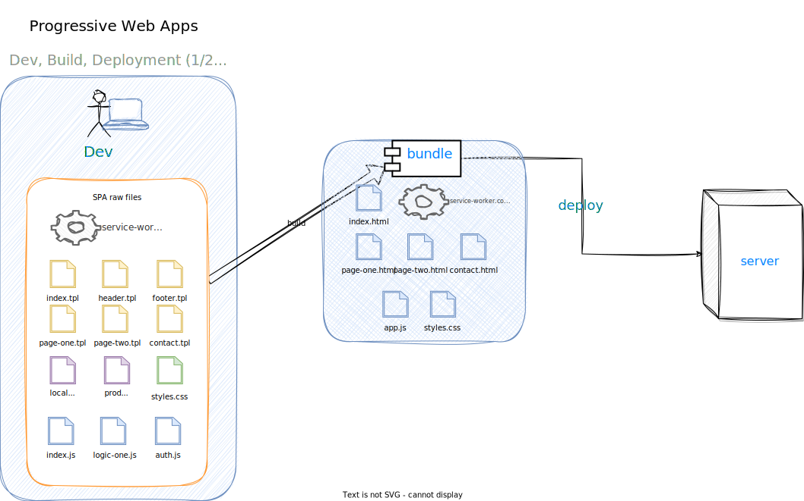

But we also have an extra step, an interesting detail: the deployment is no longer a dev-only process. It is noticeable by the user.
It can even be allowed & delayed by the user if the app is set to take into account the user's choice on the matter:

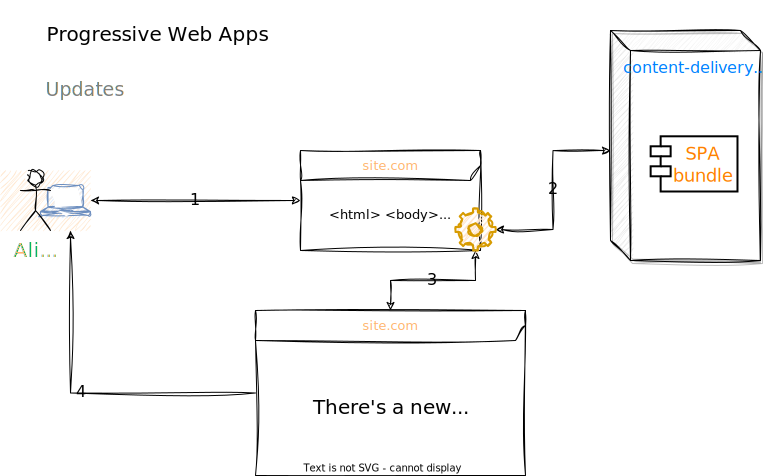

I know most people would disagree with my `complexity` score, especially for the SSR vs PWA. Hear me out, though:
* I am reasoning about PWAs as a non-SSR-SPA with offline capabilities. While I am aware that you can do an `SSR-PWA`, I think it is out of the question how many needs that covers: basically all. But, the complexity score goes to the roof.

* The SSR locks you in and **couples** the frontend with the backend very tightly. We know how that goes in the long term.
* While PWA is complex to set up & understand... once you get the hang of it and have a working setup, it tends to just work. A lot of things are handled automagically by the service workers.
* For the PWA you can opt-in & opt-out of various settings pretty much any time you want. The only risky thing is to mess up the `service worker`'s self-cache/update mechanism. Then you're kinda screwed. SSR, on the other hand, is an **all-or-nothing** kind of setup.

✅ **Pros**: has the same capabilities as a normal SPA + it works when there is no internet connection or an intermittent one, and a lot of extra functionalities that can be configured on a per-need basis.

❌ **Cons**: complicated to set up initially, requires a more thoughtful approach - your web app is now susceptible to "the fallacies of distributed systems".

### WASM
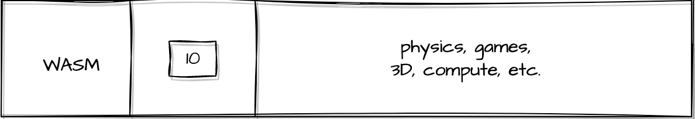

Delivered as `static html`, with a bunch of `js` for integrations... and 100.000 other things behind the scenes.

WASM apps deserve a lot more in-depth dive than what I can do in a high-level overview here. Sorry, but I will skip this one for now - I need more knowledge on the matter before I can summarise it as I did for the other types of apps.

## Necessary disclaimer

This is my mental model that helps me reason about things.
It is in no way a comprehensive guide to all things possible in the _web apps_ world.

However, in my experience, understanding these gets me through my workday quite easily,
as I can expand on my knowledge of these basic concepts and then build upon them:
* maybe some parts of an SSR SPA would have client-side hydration - for some reason.
* or maybe we deploy a static blog with comments from a database embedded at build time: the new comments won't show up until we rebuild & redeploy the website altogether.

The possibilities are endless.

## Closing notes

❗For web dev to really make sense, look at the whole lifecycle of an app, from how long it takes to create a new `
`,
all the way to how users (or web crawlers) will interact with your app.

❗ Understanding all the trade-offs between the type of software that can be run in a browser brings tenfold rewards: you can now do almost anything, on all platforms.

❗I was often able to reduce the challenge into a frontend/backend problem once I was able to understand the requirements: how do users expect to interact with the app and what features must the app support.

❗Understanding trade-offs doesn't mean only "SPA or PWA with React or Angular - which one is best for my needs". It means understanding how your app will scale in time: how complex & expensive it will be to develop and, most importantly... **deliver it**.
